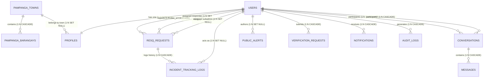

# RESQLINK Emergency Response Management System
## Full-Stack Architecture, Data Model, API Surface & Security Audit Report

**Audit Target Directory:** `c:\xampp\htdocs\Resqlink`  
**Application Name:** RESQLINK — Emergency Communication, Response & Telemetry Management System  
**Audit Scope:** Entire Monorepo (Frontend, Backend API, AI Microservice, Emergency Telemetry NOC, Database Schemas, Scripts & Configurations)  
**Audit Mode:** Read-Only Static Code Analysis & Dynamic Architecture Mapping  
**Date of Audit:** October 5, 2026  

---

## Executive Summary

### System Overview & Architecture
**RESQLINK** is a multi-tier, real-time emergency response dispatch and incident management platform designed for provincial and municipal disaster risk reduction and management offices (specifically targeting the province of **Pampanga, Philippines**, with specialized operational routing for the tri-municipality cluster: **Porac**, **Santa Rita**, and **Guagua**). 

The platform connects three core stakeholder groups:
1. **Citizens / Victims:** Report emergency incidents (Medical, Fire, Flood/Disaster, Crime/Police, Accident, Evacuation), stream live GPS coordinates, manage household emergency profiles (blood types, medical vulnerabilities, infants/seniors), and receive public safety broadcasts.
2. **Municipal Dispatchers & Central Command (Sub-Admins & Admins):** Validate incoming SOS emergencies, triage and map incidents, assign emergency response agencies (MDRRMO, PNP, BFP, Rescue), dispatch field responder units, and monitor real-time incident stages.
3. **Field Responders:** Mobile-optimized portal providing turn-by-turn response navigation, active incident acceptance, automated GPS telemetry streaming, real-time ETA calculation, and stage progression logging.

The system is architected as a distributed hybrid stack comprising:
- A **Single Page Application (SPA)** frontend built with React 18, Vite 5, Tailwind-free vanilla CSS design tokens, Lucide icons, Leaflet / React-Leaflet GIS mapping, and Recharts.
- A primary **Backend REST & WebSocket API** built with Node.js 20, Express 4.18, Sequelize 6 ORM, and Socket.IO 4.6, connecting to a MySQL (MariaDB via XAMPP) database.
- An **AI Biometrics & OCR Microservice** built with Python 3, Flask 3, EasyOCR, DeepFace, OpenCV, and TensorFlow/Keras for national ID document verification and facial matching.
- An auxiliary **Emergency Telemetry Server ("Emergency NOC")** running Express and Socket.IO on port 4000 for isolated black-and-white field telemetry testing.

### Headline Findings & Critical Risk Exposure
While the system demonstrates sophisticated domain-specific engineering — notably an automated GPS proximity stage progression engine, fine-grained telemetry tracking, and comprehensive audit trails — the audit revealed several **critical security vulnerabilities and architectural gaps** requiring immediate remediation before production deployment:

1. **Unrestricted Public Administrative Self-Registration (Critical):** The registration endpoint (`POST /api/auth/register`) accepts a `role` parameter directly from the unauthenticated client body. If `role: "admin"` or `role: "super_admin"` is provided, the backend immediately provisions a fully approved administrator account with full administrative privileges.
2. **Missing Authorization on Administrative Provisioning Routes (Critical):** `POST /api/auth/sub-admin` and `POST /api/auth/responder` require a valid JWT token (`authenticate`) but completely lack role verification middleware (`requireRole`). Any regular citizen or unverified user can create Sub-Admin dispatchers or First Responder accounts.
3. **Unauthenticated Arbitrary File Ingestion & Path Traversal Surface (Critical):** Endpoints `PUT /api/resq/direct-upload/*` and `POST /api/resq/direct-upload/*` have zero authentication middleware, zero MIME/extension validation, and zero file size restrictions, piping the incoming HTTP request stream directly to disk under `uploads/`.
4. **Unauthenticated WebSocket Gateway with Arbitrary Room Subscription (Critical):** Socket.IO connection handlers do not enforce JWT authentication. Any connecting client can join `role_admin`, `role_sub_admin`, or arbitrary `user_<id>` rooms, eavesdropping on private SOS alerts, citizen contact details, and location coordinates, or injecting spoofed telemetry pings.
5. **Completely Disabled Rate Limiting (High):** Both `apiLimiter` and `loginLimiter` middleware are implemented as dummy pass-through functions `(req, res, next) => next()`, leaving authentication routes completely vulnerable to brute-force credential stuffing and denial of service.
6. **Simulated AI Engine Fallback Producing False Approvals (High):** When the Python AI microservice is unreachable, the Node.js backend falls back to generating pseudo-random passing scores (89%–98%) and mock identity details ("JUAN DELA CRUZ"), automatically approving fraudulent identification submissions.
7. **Orphaned Features and Broken Endpoint References (Moderate):** A dedicated real-time chat interface (`ChatPage.jsx`) and geolocation hook (`useRealtimeGeolocation.js`) contain dead code calling non-existent backend endpoints (`/interviews/:id/location`), while existing backend forgot-password biometrics endpoints have no frontend UI counterpart.

---

## Part 0: Technology Stack Inventory

### Layer-by-Layer Inventory Table

| Layer | Technology | Declared Version | Purpose & Architectural Notes |
| :--- | :--- | :--- | :--- |
| **Frontend Runtime & Framework** | React | `^18.2.0` | Core UI component hierarchy, declarative state rendering |
| **Frontend DOM Renderer** | React DOM | `^18.2.0` | Virtual DOM hydration and browser mounting |
| **Frontend Build Tool** | Vite | `^5.0.8` (Plugin: `^4.2.1`) | Fast ESM dev server and Rollup production bundler |
| **Frontend Routing** | Custom State-Based | Native React `useState` | No `react-router` installed; routing is conditionally state-rendered in `App.jsx` based on `user.role` |
| **Frontend Styling** | Custom Vanilla CSS | CSS3 Variables | Comprehensive design system defined in `src/index.css` (21KB) with glassmorphism, dark palette, CSS variables, and keyframe animations |
| **Frontend Icons** | Lucide React | `^0.294.0` | Comprehensive iconography for status, navigation, and badges |
| **Frontend Maps / GIS** | Leaflet & React-Leaflet | `^1.9.4` / `^4.2.1` | Interactive tile maps, custom SVG/divIcon markers, radar circles, routing polylines |
| **Frontend Data Visualization** | Recharts | `^2.15.4` | Responsive SVG charts (Bar, Area, Pie) for incident and dispatch analytics |
| **Frontend HTTP Client** | Axios | `^1.6.2` | Base instance configured in `api.js` with Bearer token interceptor and LAN dynamic base URL resolution |
| **Frontend WebSocket Client** | Socket.IO Client | `^4.6.2` | Real-time bi-directional telemetry, alerts, and dispatch stage updates |
| **Frontend Document Export** | jsPDF & html2canvas | `^4.2.1` / `^1.4.1` | Client-side generation and rendering of official incident PDF reports |
| **Backend Runtime** | Node.js | `>=18.0.0` (Bundled: `v20.11.0`) | JavaScript runtime; project bundles an isolated Windows binary in `node-v20.11.0-win-x64` |
| **Backend Framework** | Express.js | `^4.18.2` | REST API routing, static file hosting, and HTTP middleware pipeline |
| **Async Route Handling** | express-async-errors | `^3.1.1` | Eliminates try-catch boilerplate by routing unhandled async rejections to global error handler |
| **Backend ORM** | Sequelize | `^6.35.2` | Object-Relational Mapping, associations, hooks, schema sync |
| **Database Driver** | mysql2 | `^3.6.5` | High-performance MySQL/MariaDB driver supporting prepared statements |
| **Real-Time WebSockets** | Socket.IO | `^4.6.2` | Multi-room socket server for SOS alerts, telemetry streaming, and public notifications |
| **Authentication & Tokens** | jsonwebtoken | `^9.0.2` | Access (15m–2h) and Refresh (7d) JWT generation and signature verification |
| **Password Hashing** | bcryptjs | `^2.4.3` | One-way password hashing (configured at 10–12 salt rounds) |
| **Schema Validation** | Joi & express-validator | `^17.11.0` / `^7.0.1` | Validation libraries installed in dependencies; mostly manual controller validation used |
| **Multipart / File Ingestion** | Multer | `^1.4.5-lts.1` | Disk storage ingestion for ID cards, selfies, incident photos, and resumes |
| **Image Processing (Local)** | Jimp | `^0.22.12` | Server-side JavaScript bitmap manipulation, distance/diff comparison for facial verification |
| **Email Transporter** | Nodemailer | `^6.9.7` | SMTP transport client configured for Gmail/gov.ph mail relay |
| **Backend Security Headers** | Helmet | `^7.1.0` | Sets standard security HTTP headers; configured with `crossOriginResourcePolicy: false` |
| **CORS Middleware** | cors | `^2.8.5` | Cross-Origin Resource Sharing configuration |
| **Rate Limiter (Declared)** | express-rate-limit | `^7.1.5` | Declared in `package.json`, but bypassed in `middleware/rateLimiter.js` |
| **Logging Pipeline** | Winston & Daily Rotate File | `^3.11.0` / `^4.7.1` | Structured logging (configured alongside Morgan HTTP logger) |
| **HTTP Request Logger** | Morgan | `^1.10.0` | Development HTTP request logging |
| **Task Scheduling** | node-cron | `^3.0.3` | Scheduled background maintenance tasks |
| **Distributed Cache / PubSub** | Custom In-Memory / Redis | Custom Adapter | Custom adapter (`redis.js`) featuring distributed lock abstraction with high-speed in-memory fallback |
| **Cloud Object Storage (SDK)** | @aws-sdk/client-s3 | Dynamic Import | Optional AWS S3 presigned URL generation with local edge streaming fallback |
| **Database Engine** | MySQL / MariaDB | 10.4+ (XAMPP Default) | Relational SQL database on port 3306; database name: `resqlink_db` |
| **AI Microservice Runtime** | Python | 3.10+ | Standalone Flask microservice running on port 5001 |
| **AI Framework** | Flask | `>=3.0.0` | WSGI microservice web framework |
| **AI OCR Engine** | EasyOCR | `>=1.7.0` | Deep learning-based optical character recognition for Philippine Government IDs |
| **AI Face Biometrics** | DeepFace & tf-keras | `>=0.0.84` / `>=2.15.0` | Facial detection, feature extraction, and facial verification vector comparison |
| **AI Image Processing** | OpenCV Python & Pillow | `>=4.8.0` / `>=10.0.0` | Image reading, alignment, edge detection, and quality validation |
| **Auxiliary Telemetry App** | Express + Socket.IO | `4.18.2` / `4.7.2` | Minimal standalone Emergency NOC prototype on port 4000 (`emergency-app`) |

### Dev & Infrastructure Configuration
- **Process Orchestration:** PowerShell script `Resqlink\start.ps1` handles one-click multi-process orchestration. It verifies XAMPP MySQL (port 3306), auto-kills port collisions, clears Vite cache, spawns four dedicated console windows (Backend on port 3000, Frontend on port 5173, AI Service on port 5001, Emergency NOC on port 4000), configures Windows Firewall rules for LAN cross-device testing, and auto-launches the browser to `http://localhost:5173`.
- **Root Proxy Configuration:** Frontend `vite.config.js` sets up reverse-proxy routes:
  - `/api` $\rightarrow$ `http://127.0.0.1:3000`
  - `/uploads` $\rightarrow$ `http://127.0.0.1:3000`
  - `/socket.io` $\rightarrow$ `http://127.0.0.1:3000` (with WebSocket upgrade enabled)
- **Database Seeding & Migration:** Direct Node scripts (`migrate_resq_flow.js`, `reset_and_seed_admins.js`, `seed_responders.js`, `sync_resq_db.js`) initialize database tables, establish schema constraints, and seed official provincial and municipal accounts.

### Dependency Health & Deprecation Flags
1. **Multer `^1.4.5-lts.1`:** Uses the legacy LTS branch of Multer 1.x; contains known vulnerabilities regarding unbounded memory usage or nested fields if not strictly capped.
2. **Jimp `^0.22.12`:** Older pure-JS image processing library; significantly slower and memory-intensive compared to modern native bindings such as `sharp`.
3. **Moment.js `^2.29.4`:** Listed in dependencies. Moment.js is in maintenance-only mode (deprecated by its maintainers in favor of Luxon, date-fns, or native `Intl`).
4. **Duplicate Validation Libraries:** Both `joi` (`^17.11.0`) and `express-validator` (`^7.0.1`) are installed in `backend/package.json`, yet most request validation across `resqController.js` and `authController.js` is implemented manually with ad-hoc `if` checks.

---

## Part 1: Full Feature & Module Inventory

### Feature & Module Summary Table

| Module Name | Purpose / Domain | Status | Key Backend Files | Key Frontend Files |
| :--- | :--- | :--- | :--- | :--- |
| **Auth & Account Management** | User registration, session tokens, JWT refresh, profile resolution, lockout | **Complete** *(w/ critical security flaws)* | `routes/authRoutes.js`<br>`controllers/authController.js` | `pages/AuthPage.jsx`<br>`api.js`<br>`App.jsx` |
| **KYC Identity Verification** | Tri-Municipality Philippine ID OCR, face biometric matching, KYC onboarding | **Complete** *(w/ simulation fallback)* | `routes/verificationRoutes.js`<br>`controllers/verificationController.js`<br>`services/aiEngine.js`<br>`ai-service/app.py` | `pages/AuthPage.jsx`<br>`controllers/verificationController.js` |
| **Citizen SOS Emergency Request** | Citizen emergency reporting, category selection, GPS geocoding, photo ingestion | **Complete** | `routes/resqRoutes.js`<br>`controllers/resqController.js`<br>`models/ResqRequest.js` | `pages/UserHome.jsx`<br>`utils/emergencyHelper.jsx` |
| **Emergency Live Telemetry & Tracking** | Real-time map tracking, ETA calculation, live polyline rendering, citizen cancel | **Complete** | `services/stageProgressionService.js`<br>`services/telemetryService.js`<br>`socket/index.js` | `pages/UserHome.jsx`<br>`pages/ResponderPortal.jsx` |
| **Command & Dispatch Management** | Tri-municipality emergency triage, sub-admin confirmation, responder assignment | **Complete** | `routes/resqRoutes.js`<br>`controllers/resqController.js`<br>`utils/jurisdiction.js` | `pages/AdminDashboard.jsx`<br>`pages/SubAdminDashboard.jsx` |
| **Field Responder Operations** | Active incident acceptance, turn-by-turn route, status progression, resolution notes | **Complete** | `routes/resqRoutes.js`<br>`controllers/resqController.js` | `pages/ResponderPortal.jsx`<br>`utils/emergencyHelper.jsx` |
| **Public Safety & Disaster Alerts** | Authoring, broadcasting, deactivating, and displaying emergency bulletins | **Complete** | `routes/alertRoutes.js`<br>`controllers/alertController.js`<br>`models/PublicAlert.js` | `pages/AdminDashboard.jsx`<br>`pages/UserHome.jsx` |
| **User & Responder Administration** | Account listing, active status toggle, manual KYC approval, role provisioning | **Complete** | `routes/adminRoutes.js`<br>`controllers/adminController.js` | `pages/AdminDashboard.jsx` |
| **Database Analytics & Audit Logs** | Real-time SQL aggregation of response metrics, audit trails, and PDF export | **Complete** | `routes/adminRoutes.js`<br>`controllers/adminController.js`<br>`routes/resqRoutes.js` | `pages/AdminDashboard.jsx` |
| **Citizen Medical & Household Profile** | Storage of blood type, medical history, infants/seniors count, emergency contact | **Complete** | `routes/profileRoutes.js`<br>`controllers/profileController.js`<br>`models/Profile.js` | `pages/UserHome.jsx` |
| **Biometric Password Recovery** | Email lookup, live face scan vs avatar/ID biometrics, tokenized password reset | **Partial** *(Backend only, no UI)* | `controllers/authController.js` (lines 420–717) | *None (Orphaned Backend)* |
| **Internal Real-Time Chat** | 1-on-1 messaging between responders, dispatchers, and victims | **Partial** *(Orphaned Frontend & Socket)* | `routes/chatRoutes.js`<br>`controllers/chatController.js`<br>`models/Conversation.js` | `pages/ChatPage.jsx` *(Not mounted in App.jsx)* |
| **Standalone Emergency Telemetry NOC** | Standalone minimalist emergency NOC server with file-based persistence | **Independent Prototype** | `emergency-app/server.js` | `emergency-app/public/*` |

---

### Detailed Module Breakdown

#### 1. Authentication & Session Management
- **Purpose:** Handles user sign-up, credential authentication, JWT token issuance (access token and refresh token rotation), active session recovery (`/api/auth/me`), failed attempt tracking, temporary lockout, and administrative sub-account provisioning.
- **Backend Implementation:**
  - Routes: [`backend/src/routes/authRoutes.js`](file:///c:/xampp/htdocs/Resqlink/Resqlink/backend/src/routes/authRoutes.js)
  - Controller: [`backend/src/controllers/authController.js`](file:///c:/xampp/htdocs/Resqlink/Resqlink/backend/src/controllers/authController.js) (`register`, `login`, `me`, `refreshToken`, `createSubAdmin`, `createResponder`)
  - Models: [`User.js`](file:///c:/xampp/htdocs/Resqlink/Resqlink/backend/src/models/User.js), [`Profile.js`](file:///c:/xampp/htdocs/Resqlink/Resqlink/backend/src/models/Profile.js), [`SecurityLog.js`](file:///c:/xampp/htdocs/Resqlink/Resqlink/backend/src/models/SecurityLog.js)
- **Frontend Implementation:**
  - Pages: [`frontend/src/pages/AuthPage.jsx`](file:///c:/xampp/htdocs/Resqlink/Resqlink/frontend/src/pages/AuthPage.jsx), [`frontend/src/App.jsx`](file:///c:/xampp/htdocs/Resqlink/Resqlink/frontend/src/App.jsx)
  - API Client: [`frontend/src/api.js`](file:///c:/xampp/htdocs/Resqlink/Resqlink/frontend/src/api.js)
- **Core Operations Supported:**
  - **Create:** User account creation via `POST /api/auth/register`; Sub-Admin creation via `POST /api/auth/sub-admin`; First Responder creation via `POST /api/auth/responder`.
  - **Read:** Session retrieval via `GET /api/auth/me`.
  - **Update:** Refresh token rotation via `POST /api/auth/refresh-token`; Failed login attempt increment / lockout update via `POST /api/auth/login`.
  - **Delete:** Token revocation on client logout via `localStorage.removeItem('resqlink_token')`.
- **Notable Business Logic:**
  - Account lockout: If `failed_login_attempts >= 5`, an account lock of 30 minutes is enforced via `lockout_until = new Date(Date.now() + 30 * 60 * 1000)` and logged to `security_logs`.
  - Role assignment logic in registration: Directly reads `role` from payload. If `role === 'admin' || role === 'super_admin'`, assigns `role = 'admin'` with `is_verified = true` and `verification_status = 'approved'` immediately.
- **Integrations:** Bcryptjs password hashing, JWT signature engine.
- **Known Limitations:**
  - No email verification or activation link is required; user accounts are activated instantly.
  - The refresh token endpoint does not use secure HTTP-only cookies; refresh tokens are passed in raw JSON bodies.

#### 2. KYC Onboarding & AI Identity Cross-Matching
- **Purpose:** Verifies citizen identity during registration or profile setup by matching uploaded Philippine national ID cards (front/back) with live camera selfie captures, extracting text via OCR, validating municipality residency in Pampanga, and performing face biometric distance comparison.
- **Backend Implementation:**
  - Routes: [`routes/verificationRoutes.js`](file:///c:/xampp/htdocs/Resqlink/Resqlink/backend/src/routes/verificationRoutes.js), [`routes/authRoutes.js`](file:///c:/xampp/htdocs/Resqlink/Resqlink/backend/src/routes/authRoutes.js) (lines 9–17)
  - Controller: [`controllers/verificationController.js`](file:///c:/xampp/htdocs/Resqlink/Resqlink/backend/src/controllers/verificationController.js), [`controllers/authController.js`](file:///c:/xampp/htdocs/Resqlink/Resqlink/backend/src/controllers/authController.js) (`crossMatchIdentity`)
  - Services: [`services/aiEngine.js`](file:///c:/xampp/htdocs/Resqlink/Resqlink/backend/src/services/aiEngine.js), External Python Flask Service [`ai-service/app.py`](file:///c:/xampp/htdocs/Resqlink/Resqlink/ai-service/app.py)
  - Models: [`VerificationRequest.js`](file:///c:/xampp/htdocs/Resqlink/Resqlink/backend/src/models/VerificationRequest.js)
- **Frontend Implementation:**
  - Integrated into onboarding forms in `AuthPage.jsx` and `AdminDashboard.jsx`.
- **Core Operations Supported:**
  - **Create:** Multipart submission of ID and selfie via `POST /api/verification/submit` and `POST /api/verification/submit-complete-onboarding`.
  - **Read:** Query verification status via `GET /api/verification/status`.
  - **Custom (Cross-Match):** Pre-registration identity validation via `POST /api/auth/register/cross-match-identity`.
- **Notable Business Logic:**
  - Calls Flask AI service endpoint `http://localhost:5001/api/register/cross-match-identity` with a 5-second timeout.
  - **Fallback Engine:** If the Python microservice is offline, runs a JavaScript fallback using Levenshtein distance algorithm: requires name similarity score $\ge 88.0\%$, exact birthdate string match, and checks if municipality belongs to Pampanga's 22 official local government units.
  - In `services/aiEngine.js`, fallback verification generates randomized passing quality scores ($92\% - 99\%$) and face match scores ($89\% - 98\%$), marking recommendations as `'APPROVE'`.
- **Integrations:** EasyOCR, DeepFace, OpenCV, Jimp image similarity diff.
- **Known Limitations:**
  - Fallback mechanism generates mock biometric scores and mock data, creating a security bypass whenever the Python AI service is down.

#### 3. Citizen SOS Emergency Request & Live Telemetry
- **Purpose:** Allows citizens to immediately broadcast life-threatening emergencies with GPS coordinates, multiple emergency tags (Fire, Medical, Flood, Crime, Accident), detailed descriptions, landmarks, and photos. Provides citizens with real-time tracking of assigned responders, including live distance, ETA, and cancellation capability.
- **Backend Implementation:**
  - Routes: [`routes/resqRoutes.js`](file:///c:/xampp/htdocs/Resqlink/Resqlink/backend/src/routes/resqRoutes.js) (lines 26–37)
  - Controller: [`controllers/resqController.js`](file:///c:/xampp/htdocs/Resqlink/Resqlink/backend/src/controllers/resqController.js) (`createResqRequest`, `getMyResqRequests`, `getActiveResqRequest`, `cancelResqRequest`, `uploadIncidentPhoto`)
  - Models: [`ResqRequest.js`](file:///c:/xampp/htdocs/Resqlink/Resqlink/backend/src/models/ResqRequest.js), [`IncidentTrackingLog.js`](file:///c:/xampp/htdocs/Resqlink/Resqlink/backend/src/models/IncidentTrackingLog.js)
- **Frontend Implementation:**
  - Pages: [`frontend/src/pages/UserHome.jsx`](file:///c:/xampp/htdocs/Resqlink/Resqlink/frontend/src/pages/UserHome.jsx) (Home, Tracking, History, Medical tabs)
  - Utilities: [`frontend/src/utils/emergencyHelper.jsx`](file:///c:/xampp/htdocs/Resqlink/Resqlink/frontend/src/utils/emergencyHelper.jsx)
- **Core Operations Supported:**
  - **Create:** `POST /api/resq/request` (submits emergency incident); `POST /api/resq/upload-photo` (uploads incident image).
  - **Read:** `GET /api/resq/my-requests` (incident history); `GET /api/resq/active` (active ongoing emergency).
  - **Update / Cancel:** `POST /api/resq/cancel/:id` (citizen cancels request if status is still `'Pending'`).
- **Notable Business Logic:**
  - Hardcoded critical severity: Regardless of incoming user selection, `createResqRequest` enforces `safeSeverity = 'Critical'` to guarantee high priority.
  - Multi-Agency Mapping: Automatically maps emergency types to responsible departments (`Fire` $\rightarrow$ `BFP`, `Crime/Police` $\rightarrow$ `PNP`, `Medical/Flood/Accident` $\rightarrow$ `MDRRMO`).
  - Automatic Municipality Geofencing: If municipality is unspecified or outside Porac/Santa Rita/Guagua, coordinates are evaluated: $\text{lat} \ge 15.035 \implies \text{Porac}$; $\text{lat} \ge 14.985 \implies \text{Santa Rita}$; otherwise $\text{Guagua}$.
  - Real-Time Broadcast: Emits Socket.IO events `new_rescue_request` and `emergency:new` across `role_admin`, `role_sub_admin`, and agency-specific rooms (`role_mdrrmo_admin`, `role_pnp_responder`, `role_bfp_responder`).
- **Integrations:** HTML5 Geolocation API, Leaflet Maps, Socket.IO real-time event pipeline.

#### 4. Command & Dispatch Management (Central Command & Sub-Admin)
- **Purpose:** Triages emergencies across Porac, Santa Rita, and Guagua. Sub-Admins confirm jurisdictional intake, assign specific first responder units, dispatch field teams, and oversee progression. Provincial Super Admins possess full multi-municipality command.
- **Backend Implementation:**
  - Routes: [`routes/resqRoutes.js`](file:///c:/xampp/htdocs/Resqlink/Resqlink/backend/src/routes/resqRoutes.js) (lines 46–100)
  - Controller: [`controllers/resqController.js`](file:///c:/xampp/htdocs/Resqlink/Resqlink/backend/src/controllers/resqController.js) (`getAllResqRequests`, `dispatchResqRequest`, `assignResponder`, `subadminConfirmAssignment`, `getSubAdmins`, `getAvailableResponders`)
  - Utilities: [`backend/src/utils/jurisdiction.js`](file:///c:/xampp/htdocs/Resqlink/Resqlink/backend/src/utils/jurisdiction.js)
- **Frontend Implementation:**
  - Pages: [`frontend/src/pages/AdminDashboard.jsx`](file:///c:/xampp/htdocs/Resqlink/Resqlink/frontend/src/pages/AdminDashboard.jsx), [`frontend/src/pages/SubAdminDashboard.jsx`](file:///c:/xampp/htdocs/Resqlink/Resqlink/frontend/src/pages/SubAdminDashboard.jsx)
- **Core Operations Supported:**
  - **Read:** `GET /api/resq/admin/all` (fetches all incidents with jurisdictional filtering); `GET /api/resq/subadmins` (lists dispatchers); `GET /api/resq/responders` (lists active response units).
  - **Update:** `POST /api/resq/assign/:id` (assigns responder unit and sets status to `'Assigned'`); `PUT /api/resq/confirm-subadmin/:id` (Sub-Admin accepts sector responsibility); `PUT /api/resq/dispatch/:id` (dispatches assigned unit, sets status to `'Responder Dispatched'`).
- **Notable Business Logic:**
  - Jurisdictional Scoping: `getAdminJurisdiction(user)` determines whether the operator has global access (`'all'`) or is restricted to `'Porac'`, `'Santa Rita'`, or `'Guagua'`. Sub-Admins cannot view or dispatch incidents outside their municipality unless operating under Super Admin role.
  - State Machine Enforcement: Validates status transitions (`Pending` $\rightarrow$ `Assigned` $\rightarrow$ `Responder Dispatched` $\rightarrow$ `En Route` $\rightarrow$ `Arrived` $\rightarrow$ `Completed`). Transitions can be forced if `force_override: true` or `manual_override: true` is passed.
- **Integrations:** Socket.IO multi-room dispatch broadcast, PDF report generator (`jsPDF`).

#### 5. Field Responder Telemetry & Automated Stage Progression
- **Purpose:** Dedicated mobile portal for field personnel. Allows responders to receive dispatches, accept missions, stream high-frequency GPS telemetry, automatically transition emergency stages based on physical distance, and complete missions with resolution summaries.
- **Backend Implementation:**
  - Services: [`services/stageProgressionService.js`](file:///c:/xampp/htdocs/Resqlink/Resqlink/backend/src/services/stageProgressionService.js), [`services/telemetryService.js`](file:///c:/xampp/htdocs/Resqlink/Resqlink/backend/src/services/telemetryService.js)
  - WebSocket: [`socket/index.js`](file:///c:/xampp/htdocs/Resqlink/Resqlink/backend/src/socket/index.js) (events: `telemetry_ping`, `update_responder_location`)
  - Controller: [`controllers/resqController.js`](file:///c:/xampp/htdocs/Resqlink/Resqlink/backend/src/controllers/resqController.js) (`getResponderActiveIncident`, `acceptResqRequest`, `updateResponderLocation`)
- **Frontend Implementation:**
  - Pages: [`frontend/src/pages/ResponderPortal.jsx`](file:///c:/xampp/htdocs/Resqlink/Resqlink/frontend/src/pages/ResponderPortal.jsx)
- **Core Operations Supported:**
  - **Read:** `GET /api/resq/responder/active` (loads assigned incident for logged-in responder).
  - **Update:** `POST /api/resq/accept/:id` (marks incident `'Accepted'`); `PUT /api/resq/dispatch/:id` (updates operational stage to `'En Route'`, `'Arrived'`, `'Completed'`); `POST /api/resq/update-location/:id` (HTTP fallback for location updates).
- **Notable Business Logic:**
  - **Haversine Distance & ETA:** Computes real-time distance in meters between responder coordinates and victim incident location; calculates dynamic ETA assuming an effective baseline speed of 40 km/h (11.11 m/s).
  - **Automated Stage Progression:**
    1. When a responder starts transmitting telemetry while in `'Responder Dispatched'` status, the backend automatically advances the status to `'En Route'` and logs it to `incident_tracking_logs`.
    2. When the responder enters within $\le 75\text{ meters}$ of the scene for two consecutive pings (or $\le 40\text{ meters}$ immediately), the backend automatically triggers status `'Arrived'` / `'On Scene'`.
- **Integrations:** High-accuracy HTML5 Geolocation `watchPosition`, Leaflet interactive routing, Socket.IO telemetry channels.

#### 6. Public Safety & Disaster Alerts
- **Purpose:** Enables municipal MDRRMO and Provincial Command to author and broadcast emergency alerts (e.g. Typhoon/Flood warnings, Fire hazards, Evacuation orders) to all citizen dashboards in real time.
- **Backend Implementation:**
  - Routes: [`routes/alertRoutes.js`](file:///c:/xampp/htdocs/Resqlink/Resqlink/backend/src/routes/alertRoutes.js)
  - Controller: [`controllers/alertController.js`](file:///c:/xampp/htdocs/Resqlink/Resqlink/backend/src/controllers/alertController.js)
  - Models: [`PublicAlert.js`](file:///c:/xampp/htdocs/Resqlink/Resqlink/backend/src/models/PublicAlert.js)
- **Frontend Implementation:**
  - Components: Embedded in `AdminDashboard.jsx` (Alert Management tab) and `UserHome.jsx` (Alerts tab & top broadcast banner).
- **Core Operations Supported:**
  - **Create:** `POST /api/alerts/create` (creates and broadcasts alert).
  - **Read:** `GET /api/alerts/active` (public unauthenticated feed); `GET /api/alerts/all` (admin view).
  - **Update:** `PATCH /api/alerts/toggle/:id` (activates or deactivates alert).
  - **Delete:** `DELETE /api/alerts/:id` (permanently removes alert).
- **Notable Business Logic:**
  - Alerts published by municipal admins default to their municipality (`Porac`, `Santa Rita`, or `Guagua`); Super Admins can target `'All Municipalities'`.
  - Immediate real-time broadcast via Socket.IO events `alert:broadcast` and `new_public_alert`.

#### 7. User & Responder Administration
- **Purpose:** Super Admin and municipal admins inspect user accounts, toggle active/suspended statuses, manually review pending KYC identity verification requests, and provision official dispatchers or responder units.
- **Backend Implementation:**
  - Routes: [`routes/adminRoutes.js`](file:///c:/xampp/htdocs/Resqlink/Resqlink/backend/src/routes/adminRoutes.js)
  - Controller: [`controllers/adminController.js`](file:///c:/xampp/htdocs/Resqlink/Resqlink/backend/src/controllers/adminController.js)
- **Frontend Implementation:**
  - Pages: `AdminDashboard.jsx` (Users and Fleet tabs)
- **Core Operations Supported:**
  - **Read:** `GET /api/admin/users`, `GET /api/admin/verification-queue`, `GET /api/admin/audit-logs`.
  - **Update:** `PATCH /api/admin/users/:id/active` (deactivates or activates user account); `PATCH /api/admin/users/:id/verification` (overrides verification status); `POST /api/admin/verifications/:id/approve` (approves KYC application and syncs selfie to profile avatar).
  - **Custom (Mock Backup):** `POST /api/admin/trigger-backup` (logs an audit entry but creates no real dump).

#### 8. Database Analytics & Reporting
- **Purpose:** Provides dispatchers and administrators with real-time incident metrics, response time tracking, severity breakdowns, and printable PDF reports.
- **Backend Implementation:**
  - Controller: `resqController.js` (`getResqAnalytics`), `adminController.js` (`getDashboardStats`)
- **Frontend Implementation:**
  - Pages: `AdminDashboard.jsx` (Analytics tab)
- **Core Operations Supported:**
  - **Read:** `GET /api/resq/analytics`, `GET /api/admin/dashboard-stats`.
- **Notable Business Logic:**
  - Zero mock data: Aggregates real SQL counts (`COUNT(*)`) grouped by municipality, emergency category, agency, and status. Calculates average response duration in seconds (`response_duration_seconds`).

#### 9. Citizen Medical & Household Safety Profile
- **Purpose:** Stores life-saving medical data (blood type, allergies, chronic conditions, special needs) and household vulnerability data (number of infants, seniors, PWDs) along with emergency contacts, attached directly to SOS dispatches.
- **Backend Implementation:**
  - Routes: [`routes/profileRoutes.js`](file:///c:/xampp/htdocs/Resqlink/Resqlink/backend/src/routes/profileRoutes.js)
  - Controller: [`controllers/profileController.js`](file:///c:/xampp/htdocs/Resqlink/Resqlink/backend/src/controllers/profileController.js)
  - Models: [`Profile.js`](file:///c:/xampp/htdocs/Resqlink/Resqlink/backend/src/models/Profile.js)
- **Frontend Implementation:**
  - Pages: `UserHome.jsx` (Medical Profile tab)
- **Core Operations Supported:**
  - **Read:** `GET /api/profile/me`.
  - **Update:** `PUT /api/profile/me` (saves medical conditions, household counts, emergency contacts).

#### 10. Real-Time Chat & Communications (Partially Implemented / Orphaned)
- **Purpose:** Intended to provide 1-on-1 private messaging between victims and responders, or dispatchers and field units.
- **Backend Implementation:**
  - Routes: [`routes/chatRoutes.js`](file:///c:/xampp/htdocs/Resqlink/Resqlink/backend/src/routes/chatRoutes.js)
  - Controller: [`controllers/chatController.js`](file:///c:/xampp/htdocs/Resqlink/Resqlink/backend/src/controllers/chatController.js)
  - Models: [`Conversation.js`](file:///c:/xampp/htdocs/Resqlink/Resqlink/backend/src/models/Conversation.js), [`Message.js`](file:///c:/xampp/htdocs/Resqlink/Resqlink/backend/src/models/Message.js)
- **Frontend Implementation:**
  - Standalone Component: [`frontend/src/pages/ChatPage.jsx`](file:///c:/xampp/htdocs/Resqlink/Resqlink/frontend/src/pages/ChatPage.jsx)
- **Status / Limitation:** **Incomplete / Orphaned.** `ChatPage.jsx` is never imported, routed, or rendered in `App.jsx`, `AdminDashboard.jsx`, `SubAdminDashboard.jsx`, or `UserHome.jsx`. End users have no UI entry point to interact with the chat system.

---

## Part 2: User Roles & Capabilities (Full Breakdown)

### Role Definitions & Code Identification
Roles are stored in the `users` table under the `role` ENUM column, defined in [`models/User.js`](file:///c:/xampp/htdocs/Resqlink/Resqlink/backend/src/models/User.js#L33-L46):
```javascript
role: {
  type: DataTypes.ENUM(
    'citizen',
    'mdrrmo_admin',
    'pnp_responder',
    'bfp_responder',
    'super_admin',
    'admin',
    'sub_admin',
    'user',
    'responder'
  ),
  allowNull: false,
  defaultValue: 'citizen',
}
```
In practice, the system logic partitions these values into **four primary operational archetypes**:
1. **`super_admin`:** Provincial Central Command Administrator (unrestricted jurisdiction).
2. **`admin` / `mdrrmo_admin`:** Municipal MDRRMO Chief Administrator (scoped to Porac, Santa Rita, or Guagua).
3. **`sub_admin`:** Municipal Duty Dispatcher & Field Supervisor (assigned to a municipal sector).
4. **`responder` / `pnp_responder` / `bfp_responder`:** Field Responder Unit (Ambulance, Police Patrol, Fire Engine).
5. **`citizen` / `user`:** Registered Resident / General Public Requester.

---

### Detailed Role Capability Breakdown

#### 1. Super Admin (`super_admin`)
- **Role Definition:** Root authority; identified by `role === 'super_admin'` or email containing `superadmin`.
- **Jurisdictional Scope:** Global / All Municipalities (`'all'`). Bypasses all municipality query filters.
- **Capabilities:**
  - **Incidents:** Full CRUD; can view all incidents across all towns; can force-override status transitions; can assign sub-admins and responders to any incident.
  - **Alerts:** Can author alerts targeting `'All Municipalities'` or specific towns; can activate, toggle, or delete any alert.
  - **Users:** Can view all users, activate/deactivate any account, approve/reject KYC requests, create new Sub-Admins and Responders.
  - **Analytics:** Full provincial analytics and PDF incident report generation.
- **Navigation / UI:** Full access to `AdminDashboard.jsx` with all 6 tabs (`incidents`, `map`, `users`, `fleet`, `alerts`, `analytics`).

#### 2. Municipal Admin (`admin` / `mdrrmo_admin`)
- **Role Definition:** Municipal disaster head; identified by `role === 'admin'` or `role === 'mdrrmo_admin'`.
- **Jurisdictional Scope:** Strictly scoped to assigned municipality (`Porac`, `Santa Rita`, or `Guagua`) via `getAdminJurisdiction(req.user)`.
- **Capabilities:**
  - **Incidents:** Can view, assign, and dispatch incidents within their assigned municipality. Blocked with HTTP 403 if attempting to access incidents from another municipality.
  - **Alerts:** Can author and manage alerts strictly within their municipal boundary.
  - **Users:** Can view municipal users, toggle user status within their town, and provision municipal responders.
- **Navigation / UI:** Renders `AdminDashboard.jsx`; incident queues and user tables are automatically filtered to show only local records.

#### 3. Sub-Admin / Municipal Dispatcher (`sub_admin`)
- **Role Definition:** Operating dispatcher; identified by `role === 'sub_admin'`.
- **Jurisdictional Scope:** Scoped to municipal sector (`Porac`, `Santa Rita`, or `Guagua`).
- **Capabilities:**
  - **Incidents:** Can view sector incidents via `GET /api/resq/admin/all?status=all`; can confirm sector assignment via `PUT /api/resq/confirm-subadmin/:id`; can assign and dispatch responders via `PUT /api/resq/dispatch/:id`.
  - **Cannot Access:** Cannot access user management (`/api/admin/users`), verification queue review (`/api/admin/verification-queue`), or system audit logs (`/api/admin/audit-logs`).
- **Navigation / UI:** Routed to [`SubAdminDashboard.jsx`](file:///c:/xampp/htdocs/Resqlink/Resqlink/frontend/src/pages/SubAdminDashboard.jsx); navigation is focused on the Dispatch Queue and Radar Map.

#### 4. Field Responder (`responder`, `pnp_responder`, `bfp_responder`)
- **Role Definition:** Emergency field personnel; identified by `role === 'responder'` or agency-specific responder roles.
- **Jurisdictional Scope:** Scoped to assigned active incidents.
- **Capabilities:**
  - **Incidents:** Can view assigned active incident via `GET /api/resq/responder/active`; can accept dispatch via `POST /api/resq/accept/:id`; can update operational stages (`En Route`, `Arrived`, `Completed`) via `PUT /api/resq/dispatch/:id`.
  - **Telemetry:** Streams live GPS coordinates via WebSocket `telemetry_ping` or `POST /api/resq/update-location/:id`.
  - **Cannot Access:** Cannot view other incidents, cannot assign units, cannot broadcast alerts, cannot view system users.
- **Navigation / UI:** Exclusively routed to [`ResponderPortal.jsx`](file:///c:/xampp/htdocs/Resqlink/Resqlink/frontend/src/pages/ResponderPortal.jsx); UI displays GPS lock status, victim routing map, turn-by-turn navigation, and action buttons.

#### 5. Citizen / Resident (`citizen`, `user`)
- **Role Definition:** General public; default role upon registration.
- **Jurisdictional Scope:** Row-level restriction: can only view incidents authored by their own user ID (`user_id = req.user.id`).
- **Capabilities:**
  - **Incidents:** Can create SOS requests (`POST /api/resq/request`), upload incident photos (`POST /api/resq/upload-photo`), view their own active and historical requests, and cancel pending requests.
  - **Alerts:** Can view active public bulletins (`GET /api/alerts/active`).
  - **Profile:** Can view and update their own medical profile and household safety data (`PUT /api/profile/me`).
  - **Cannot Access:** Completely blocked from dispatching, unit assignment, user listings, and administrative analytics.
- **Navigation / UI:** Exclusively routed to [`UserHome.jsx`](file:///c:/xampp/htdocs/Resqlink/Resqlink/frontend/src/pages/UserHome.jsx) with SOS trigger button, live tracker, request history, medical profile form, and alerts feed.

---

### Consolidated Role Capability Matrix

| Feature / Domain Module | Citizen / User | Field Responder | Sub-Admin Dispatcher | Municipal Admin | Super Admin |
| :--- | :---: | :---: | :---: | :---: | :---: |
| **SOS Incident Creation** | **C** | None | None | None | None |
| **Own Incident Tracking & Cancel** | **R, U** (Cancel only) | None | None | None | None |
| **View Incident Queue** | None | **R** (Assigned active only) | **R** (Municipality scope) | **R** (Municipality scope) | **R** (All / Global) |
| **Assign Responder Units** | None | None | **U** | **U** | **U** |
| **Confirm Sector Responsibility** | None | None | **U** | None | None |
| **Accept Mission Assignment** | None | **U** (Custom Accept) | None | None | None |
| **Update Operational Stage** | None | **U** (`En Route`, `Arrived`, `Completed`) | **U** (Dispatch & Reassign) | **U** (Full override) | **U** (Full override) |
| **Transmit GPS Telemetry** | None | **C, U** (Continuous Ping) | None | None | None |
| **Public Alert Viewing** | **R** (Active only) | **R** (Active only) | **R** (Active only) | **R** (Active & Inactive) | **R** (Active & Inactive) |
| **Public Alert Authoring & Deletion** | None | None | None | **C, U, D** (Town scope) | **C, U, D** (Global scope) |
| **User Account Management** | None | None | None | **R, U** (Town scope) | **R, U** (Global scope) |
| **KYC Identity Approval / Reject** | None | None | None | **R, U** (Town scope) | **R, U** (Global scope) |
| **Sub-Admin & Responder Creation** | **C** *(Flaw in code)* | **C** *(Flaw in code)* | **C** *(Flaw in code)* | **C** | **C** |
| **System Audit Logs & Backup** | None | None | None | None | **R, C** (Snapshot) |
| **Analytics & PDF Incident Export** | None | None | **R** | **R, Export** | **R, Export** |
| **Medical Profile Management** | **C, R, U** (Own profile) | None | None | None | None |

*Legend:* **C** = Create, **R** = Read, **U** = Update, **D** = Delete, **None** = No Access.

---

### Inconsistent & Frontend-Only Role Check Flags
1. **Critical Privilege Escalation on Provisioning Endpoints:**
   - In [`routes/authRoutes.js`](file:///c:/xampp/htdocs/Resqlink/Resqlink/backend/src/routes/authRoutes.js#L26-L27), `/api/auth/sub-admin` and `/api/auth/responder` only require `authenticate`. Neither route specifies `requireRole('admin', 'super_admin')`.
   - In [`controllers/authController.js`](file:///c:/xampp/htdocs/Resqlink/Resqlink/backend/src/controllers/authController.js#L718-L823), `createSubAdmin` and `createResponder` execute with no check against `req.user.role`. A standard authenticated citizen can post directly to these endpoints to create arbitrary elevated Sub-Admin or Responder accounts.
2. **Frontend-Only Role Separation in App.jsx:**
   - Routing in [`App.jsx`](file:///c:/xampp/htdocs/Resqlink/Resqlink/frontend/src/App.jsx#L47-L97) relies entirely on `user.role` stored in client state. While the backend does enforce `requireRole` on administrative routes, an attacker modifying the client `user` state can force the React UI to render `AdminDashboard` or `SubAdminDashboard`.
3. **Jurisdiction Filter Enforced Post-Query in Memory:**
   - In [`controllers/adminController.js`](file:///c:/xampp/htdocs/Resqlink/Resqlink/backend/src/controllers/adminController.js#L269-L280), `getAllUsers` performs `User.findAll()`, fetching **all users across the entire database into memory**, and only then filters them with `users.filter(...)`. This exposes potential memory exhaustion and leaks database records if filtering logic fails.

---

## Part 3: Data Model Audit

### Entity Relationships & Foreign Keys



---

### Detailed Schema & Constraints Inventory

#### 1. `users`
- **Fields:**
  - `id`: `INTEGER`, Primary Key, Auto-Increment.
  - `uuid`: `STRING` / `CHAR(36)`, UUIDV4 default, Not Null, Unique constraint.
  - `email`: `VARCHAR(255)`, Not Null, Unique constraint, validated with `isEmail`.
  - `phone_number`: `VARCHAR(20)`, Nullable.
  - `password_hash`: `VARCHAR(255)`, Not Null.
  - `role`: `ENUM('citizen', 'mdrrmo_admin', 'pnp_responder', 'bfp_responder', 'super_admin', 'admin', 'sub_admin', 'user', 'responder')`, Not Null, Default `'citizen'`.
  - `agency`: `ENUM('MDRRMO', 'PNP', 'BFP', 'CITIZEN', 'NONE', 'Medical', 'Police', 'Fire', 'Rescue')`, Default `'CITIZEN'`.
  - `badge_or_unit_id`: `VARCHAR(50)`, Nullable.
  - `is_verified`: `BOOLEAN`, Default `false`.
  - `verification_status`: `ENUM('unverified', 'pending_ai', 'pending_admin', 'approved', 'rejected')`, Default `'unverified'`.
  - `is_active`: `BOOLEAN`, Default `true`.
  - `failed_login_attempts`: `INTEGER`, Default `0`.
  - `lockout_until`: `DATE`, Nullable.
  - `last_login_at`: `DATE`, Nullable.
  - `refresh_token`: `TEXT`, Nullable.
  - `account_status`: `ENUM('ACTIVE', 'SUSPENDED', 'BLOCKED')`, Default `'ACTIVE'`.
  - `penalty_balance`: `DECIMAL(10, 2)`, Default `0.00`.
  - `suspension_ends_at`: `DATE`, Nullable.
  - `createdAt`, `updatedAt`: `DATETIME`.
- **Indexes:** Primary key `id`, unique index on `email`, unique index on `uuid`, composite index on `(verification_status, role)`.

#### 2. `profiles`
- **Fields:**
  - `id`: `INTEGER`, Primary Key, Auto-Increment.
  - `user_id`: `INTEGER`, Not Null, Unique (Foreign Key referencing `users(id)` ON DELETE CASCADE).
  - `first_name`, `last_name`: `VARCHAR(100)`, Not Null.
  - `full_name`: `VARCHAR(255)`, Nullable.
  - `avatar_url`, `id_document_url`, `resume_url`: `VARCHAR(255)`, Nullable.
  - `headline`: `VARCHAR(255)`, Nullable.
  - `bio`: `TEXT`, Nullable.
  - `birthdate`: `DATEONLY`, Nullable.
  - `pampanga_town_id`: `INTEGER`, Foreign Key referencing `pampanga_towns(id)` ON DELETE SET NULL.
  - `city`: `VARCHAR(100)`, Default `'City of San Fernando'`.
  - `province`: `VARCHAR(100)`, Default `'Pampanga'`.
  - `barangay`: `VARCHAR(100)`, Nullable.
  - `street`: `VARCHAR(255)`, Nullable.
  - `latitude`: `DECIMAL(10, 8)`, Default `15.0343`.
  - `longitude`: `DECIMAL(11, 8)`, Default `120.6843`.
  - `blood_type`: `VARCHAR(10)`, Default `'Unknown'`.
  - `medical_conditions`: `JSON`, Default `[]`.
  - `special_needs`: `VARCHAR(100)`, Default `'None'`.
  - `household_count`: `INTEGER`, Default `1`.
  - `household_infants`, `household_seniors`: `INTEGER`, Default `0`.
  - `emergency_contact_name`: `VARCHAR(100)`, Nullable.
  - `emergency_contact_phone`: `VARCHAR(25)`, Nullable.
  - `emergency_contact_relation`: `VARCHAR(50)`, Nullable.
  - `responder_badge_number`: `VARCHAR(50)`, Nullable.
  - `responder_unit`: `VARCHAR(100)`, Nullable.
  - *Legacy Fields:* `skills` (`JSON`), `hourly_rate` (`DECIMAL`), `daily_rate` (`DECIMAL`), `availability_status` (`ENUM`), `certifications` (`JSON`), `years_experience` (`INTEGER`), `average_rating` (`FLOAT`), `total_reviews` (`INTEGER`), `completed_jobs_count` (`INTEGER`).
  - `createdAt`, `updatedAt`: `DATETIME`.

#### 3. `resq_requests`
- **Fields:**
  - `id`: `INTEGER`, Primary Key, Auto-Increment.
  - `uuid`: `STRING`, UUIDV4 default, Not Null, Unique constraint.
  - `user_id`: `INTEGER`, Not Null (Foreign Key referencing `users(id)` ON DELETE CASCADE).
  - `reporter_name`: `VARCHAR(150)`, Nullable.
  - `contact_number`: `VARCHAR(25)`, Nullable.
  - `emergency_type`: `ENUM('Fire', 'Crime/Police', 'Medical', 'Flood/Disaster', 'Accident', 'Evacuation', 'Other')`, Not Null, Default `'Medical'`.
  - `severity_level`: `ENUM('Critical', 'High', 'Moderate', 'Low')`, Not Null, Default `'High'`.
  - `description`: `TEXT`, Nullable.
  - `latitude`: `DECIMAL(10, 8)`, Not Null.
  - `longitude`: `DECIMAL(11, 8)`, Not Null.
  - `municipality`: `VARCHAR(100)`, Not Null, Default `'Porac'`.
  - `barangay`: `VARCHAR(100)`, Nullable.
  - `address_location`: `VARCHAR(255)`, Nullable.
  - `landmark`: `VARCHAR(200)`, Nullable.
  - `photo_url`: `VARCHAR(255)`, Nullable.
  - `target_agency`: `ENUM('MDRRMO', 'PNP', 'BFP', 'Multi-Agency', 'Unassigned')`, Default `'MDRRMO'`.
  - `assigned_department`: `VARCHAR(50)`, Default `'Medical'`.
  - `status`: `ENUM('Pending', 'Assigned', 'Accepted', 'Validated', 'Responder Dispatched', 'Dispatched', 'En Route', 'On Scene', 'Arrived', 'In Progress', 'Resolved', 'Completed', 'Cancelled', 'Closed')`, Default `'Pending'`.
  - `is_verified_incident`: `BOOLEAN`, Default `false`.
  - `assigned_subadmin_id`: `INTEGER`, Nullable (Foreign Key referencing `users(id)` ON DELETE SET NULL).
  - `assigned_sector`: `VARCHAR(100)`, Nullable.
  - `subadmin_confirmed_at`: `DATE`, Nullable.
  - `subadmin_notes`: `TEXT`, Nullable.
  - `assigned_responder_id`: `INTEGER`, Nullable (Foreign Key referencing `users(id)` ON DELETE SET NULL).
  - `assigned_agency`: `VARCHAR(50)`, Nullable.
  - `responder_name`: `VARCHAR(255)`, Nullable.
  - `responder_phone`: `VARCHAR(25)`, Nullable.
  - `responder_unit`: `VARCHAR(255)`, Nullable.
  - `responder_lat`: `DECIMAL(10, 8)`, Nullable.
  - `responder_lng`: `DECIMAL(11, 8)`, Nullable.
  - `dispatcher_notes`, `resolution_notes`: `TEXT`, Nullable.
  - `reported_at`: `DATE`, Default `NOW`.
  - `validated_at`, `dispatched_at`, `en_route_at`, `on_scene_at`, `arrived_at`, `resolved_at`, `completed_at`, `closed_at`: `DATETIME`, Nullable.
  - `response_duration_seconds`: `INTEGER`, Nullable.
  - `createdAt`, `updatedAt`: `DATETIME`.

#### 4. `incident_tracking_logs`
- **Fields:**
  - `id`: `INTEGER`, Primary Key, Auto-Increment.
  - `incident_id`: `INTEGER`, Not Null (Foreign Key referencing `resq_requests(id)` ON DELETE CASCADE).
  - `actor_id`: `INTEGER`, Nullable (Foreign Key referencing `users(id)` ON DELETE SET NULL).
  - `actor_name`: `VARCHAR(100)`, Nullable.
  - `actor_role`: `VARCHAR(50)`, Nullable.
  - `previous_status`: `VARCHAR(50)`, Nullable.
  - `new_status`: `VARCHAR(50)`, Not Null.
  - `notes`: `TEXT`, Nullable.
  - `latitude`: `DECIMAL(10, 8)`, Nullable.
  - `longitude`: `DECIMAL(11, 8)`, Nullable.
  - `recorded_at`: `DATE`, Default `NOW`.

#### 5. `public_alerts`
- **Fields:**
  - `id`: `INTEGER`, Primary Key, Auto-Increment.
  - `uuid`: `STRING`, UUIDV4 default, Not Null, Unique constraint.
  - `title`: `VARCHAR(255)`, Not Null.
  - `message`: `TEXT`, Not Null.
  - `severity`: `ENUM('Low', 'Advisory', 'Moderate', 'High', 'Critical')`, Default `'High'`.
  - `alert_type`: `ENUM('Typhoon/Flood', 'Fire Hazard', 'Earthquake', 'Road Advisory', 'Public Safety', 'Health Advisory', 'General Announcement')`, Default `'General Announcement'`.
  - `target_barangay`: `VARCHAR(100)`, Default `'All Porac'`.
  - `target_municipality`: `VARCHAR(100)`, Default `'Porac'`.
  - `author_id`: `INTEGER`, Nullable (Foreign Key referencing `users(id)` ON DELETE SET NULL).
  - `author_name`: `VARCHAR(100)`, Default `'MDRRMO Porac Command'`.
  - `is_active`: `BOOLEAN`, Default `true`.
  - `published_at`: `DATE`, Default `NOW`.
  - `expires_at`: `DATE`, Nullable.

#### 6. Other Tables
- **`verification_requests`:** Tracks KYC submissions with fields `id_type`, `extracted_id_num`, `id_image_url`, `id_back_image`, `live_selfie_url`, `ocr_extracted_data` (JSON), `facial_match_score` (FLOAT), `quality_score` (FLOAT), `status` (`'PENDING_ADMIN_APPROVAL'`, `'APPROVED'`, `'REJECTED'`), `admin_notes`.
- **`notifications`:** Stores user alerts with `sender_id`, `receiver_id`, `target_group` (`'all'`, `'responders'`, `'citizens'`, `'specific'`), `type`, `title`, `message`, `is_read`.
- **`conversations` & `messages`:** Stores 1-on-1 chat history with participant IDs, message text, attachment URL, and read status.
- **`audit_logs` & `security_logs`:** Audit trail for administrative actions, password resets, logins, and IP logging.
- **`pampanga_towns` & `pampanga_barangays`:** Master geographical reference data for Pampanga towns and barangays.

---

### Backend vs Frontend Validation Divergences
1. **Password Length Constraint:**
   - **Frontend (`AuthPage.jsx`):** Enforces minimum 6 characters: `form.password.length < 6`.
   - **Backend (`authController.js`):** In `register`, checks only `!password` without length validation. In `forgotPasswordResetPassword`, enforces `newPassword.length < 6`. Schema has no minimum length validation for initial registration.
2. **Emergency Severity Level:**
   - **Frontend (`UserHome.jsx`):** Allows selecting severity levels (Critical, High, Moderate, Low).
   - **Backend (`resqController.js`):** Ignores user-selected severity and unconditionally overrides to `'Critical'` (`const safeSeverity = 'Critical'`).
3. **Coordinates Bounds:**
   - **Frontend:** HTML5 geolocation returns standard decimal lat/lng.
   - **Backend:** Enforces strict boundary checks (`lat < -90 || lat > 90 || lng < -180 || lng > 180`) returning HTTP 422 if coordinates fail validation.
4. **Status Enum Mismatches:**
   - Database schema was updated in `migrate_resq_flow.js` to include 14 statuses: `'Pending', 'Assigned', 'Accepted', 'Validated', 'Responder Dispatched', 'Dispatched', 'En Route', 'On Scene', 'Arrived', 'In Progress', 'Resolved', 'Completed', 'Cancelled', 'Closed'`.
   - Frontend tracking components in `UserHome.jsx` and `ResponderPortal.jsx` map these into 5 primary linear steps: `Pending` $\rightarrow$ `Dispatched` $\rightarrow$ `En Route` $\rightarrow$ `Arrived` $\rightarrow$ `Resolved`.

---

## Part 4: API Surface Audit

### Complete Inventory of Backend Endpoints

| HTTP Method | Route Path | Purpose | Role Authorization | Request Body / Parameters | Response Summary |
| :--- | :--- | :--- | :--- | :--- | :--- |
| **Health** | | | | | |
| `GET` | `/health`, `/api/health` | Service health check | **Public** (No Auth) | None | `{ status: "ok", service, time }` |
| **Authentication & Registration** | | | | | |
| `POST` | `/api/auth/register` | User/Admin registration | **Public** (No Auth) | Multipart / JSON: `email, password, role, first_name, last_name, municipality...` | `{ success: true, message, user }` |
| `POST` | `/api/auth/register/cross-match-identity` | Pre-registration KYC cross-match | **Public** (No Auth) | Multipart: `id_front, id_back`, text fields | `{ status: "SUCCESS" \| "FAILED", name_score... }` |
| `POST` | `/api/register/cross-match-identity` | Direct alias for KYC cross-match | **Public** (No Auth) | Multipart: `id_front, id_back`, text fields | `{ status: "SUCCESS" \| "FAILED", name_score... }` |
| `POST` | `/api/auth/login` | Authenticate and issue JWT tokens | **Public** (No Auth) | JSON: `{ email, password }` | `{ success: true, user, tokens: { accessToken, refreshToken } }` |
| `POST` | `/api/auth/refresh-token` | Renew expired access token | **Public** (No Auth) | JSON: `{ refreshToken }` | `{ success: true, tokens }` |
| `GET` | `/api/auth/me` | Fetch active user session & profile | `authenticate` (Any valid user) | None (Bearer Token) | `{ success: true, user }` |
| `POST` | `/api/auth/sub-admin` | Provision Sub-Admin dispatcher | `authenticate` *(Missing RBAC)* | JSON: `{ email, password, first_name, last_name, unit_name }` | `{ success: true, user }` |
| `POST` | `/api/auth/responder` | Provision First Responder unit | `authenticate` *(Missing RBAC)* | JSON: `{ email, password, department, municipality, badge_number... }` | `{ success: true, user }` |
| **Password Reset via Biometrics** | | | | | |
| `POST` | `/api/auth/forgot-password/verify-email` | Validate account email for recovery | **Public** (No Auth) | JSON: `{ email }` | `{ success: true, resetSessionToken, user }` |
| `POST` | `/api/auth/forgot-password/verify-face` | Compare live selfie with on-file photos | **Public** (Session Token in body) | Multipart: `selfie`, body: `{ resetSessionToken }` | `{ success: true, passwordResetToken }` |
| `POST` | `/api/auth/forgot-password/reset-password`| Commit new password via reset token | **Public** (Reset Token in body) | JSON: `{ passwordResetToken, newPassword }` | `{ success: true, message }` |
| **Emergency Incidents (RESQ)** | | | | | |
| `POST` | `/api/resq/upload-photo` | Upload emergency incident photo | `authenticate` | Multipart: `photo` | `{ success: true, data: { publicUrl, filename } }` |
| `GET` | `/api/resq/upload-url` | Generate S3 presigned URL | `authenticate` | Query: `?mime_type=...&extension=...` | `{ success: true, data: { uploadUrl, key... } }` |
| `PUT` | `/api/resq/direct-upload/*` | Direct streaming file upload | **None (Zero Auth Check)** | Raw byte stream | `{ success: true, message, key }` |
| `POST` | `/api/resq/direct-upload/*` | Direct streaming file upload alias | **None (Zero Auth Check)** | Raw byte stream | `{ success: true, message, key }` |
| `POST` | `/api/resq/request` | Submit new SOS emergency | `authenticate` | JSON: `{ emergency_type, latitude, longitude, municipality... }` | `{ success: true, message, request }` |
| `GET` | `/api/resq/my-requests` | Citizen list of own incidents | `authenticate` | None | `{ success: true, requests }` |
| `GET` | `/api/resq/active` | Citizen get active ongoing incident | `authenticate` | None | `{ success: true, request }` |
| `POST` | `/api/resq/cancel/:id` | Citizen cancel pending incident | `authenticate` | URL Param: `:id` | `{ success: true, message }` |
| `GET` | `/api/resq/analytics` | Get real-time SQL response metrics | `admin`, `sub_admin`, `super_admin`, `mdrrmo_admin`, `pnp_responder`, `bfp_responder` | None | `{ success: true, metrics }` |
| `GET` | `/api/resq/admin/all` | Dispatcher view all incidents | `admin`, `sub_admin`, `super_admin`, `mdrrmo_admin`, `responder` | Query: `?status=all` | `{ success: true, requests }` |
| `GET` | `/api/resq/responder/active` | Responder view assigned incident | `admin`, `sub_admin`, `super_admin`, `responder`... | None | `{ success: true, incident }` |
| `PUT` | `/api/resq/dispatch/:id` | Update status, assign, or advance stage | `admin`, `sub_admin`, `super_admin`, `responder`... | JSON: `{ status, force_override, responder_lat... }` | `{ success: true, message, request }` |
| `POST` | `/api/resq/assign/:id` | Assign responder to incident | `admin`, `sub_admin`, `super_admin`, `mdrrmo_admin` | JSON: `{ responder_id, responder_name... }` | `{ success: true, message, request }` |
| `POST` | `/api/resq/accept/:id` | Responder accept dispatch | `admin`, `sub_admin`, `super_admin`, `responder`... | URL Param: `:id` | `{ success: true, message, request }` |
| `GET` | `/api/resq/subadmins` | List available sub-admin dispatchers| `admin`, `sub_admin`, `super_admin`, `mdrrmo_admin` | Query: `?municipality=...` | `{ success: true, subadmins }` |
| `PUT` | `/api/resq/confirm-subadmin/:id`| Sub-Admin confirm sector assignment | `admin`, `sub_admin`, `super_admin` | URL Param: `:id` | `{ success: true, message, request }` |
| `GET` | `/api/resq/responders` | List available responder units | `admin`, `sub_admin`, `super_admin`, `responder`... | Query: `?municipality=...&department=...` | `{ success: true, responders }` |
| `POST` | `/api/resq/update-location/:id`| HTTP fallback location ping | `admin`, `sub_admin`, `super_admin`, `responder`... | JSON: `{ responder_lat, responder_lng }` | `{ success: true, message }` |
| **Public Alerts** | | | | | |
| `GET` | `/api/alerts/active` | Public feed of active bulletins | **Public** (No Auth) | Query: `?municipality=...` | `{ success: true, alerts }` |
| `GET` | `/api/alerts/all` | Admin view of all alerts | `admin`, `sub_admin`, `super_admin`, `mdrrmo_admin` | None | `{ success: true, alerts }` |
| `POST` | `/api/alerts/create` | Author and broadcast public alert | `admin`, `sub_admin`, `super_admin`, `mdrrmo_admin` | JSON: `{ title, message, severity, target_municipality... }` | `{ success: true, message, alert }` |
| `PATCH` | `/api/alerts/toggle/:id` | Toggle active status of alert | `admin`, `sub_admin`, `super_admin`, `mdrrmo_admin` | URL Param: `:id` | `{ success: true, message, alert }` |
| `DELETE` | `/api/alerts/:id` | Permanently remove alert | `admin`, `sub_admin`, `super_admin`, `mdrrmo_admin` | URL Param: `:id` | `{ success: true, message }` |
| **Administration** | | | | | |
| `GET` | `/api/admin/dashboard-stats` | Aggregated dashboard KPI counters | `super_admin`, `admin` | None | `{ success: true, stats }` |
| `GET` | `/api/admin/verification-queue`| List pending KYC reviews | `super_admin`, `admin` | None | `{ success: true, count, requests }` |
| `PATCH` | `/api/admin/verification-queue/:id` | Review/reject verification | `super_admin`, `admin` | JSON: `{ status, admin_notes }` | `{ success: true, request }` |
| `POST` | `/api/admin/verifications/:id/approve` | Approve KYC and activate user | `super_admin`, `admin` | JSON: `{ admin_notes }` | `{ success: true, message, request }` |
| `GET` | `/api/admin/users` | List all system user accounts | `super_admin`, `admin` | None | `{ success: true, count, users }` |
| `PATCH` | `/api/admin/users/:id/active` | Toggle active/deactivated status | `super_admin`, `admin` | JSON: `{ is_active }` | `{ success: true, message, user }` |
| `PATCH` | `/api/admin/users/:id/verification` | Override KYC verification status | `super_admin`, `admin` | JSON: `{ is_verified, verification_status }` | `{ success: true, message, user }` |
| `GET` | `/api/admin/audit-logs` | Retrieve system audit logs | `super_admin`, `admin` | None | `{ success: true, count, logs }` |
| `POST` | `/api/admin/trigger-backup` | Generate system database snapshot | `super_admin`, `admin` | None | `{ success: true, message, backup_file }` |
| `POST` | `/api/admin/notifications/broadcast` | Send admin announcement | `super_admin`, `admin` | JSON: `{ target_group, title, message }` | `{ success: true, notification }` |
| `GET` | `/api/admin/notifications/history` | View broadcast notification log | `super_admin`, `admin` | None | `{ success: true, count, notifications }` |
| **KYC Verification (User Side)** | | | | | |
| `POST` | `/api/verification/submit` | Submit ID front & selfie for review | `authenticate` | Multipart: `id_front, id_back, selfie` | `{ success: true, verification, ai_analysis }` |
| `POST` | `/api/verification/submit-complete-onboarding` | Submit full KYC profile | `authenticate` | Multipart: `id_front, selfie`, text fields | `{ success: true, message }` |
| `GET` | `/api/verification/status` | Check user verification review status| `authenticate` | None | `{ success: true, verification }` |
| **Profile & Users** | | | | | |
| `GET` | `/api/profile/me` | Fetch active user profile | `authenticate` | None | `{ success: true, profile }` |
| `GET` | `/api/profile/user/:userId` | View user profile | **Public (Missing Auth)** | URL Param: `:userId` | `{ success: true, profile }` |
| `GET` | `/api/profile/:userId` | View user profile alias | **Public (Missing Auth)** | URL Param: `:userId` | `{ success: true, profile }` |
| `PUT` | `/api/profile/me` | Update medical & household profile | `authenticate` | JSON: `{ blood_type, medical_conditions... }` | `{ success: true, profile }` |
| `POST` | `/api/profile/upload` | Upload resume or document | `authenticate` | Multipart: `file` | `{ success: true, file_url }` |
| `GET` | `/api/users/:id/reputation` | Query user reputation score | **Public (Missing Auth)** | URL Param: `:id` | `{ success: true, reputation }` |
| `GET` | `/api/users/:id` | View user by ID alias | **Public (Missing Auth)** | URL Param: `:id` | `{ success: true, profile }` |
| **Notifications** | | | | | |
| `GET` | `/api/notifications/` | Get user notifications | `authenticate` | None | `{ success: true, notifications }` |
| `GET` | `/api/notifications/unread-count` | Get count of unread notifications | `authenticate` | None | `{ success: true, count }` |
| `PATCH` | `/api/notifications/:id/read` | Mark single notification as read | `authenticate` | URL Param: `:id` | `{ success: true, notification }` |
| `PATCH` | `/api/notifications/read-all` | Mark all notifications as read | `authenticate` | None | `{ success: true, message }` |
| **Chat & Messaging** | | | | | |
| `GET` | `/api/chat/conversations` | List user conversation threads | `authenticate` | None | `{ success: true, conversations }` |
| `POST` | `/api/chat/conversations` | Get or create conversation thread | `authenticate` | JSON: `{ recipient_id }` | `{ success: true, conversation }` |
| `GET` | `/api/chat/messages/:conversationId` | Fetch message history in thread | `authenticate` | URL Param: `:conversationId` | `{ success: true, messages }` |
| `POST` | `/api/chat/messages`, `/api/chat/send` | Post text or file attachment message | `authenticate` | Multipart: `attachment`, body: `{ conversation_id, message_text }` | `{ success: true, message }` |

---

### Endpoints with No Visible Authentication / Authorization Checks
1. `PUT /api/resq/direct-upload/*` & `POST /api/resq/direct-upload/*`: Completely open to unauthenticated writes.
2. `GET /api/profile/user/:userId` & `GET /api/profile/:userId`: Profile inspection endpoints in `profileRoutes.js` (lines 8–9) lack `authenticate` middleware, allowing anyone to read full names, phone numbers, addresses, coordinates, and emergency contacts.
3. `GET /api/users/:id` & `GET /api/users/:id/reputation`: In `userRoutes.js` (lines 6–7), neither endpoint enforces authentication.
4. `POST /api/auth/sub-admin` & `POST /api/auth/responder`: Protected only by `authenticate`, with zero role verification.

---

### Endpoint Mismatches (Frontend vs. Backend Cross-Reference)

#### 1. Endpoints Referenced in Frontend but Absent from Backend
- `PATCH /api/interviews/:interviewId/location` (referenced in [`frontend/src/hooks/useRealtimeGeolocation.js`](file:///c:/xampp/htdocs/Resqlink/Resqlink/frontend/src/hooks/useRealtimeGeolocation.js#L67)): Endpoint does not exist in backend.
- `POST /api/interviews/:interviewId/location` (referenced in [`frontend/src/hooks/useRealtimeGeolocation.js`](file:///c:/xampp/htdocs/Resqlink/Resqlink/frontend/src/hooks/useRealtimeGeolocation.js#L74)): Endpoint does not exist in backend.

#### 2. Endpoints Implemented in Backend with No Counterpart in Frontend
- `POST /api/auth/forgot-password/verify-email`: Biometric password recovery step 1; no UI form exists in `AuthPage.jsx`.
- `POST /api/auth/forgot-password/verify-face`: Biometric password recovery step 2; no camera capture or submission UI exists.
- `POST /api/auth/forgot-password/reset-password`: Biometric password recovery step 3; no new password form exists.
- `GET /api/verification/status`: Endpoint to poll verification review status; frontend relies solely on `/api/auth/me`.
- `POST /api/admin/trigger-backup`: Backend route exists in `adminRoutes.js`, but no button or action triggers it in `AdminDashboard.jsx`.
- `GET /api/admin/dashboard-stats`: Exists in `adminController.js`, but `AdminDashboard.jsx` calculates KPIs directly by aggregating results from `/api/resq/admin/all` and `/api/admin/users`.
- `GET /api/users/:id/reputation`: Legacy endpoint from gig platform; no frontend component queries reputation.
- All `/api/chat/*` routes: Entire module is orphaned because `ChatPage.jsx` is never mounted.

---

## Part 5: Security Audit

### 1. Authentication Mechanisms
- **Login Flow & Password Verification:** Credentials (`email`, `password`) are evaluated against the database. Hashes are verified using `bcrypt.compare` against `User.password_hash`. Password hashes are generated with 10 salt rounds (`bcrypt.hash(password, 10)`).
- **Password Complexity Policy:** Weak. Backend registration enforces no length or character complexity check. Password reset enforces only `newPassword.length >= 6`. No requirements for uppercase, lowercase, numeric, or special characters.
- **Account Lockout:** Enforced at 5 failed attempts (`failed_login_attempts >= 5`) for 30 minutes (`lockout_until = Date.now() + 30m`). State is stored on the user table.
- **Biometric Recovery Flow:** An innovative multi-stage biometric recovery pipeline exists in `authController.js` (Email lookup $\rightarrow$ 15m session token $\rightarrow$ Live selfie compared against avatar or ID via Jimp distance/diff $\ge 50\%$ match score $\rightarrow$ 10m password reset token). However, as noted in Part 4, this flow is completely unexposed on the frontend.
- **CRITICAL FLAW — Public Administrative Self-Registration:**
  In [`backend/src/controllers/authController.js`](file:///c:/xampp/htdocs/Resqlink/Resqlink/backend/src/controllers/authController.js#L69-L73):
  ```javascript
  if (role === 'admin' || role === 'super_admin') {
    userRole = 'admin';
    isVerified = true;
    verificationStatus = 'approved';
  }
  ```
  Any public attacker sending `{ "email": "attacker@evil.com", "password": "...", "role": "admin", "first_name": "Attacker", "last_name": "Root" }` to `POST /api/auth/register` is granted an active, verified `admin` account immediately.

### 2. Authorization & RBAC
- **Middleware Implementation:** RBAC is handled by [`middleware/rbac.js`](file:///c:/xampp/htdocs/Resqlink/Resqlink/backend/src/middleware/rbac.js), which returns HTTP 401 if unauthenticated and HTTP 403 if `!allowedRoles.includes(req.user.role)`.
- **Inconsistent Enforcement:**
  - Route files inconsistently enforce RBAC: `adminRoutes.js` applies `requireRole('super_admin', 'admin')` to the entire router, but `authRoutes.js` mounts `/sub-admin` and `/responder` without any `requireRole` middleware.
  - In `resqRoutes.js`, `/api/resq/dispatch/:id` allows `responder` in `requireRole(...)`. Inside `dispatchResqRequest`, a responder can pass `force_override: true` or update any incident field because `force_override` is evaluated before checking if the user is a super admin:
    ```javascript
    const isOverride = req.body.force_override === true || req.body.manual_override === true || req.user.role === 'super_admin';
    ```
- **Municipal Isolation Vulnerabilities:**
  - Jurisdiction is determined in [`utils/jurisdiction.js`](file:///c:/xampp/htdocs/Resqlink/Resqlink/backend/src/utils/jurisdiction.js#L10-L27) using email string inclusion:
    ```javascript
    if (role === 'super_admin' || email.includes('superadmin')) return 'all';
    if (email.includes('porac')) return 'Porac';
    ```
    If a citizen registers with the email `john.superadmin@gmail.com`, `getAdminJurisdiction` evaluates their jurisdiction as `'all'`.

### 3. Session & Token Security
- **Storage Location:** Both frontend access tokens (`resqlink_token`) and user metadata are stored in browser **`localStorage`**.
- **XSS Exposure:** Because tokens are in `localStorage` rather than HTTP-only, secure cookies, any Cross-Site Scripting (XSS) vulnerability allows complete session hijacking.
- **Token Lifespan:** Access tokens are issued with a 2-hour lifespan (`expiresIn: '2h'`), which is excessively long for high-security emergency and administrative systems (standard best practice is 15 minutes). Refresh tokens have a 7-day expiry (`expiresIn: '7d'`).
- **Token Invalidation:** Refresh tokens are stored in the database (`User.refresh_token`) and verified during rotation, but logging out on the client simply removes the token from `localStorage` without invalidating the token server-side or adding it to a revocation blacklist.

### 4. CSRF Protection
- **Status:** **Completely Absent.** Neither the Express backend nor the Vite frontend implements CSRF tokens (e.g. `csurf` or double-submit cookies). While `localStorage` Bearer token authentication mitigates classic cross-origin form POST attacks, state-changing endpoints accepting cookie or unauthenticated requests are vulnerable.

### 5. CORS Configuration
- **Backend CORS:** In [`backend/src/app.js`](file:///c:/xampp/htdocs/Resqlink/Resqlink/backend/src/app.js#L37):
  ```javascript
  app.use(cors({ origin: true, credentials: true }));
  ```
  `origin: true` dynamically reflects whatever `Origin` header is supplied by the incoming request, while enabling `credentials: true`. This effectively disables cross-origin restrictions, allowing any malicious third-party site to issue authenticated requests if credentials/tokens are forwarded.
- **WebSocket CORS:** In [`backend/src/socket/index.js`](file:///c:/xampp/htdocs/Resqlink/Resqlink/backend/src/socket/index.js#L7-L10), CORS is configured with `origin: '*'`.

### 6. Rate Limiting
- **Status:** **Disabled / Non-Functional.**
- In [`backend/src/middleware/rateLimiter.js`](file:///c:/xampp/htdocs/Resqlink/Resqlink/backend/src/middleware/rateLimiter.js):
  ```javascript
  // Rate Limiter Pass-Through for seamless development & testing
  const apiLimiter = (req, res, next) => next();
  const loginLimiter = (req, res, next) => next();
  module.exports = { apiLimiter, loginLimiter };
  ```
  Despite `express-rate-limit` being present in `package.json`, rate limiting is completely bypassed across all API routes and the login endpoint.

### 7. Input Validation & Sanitization
- **Backend Validation:** Mostly manual `if (!email || !password)` checks scattered across controllers. No centralized sanitization against HTML injection or XSS (e.g. DOMPurify or sanitize-html) is performed before persisting text fields (`description`, `landmark`, `title`, `message`) into MySQL.
- **Frontend Validation:** Standard HTML form attributes (`required`, `type="email"`, `minLength`) in React JSX.

### 8. Injection Risk Surface
- **SQL Injection:** Low risk on primary endpoints because Sequelize ORM parameterized queries are used (`findByPk`, `findOne`, `create`, `update`).
- **Raw SQL Vulnerabilities:** In `migrate_resq_flow.js` and `reset_and_seed_admins.js`, raw SQL queries are executed with template literals. While these are currently seed/migration scripts, any pattern expansion into controllers could introduce direct SQL injection.

### 9. File Upload Security & Arbitrary File Writes
- **Multer Filter:** In [`middleware/upload.js`](file:///c:/xampp/htdocs/Resqlink/Resqlink/backend/src/middleware/upload.js#L21-L38), MIME types and extensions are checked for JPEG, PNG, WEBP, PDF, DOC, DOCX. File size is capped at 50MB. Uploads are stored in the local `uploads/` directory with randomized names.
- **CRITICAL FLAW — Edge Direct Upload Bypass:**
  In [`routes/resqRoutes.js`](file:///c:/xampp/htdocs/Resqlink/Resqlink/backend/src/routes/resqRoutes.js#L29-L30) and [`controllers/resqController.js`](file:///c:/xampp/htdocs/Resqlink/Resqlink/backend/src/controllers/resqController.js#L64-L86):
  ```javascript
  router.put('/direct-upload/*', resqController.handleDirectUpload);
  router.post('/direct-upload/*', resqController.handleDirectUpload);
  ```
  `handleDirectUpload` has **no authentication middleware**, takes `key` from request params, and executes:
  ```javascript
  const filePath = path.join(__dirname, '../../uploads', key);
  const writeStream = fs.createWriteStream(filePath);
  req.pipe(writeStream);
  ```
  - An attacker can stream an infinite payload to fill the server disk (Denial of Service).
  - An attacker can upload executable files or scripts.
  - If `key` contains path traversal characters (`../`), files can be written outside the `uploads` directory.

### 10. WebSocket Security & Information Leakage
- In [`socket/index.js`](file:///c:/xampp/htdocs/Resqlink/Resqlink/backend/src/socket/index.js), `io.on('connection')` enforces **zero token or handshake authentication**.
- A client can send `join_user_room` with any arbitrary `userId` and `role: 'admin'`, granting immediate access to rooms `user_<id>` and `role_admin`.
- Emergency SOS alerts emitted to `role_admin` transmit full victim names, phone numbers, exact GPS coordinates, and household medical vulnerabilities to any unauthorized socket connection.

### 11. Secrets Management
- **Committed Dev Secrets:**
  In [`backend/.env`](file:///c:/xampp/htdocs/Resqlink/Resqlink/backend/.env#L14-L15) and fallback defaults across code:
  - `JWT_ACCESS_SECRET=resqlink_access_secret_dev_2026`
  - `JWT_REFRESH_SECRET=resqlink_refresh_secret_dev_2026`
  - Database password is blank (`DB_PASS=`) with user `root`.
- In `start.ps1`, default super-admin credentials (`superadmin@resqlink.gov.ph` / `Admin@123456`) are printed in plain text.

### 12. Production-Readiness Flags
- `NODE_ENV` is set to `development`.
- Detailed error stack traces are exposed in API responses when an error occurs (`middleware/errorHandler.js#L8`).
- `uploads/` directory is served statically with `express.static` with disabled cross-origin resource policy, allowing direct public access to uploaded national ID documents and victim photos.
- Database backup endpoint (`POST /api/admin/trigger-backup`) is a placebo that writes an audit log but does not generate or verify any database backup file.

---

## Findings & Flags Summary

### Critical Priority (Immediate Remediation Required)

1. **Unrestricted Public Administrative Privilege Escalation (`authController.js`):**
   - *Detail:* Public registration `POST /api/auth/register` respects `role: "admin"` or `"super_admin"` from the request body and provisions an approved admin account with no authorization check.
   - *Impact:* Complete compromise of the platform; any internet user can grant themselves administrative command.
2. **Missing Authorization on Sub-Admin & Responder Creation Routes (`authRoutes.js`):**
   - *Detail:* `POST /api/auth/sub-admin` and `POST /api/auth/responder` require only a standard JWT token, lacking `requireRole('super_admin', 'admin')`.
   - *Impact:* Any registered citizen can create operational dispatchers and first responder accounts.
3. **Unauthenticated Arbitrary File Upload via Direct Upload Route (`resqRoutes.js`):**
   - *Detail:* `PUT /api/resq/direct-upload/*` and `POST /api/resq/direct-upload/*` have zero authentication, no file type restrictions, no size limits, and pipe raw streams directly to disk.
   - *Impact:* Remote server disk exhaustion, potential path traversal, and malicious file injection.
4. **Unauthenticated WebSocket Gateway with Open Administrative Rooms (`socket/index.js`):**
   - *Detail:* Socket connection establishes with no token validation. Clients can self-assign `role_admin` or `user_<id>` rooms via `join_user_room`.
   - *Impact:* Interception of real-time citizen SOS broadcasts, GPS coordinates, personal data, and transmission of spoofed emergency telemetry.

---

### Moderate Priority (High Architectural / Security Concern)

5. **Disabled Rate Limiting (`rateLimiter.js`):**
   - *Detail:* Both `apiLimiter` and `loginLimiter` are no-op pass-through functions `(req, res, next) => next()`.
   - *Impact:* Vulnerability to automated brute-force login attempts, OTP enumeration, and API denial of service.
6. **Simulated AI Engine Verification Fallback (`aiEngine.js`):**
   - *Detail:* When the Python AI service times out or is offline, the backend generates fake random passing scores ($89\%–98\%$) and mock identity data ("JUAN DELA CRUZ"), auto-approving unverified users.
   - *Impact:* Total bypass of KYC identity verification whenever the AI microservice is disabled.
7. **Email-String and Regex-Based Jurisdiction Determination (`jurisdiction.js`):**
   - *Detail:* `getAdminJurisdiction` evaluates jurisdiction using string matching on the user's email address (`email.includes('superadmin')`).
   - *Impact:* A user registering an email containing the word "superadmin" can bypass municipal scoping.
8. **Insecure Storage of JWT Tokens in `localStorage` (`App.jsx`, `api.js`):**
   - *Detail:* Access tokens are stored in `localStorage` and valid for 2 hours.
   - *Impact:* Full vulnerability to token theft via Cross-Site Scripting (XSS).
   - *Remediation:* Migrate token storage to secure, HTTP-only, SameSite cookies.
9. **Permissive CORS Configuration (`app.js`):**
   - *Detail:* `cors({ origin: true, credentials: true })` reflects any incoming `Origin` header while allowing credentials.
   - *Impact:* Bypasses origin boundaries, enabling cross-origin authenticated exploitation.
10. **Unauthenticated Public Profile & User Endpoints (`profileRoutes.js`, `userRoutes.js`):**
    - *Detail:* `GET /api/profile/user/:userId`, `GET /api/profile/:userId`, and `GET /api/users/:id` lack `authenticate` middleware.
    - *Impact:* Information disclosure of resident names, coordinates, and emergency contacts.

---

### Minor Priority (Code Quality, Hygiene & Dead Code)

11. **Orphaned Real-Time Chat Feature (`ChatPage.jsx`, `chatRoutes.js`):**
    - *Detail:* A full chat module exists across frontend and backend, but `ChatPage.jsx` is never rendered in the application.
12. **Broken Geolocation Hook with Missing Backend Routes (`useRealtimeGeolocation.js`):**
    - *Detail:* Calls `/api/interviews/:id/location`, an endpoint from a previous platform that does not exist in RESQLINK.
13. **Unimplemented Frontend for Biometric Password Reset (`authController.js`):**
    - *Detail:* Three backend routes exist for facial biometric password recovery, but no UI exists on `AuthPage.jsx`.
14. **Hardcoded Severity Level in Emergency Requests (`resqController.js`):**
    - *Detail:* Incoming citizen severity selections are discarded in favor of hardcoded `'Critical'`.
15. **Mock Database Backup Endpoint (`adminController.js`):**
    - *Detail:* `POST /api/admin/trigger-backup` creates an audit entry with a simulated filename but performs no actual database backup.
16. **Legacy Job Platform Schema Artifacts (`Profile.js`, `User.js`):**
    - *Detail:* Tables retain unused columns from an earlier platform (`skills`, `daily_rate`, `hourly_rate`, `completed_jobs_count`, `resume_url`).
    - *Remediation:* Clean up deprecated schema columns during a planned database refactor.
17. **Plaintext Administrative Credentials in Launch Scripts (`start.ps1`):**
    - *Detail:* Startup scripts print default super-admin credentials to the terminal console on launch.

---
*Report Compiled Factually from Direct Source Code Inspection.*  
*RESQLINK Emergency Response System — Architecture & Security Audit.*
