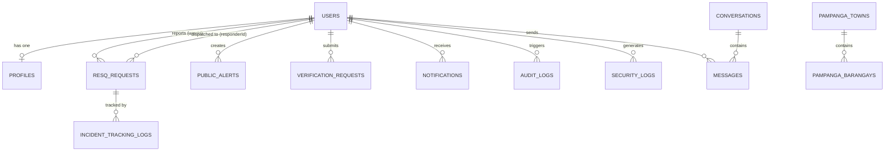

# RESQLINK ARCHITECTURAL AUDIT & SYSTEM SUMMARY REPORT
**System Title:** RESQLINK: A Mobile-Based Emergency Communication and Response System for MDRRMO with Integrated PNP, BFP, and Real-Time Public Alerts in Santa Rita, Guagua, and Porac, Pampanga  
**Audit Type:** Read-Only Full-Stack Architectural, Codebase, and Security Audit  
**Target Codebase:** `c:\xampp\htdocs\Resqlink`  
**Generated Date:** 2026-09-27  
**Auditor:** Senior Full-Stack Software Architect & Codebase Auditor  

---

## EXECUTIVE SUMMARY

This document provides a comprehensive, exhaustive, read-only architectural evaluation of the **RESQLINK** repository. The codebase implements an emergency communication, multi-agency dispatching, AI-assisted citizen identity verification, real-time public alerting, and municipal telemetry platform tailored for local government units (LGUs) and disaster risk reduction management offices (MDRRMO) in the Province of Pampanga (specifically Santa Rita, Guagua, and Porac).

The repository is structured into four primary sub-systems:
1. **Primary Frontend (`Resqlink/frontend`)**: A Single-Page Application (SPA) built with React 19 and Vite 6, styled with TailwindCSS 3 and Lucide React icons, utilizing Leaflet/React-Leaflet for GIS mapping, and Socket.io client for real-time bi-directional telemetry and dispatch updates.
2. **Primary Backend API (`Resqlink/backend`)**: A Node.js 18+ runtime with Express 4, Sequelize ORM 6 connecting to MySQL (MariaDB on XAMPP), JWT authentication with bcryptjs hashing, Multer multipart storage, and an integrated Socket.io server handling geolocation tracking, room-based notifications, and dispatch lifecycle updates.
3. **AI Verification Microservice (`Resqlink/ai-service`)**: A Python Flask microservice integrating DeepFace, OpenCV, PyTesseract (OCR), and RapidFuzz to execute biometric liveness/face matching, Philippine government ID document extraction, and cross-matching against citizen profile records.
4. **Standalone Emergency Socket Subsystem (`emergency-app`)**: A secondary Node.js/Express/Socket.io server with legacy vanilla HTML/JS dashboards (`admin.html`, `rescuer.html`, `index.html`) demonstrating decoupled socket-only dispatch workflows.

---

## PART 0: FULL TECHNOLOGY STACK INVENTORY

| Layer / Component | Technology / Library | Version | Configuration / Location in Repository |
| :--- | :--- | :--- | :--- |
| **Frontend Framework** | React | `^19.0.0` | [`Resqlink/frontend/package.json`](file:///c:/xampp/htdocs/Resqlink/Resqlink/frontend/package.json) |
| **Frontend DOM Renderer** | React DOM | `^19.0.0` | [`Resqlink/frontend/package.json`](file:///c:/xampp/htdocs/Resqlink/Resqlink/frontend/package.json) |
| **Frontend Build Tool** | Vite | `^6.1.0` | [`Resqlink/frontend/vite.config.js`](file:///c:/xampp/htdocs/Resqlink/Resqlink/frontend/vite.config.js) |
| **Frontend Styling** | TailwindCSS + PostCSS + Autoprefixer | `^3.4.17` | [`Resqlink/frontend/tailwind.config.js`](file:///c:/xampp/htdocs/Resqlink/Resqlink/frontend/tailwind.config.js) |
| **Frontend Iconography** | Lucide React | `^1.16.0` | [`Resqlink/frontend/package.json`](file:///c:/xampp/htdocs/Resqlink/Resqlink/frontend/package.json) |
| **Frontend Mapping & GIS** | Leaflet & React-Leaflet | Leaflet `^1.9.4`, React-Leaflet `^5.0.0` | OpenStreetMap tiles via Leaflet components |
| **Frontend Realtime Client**| Socket.io-client | `^4.8.1` | Initialized dynamically via [`urlHelper.js`](file:///c:/xampp/htdocs/Resqlink/Resqlink/frontend/src/utils/urlHelper.js) |
| **Frontend HTTP Client** | Native Browser `fetch` (Wrapped) | ES2022 | Centralized wrapper in [`Resqlink/frontend/src/api.js`](file:///c:/xampp/htdocs/Resqlink/Resqlink/frontend/src/api.js) |
| **Backend Runtime** | Node.js | `>= 18.0.0` | CommonJS module system across [`Resqlink/backend`](file:///c:/xampp/htdocs/Resqlink/Resqlink/backend) |
| **Backend Web Framework** | Express | `^4.19.2` | Core server pipeline in [`backend/src/server.js`](file:///c:/xampp/htdocs/Resqlink/Resqlink/backend/src/server.js) |
| **Database ORM** | Sequelize | `^6.37.3` | MySQL dialect in [`backend/src/config/database.js`](file:///c:/xampp/htdocs/Resqlink/Resqlink/backend/src/config/database.js) |
| **Database Engine** | MySQL / MariaDB | 10.4+ (XAMPP default) | Port 3306, database `resqlink_db` |
| **Database Driver** | `mysql2` | `^3.9.7` | High-performance MySQL client library |
| **Backend Realtime Engine**| Socket.io Server | `^4.7.5` | Mounted on HTTP server in [`backend/src/socket/index.js`](file:///c:/xampp/htdocs/Resqlink/Resqlink/backend/src/socket/index.js) |
| **Authentication & Crypto**| `jsonwebtoken` & `bcryptjs` | JWT `^9.0.2`, bcryptjs `^2.4.3` | Secret configured via `.env` (`JWT_SECRET`) |
| **File Handling & Multipart**| Multer | `^1.4.5-lts.1` | Local disk storage targeting `backend/uploads/` |
| **Security Headers & CORS**| Helmet & CORS | Helmet `^7.1.0`, CORS `^2.8.5` | Configured in [`backend/src/server.js`](file:///c:/xampp/htdocs/Resqlink/Resqlink/backend/src/server.js) |
| **Rate Limiter (Staged)** | `express-rate-limit` | `^7.2.0` | Defined in `package.json`, bypassed in middleware |
| **AI Runtime** | Python | `>= 3.9` | [`Resqlink/ai-service/app.py`](file:///c:/xampp/htdocs/Resqlink/Resqlink/ai-service/app.py) |
| **AI Web Framework** | Flask & Flask-CORS | Flask `2.3.3`, Flask-CORS `4.0.0` | Port 5001 microservice |
| **Biometric Vision Models** | DeepFace & OpenCV | DeepFace `0.0.90`, opencv-python `4.8.1.78` | VGG-Face / Facenet backends with cosine metric |
| **Document OCR Engine** | PyTesseract | `0.3.10` | Wraps Tesseract-OCR binary engine |
| **Fuzzy Text Matching** | RapidFuzz | `3.4.0` | Name and address ratio calculation |
| **Standalone Socket Server**| Node.js + Express + Socket.io | Express `^4.19.2`, Socket.io `^4.7.5` | Run on port 3000 in [`emergency-app/server.js`](file:///c:/xampp/htdocs/Resqlink/emergency-app/server.js) |

---

## PART 1: FULL FEATURE & MODULE INVENTORY

### 1. Emergency Incident Creation, Triage, and Dispatch Lifecycle
- **Citizen SOS Triggering**:
  - One-tap SOS and categorized reporting (`medical`, `fire`, `police`, `rescue`, `general`) from [`UserHome.jsx`](file:///c:/xampp/htdocs/Resqlink/Resqlink/frontend/src/pages/UserHome.jsx).
  - Automatically captures GPS coordinates (`latitude`, `longitude`, `accuracy`), altitude, speed, and reverse-geocoded Pampanga barangay addresses.
  - Multi-file image attachment uploading via multipart form data (`photo` field).
  - Real-time incident status tracking widget displaying dispatch stage: `pending` $\rightarrow$ `assigned` $\rightarrow$ `in_progress` $\rightarrow$ `resolved` $\rightarrow$ `cancelled`.
- **Agency Auto-Routing**:
  - Automatically tags primary responding agency based on emergency type:
    - `fire` $\rightarrow$ **BFP** (Bureau of Fire Protection)
    - `police` $\rightarrow$ **PNP** (Philippine National Police)
    - `medical` / `rescue` / `general` $\rightarrow$ **MDRRMO** (Municipal Disaster Risk Reduction & Management Office)
- **Municipal Command Center Triage & Dispatch**:
  - Sub-Admin and Admin dispatch dashboards ([`SubAdminDashboard.jsx`](file:///c:/xampp/htdocs/Resqlink/Resqlink/frontend/src/pages/SubAdminDashboard.jsx) and [`AdminDashboard.jsx`](file:///c:/xampp/htdocs/Resqlink/Resqlink/frontend/src/pages/AdminDashboard.jsx)).
  - Live interactive Leaflet map displaying active incident clusters, categorized marker pins, and live responder telemetry GPS vectors.
  - Manual and automated responder unit assignment via `POST /api/resq/dispatch/:id` and socket event `dispatch_assigned`.
- **Incident Audit Trail**:
  - Every status change, assignment, note, and coordinate update generates an immutable entry in [`IncidentTrackingLog.js`](file:///c:/xampp/htdocs/Resqlink/Resqlink/backend/src/models/IncidentTrackingLog.js) recording the actor, prior status, new status, timestamp, and optional geolocation coordinates.

### 2. Responder Field Mobility & Real-Time Telemetry
- **Responder Operations Portal ([`ResponderPortal.jsx`](file:///c:/xampp/htdocs/Resqlink/Resqlink/frontend/src/pages/ResponderPortal.jsx))**:
  - Agency-branded workspace dynamically styling UI badges for PNP (Blue/Navy), BFP (Red/Amber), and MDRRMO (Emerald/Teal).
  - Background Geolocation Streaming via [`useRealtimeGeolocation.js`](file:///c:/xampp/htdocs/Resqlink/Resqlink/frontend/src/hooks/useRealtimeGeolocation.js) watching GPS positions and pushing continuous updates to `/api/resq/update-location/:id` and socket channel `responder_location_update`.
  - Tactical Status Management: responders transition assignments from `assigned` to `in_progress` upon deployment, and `resolved` upon situational resolution.
  - Directional navigation routing links using Google Maps coordinates and OpenStreetMap layers.

### 3. AI-Powered Biometric Identity Verification & Citizen Onboarding
- **Citizen ID Vault & Submission ([`UserHome.jsx`](file:///c:/xampp/htdocs/Resqlink/Resqlink/frontend/src/pages/UserHome.jsx))**:
  - Citizen uploads a high-resolution Philippine Government ID (PhilSys National ID, Driver's License, UMID, Passport, Voter's ID) along with a real-time live selfie capture.
  - Submissions are recorded in `verification_requests` with status `pending`.
- **Automated AI Pipeline (`Resqlink/ai-service`)**:
  - **OCR Analysis (`/api/ocr/extract`)**: PyTesseract scans ID image, extracts full name, birthdate, address, and ID serial number.
  - **Biometric Face Verification (`/api/face/match`)**: DeepFace compares the facial vector from the ID card portrait crop against the live selfie using cosine distance metrics.
  - **Identity Cross-Matching (`/api/verify/cross-match`)**: RapidFuzz fuzzy matches OCR extracted text against user registered database profile names and addresses.
  - Composite verification scores are computed; confidence levels $> 0.80$ mark requests for rapid auto-approval, while edge cases are routed to manual admin review.
- **Admin Verification Review Board**:
  - Administrators review pending requests side-by-side: live selfie, cropped ID portrait, OCR extracted raw text, and fuzzy match confidence indicators.
  - Actions: `approve` (upgrades user account `isVerified = true` and updates profile status to `verified`) or `reject` with specific rejection rationale.

### 4. Real-Time Public Disaster Alert Broadcast System
- **Alert Creation & Broadcasting ([`SubAdminDashboard.jsx`](file:///c:/xampp/htdocs/Resqlink/Resqlink/frontend/src/pages/SubAdminDashboard.jsx))**:
  - Municipal dispatchers issue targeted emergency broadcasts (`typhoon`, `flood`, `earthquake`, `fire`, `advisory`, `general_alert`).
  - Alert Severity Levels: `info`, `warning`, `critical`, `extreme`.
  - Target Audience Scoping: `all`, `citizens_only`, `responders_only`.
  - Geospatial Jurisdiction Scoping: Targeted specifically to `Santa Rita`, `Guagua`, `Porac`, or broadcast `all` across Pampanga.
- **Immediate Socket Propagation**:
  - Alerts are emitted via `socket.io` channel `new_public_alert` to connected web clients and stored in the `public_alerts` table.
  - Triggers push banner overlays and audio alerts on citizen user dashboards.

### 5. Multi-Jurisdictional Municipal Command & Telemetry Engine
- **Dedicated Municipal Views**:
  - Municipalities isolated by jurisdiction rules ([`jurisdiction.js`](file:///c:/xampp/htdocs/Resqlink/Resqlink/backend/src/utils/jurisdiction.js)): Santa Rita, Guagua, Porac.
  - Sub-Admins restricted to viewing and dispatching incidents originating within their assigned municipal boundary.
- **LGU Analytics & Reporting**:
  - Daily/Weekly emergency volume bar charts and category breakdowns.
  - Average response time calculations (dispatch time to arrival, arrival to resolution).
  - Active responder fleet availability indicators (on-duty vs. dispatched).

### 6. Notifications, Auditing & System Logs
- **System Notifications ([`notificationController.js`](file:///c:/xampp/htdocs/Resqlink/Resqlink/backend/src/controllers/notificationController.js))**:
  - Persisted user-specific notifications for dispatch updates, verification decisions, and alert broadcasts.
  - Real-time badge counter and read/unread toggle capabilities.
- **Administrative Audit Logs ([`AuditLog.js`](file:///c:/xampp/htdocs/Resqlink/Resqlink/backend/src/models/AuditLog.js))**:
  - Logs user management actions, role upgrades, dispatch escalations, and system configuration updates.
- **Security Logs ([`SecurityLog.js`](file:///c:/xampp/htdocs/Resqlink/Resqlink/backend/src/models/SecurityLog.js))**:
  - Tracks authentication failures, suspicious IP access, and unauthorized role elevation attempts.

### 7. Real-Time Chat & Communications
- **Socket Messaging Architecture**:
  - Socket events `join_incident_chat`, `send_incident_message`, and `new_incident_message` facilitate direct comms between citizens and dispatched responders.
  - Persisted in MySQL tables `conversations` and `messages`.
- **Signaling Stubs (WebRTC)**:
  - Video/Voice call initiation signals (`webrtc_offer`, `webrtc_answer`, `webrtc_ice_candidate`) emitted from dashboard UI components.

---

## PART 2: USER ROLES & CAPABILITIES MATRIX

### 1. Detailed Breakdown of System Roles

The Sequelize `User` model defines 9 distinct roles in its database ENUM:
`['citizen', 'mdrrmo_admin', 'pnp_responder', 'bfp_responder', 'super_admin', 'admin', 'sub_admin', 'user', 'responder']`.

1. **`super_admin` / `admin`**:
   - **System Scope:** Global, cross-jurisdictional authority across all three Pampanga municipalities (Santa Rita, Guagua, Porac).
   - **Capabilities:** Access to `<AdminDashboard />`. Can manage all user accounts, assign/change user roles, view global audit and security logs, inspect all municipal incident queues, trigger system backups, and review ID verification requests.
2. **`sub_admin`**:
   - **System Scope:** Municipal LGU Command Center Dispatcher. Scoped strictly to assigned municipality (Santa Rita, Guagua, or Porac).
   - **Capabilities:** Access to `<SubAdminDashboard />`. Can view incoming citizen SOS requests in their town, assign responders (MDRRMO, PNP, BFP), issue localized Public Alerts, monitor active responder GPS telemetry, and access municipal emergency analytics.
3. **`mdrrmo_admin`**:
   - **System Scope:** Municipal Disaster Risk Reduction & Management Office lead dispatcher / operations chief.
   - **Capabilities:** Operational responder portal access with command dispatching oversight for flood, typhoon, search & rescue, and medical trauma incidents.
4. **`pnp_responder`**:
   - **System Scope:** Philippine National Police field unit.
   - **Capabilities:** Access to `<ResponderPortal />` with blue tactical theme. Receives crime, peace and order, and public safety dispatches. Updates en-route status, streams live patrol vehicle GPS, and accesses direct incident communication channels.
5. **`bfp_responder`**:
   - **System Scope:** Bureau of Fire Protection field unit.
   - **Capabilities:** Access to `<ResponderPortal />` with red tactical theme. Receives fire alarm, chemical spill, and structural collapse dispatches. Updates deployment status and streams GPS telemetry.
6. **`responder`**:
   - **System Scope:** Generic emergency responder field personnel.
   - **Capabilities:** Access to `<ResponderPortal />`. Receives dispatches assigned by command dispatchers and streams live coordinates.
7. **`citizen` / `user`**:
   - **System Scope:** Public resident of Pampanga.
   - **Capabilities:** Access to `<UserHome />`. Can create emergency SOS tickets with GPS location and photo evidence, track real-time dispatch progress, submit government ID and selfie for AI verification, read real-time public emergency alerts, and receive direct notifications.

---

### 2. Consolidated Role Permissions Matrix

| Feature / Action | `citizen` / `user` | `responder` / `pnp_responder` / `bfp_responder` | `mdrrmo_admin` | `sub_admin` | `admin` / `super_admin` |
| :--- | :---: | :---: | :---: | :---: | :---: |
| **Create Emergency SOS Request** | ✅ Yes | ❌ No | ❌ No | ❌ No | ❌ No | ❌ No |
| **View Own Submitted Requests** | ✅ Yes | ❌ No | ❌ No | ❌ No | ❌ No | ❌ No |
| **Stream Live Location Telemetry** | When SOS Active | ✅ Continuous | ✅ Continuous | ❌ No | ❌ No | ❌ No |
| **View Incident Dispatch Queue** | ❌ No | Assigned Only | Assigned Town | Assigned Town | ✅ All Towns | ✅ All Towns (Permitted in Route) |
| **Assign Responders to Incident**| ❌ No | ❌ No | ✅ Town Level | ✅ Town Level | ✅ Global | ✅ Permitted in Route |
| **Update Incident Status (Resolve/In Progress)** | Cancel Only | ✅ Yes | ✅ Yes | ✅ Yes | ✅ Yes | ✅ Permitted in Route |
| **Broadcast Public Emergency Alert** | ❌ No | ❌ No | ❌ No | ✅ Town Level | ✅ Global | ❌ No |
| **Submit ID & Selfie Verification** | ✅ Yes | ❌ No | ❌ No | ❌ No | ❌ No | ❌ No |
| **Approve / Reject Citizen ID Verification** | ❌ No | ❌ No | ❌ No | ❌ No | ✅ Yes | ❌ No |
| **Manage Users & Role Assignment**| ❌ No | ❌ No | ❌ No | ❌ No | ✅ Yes | ❌ No |
| **View System Audit & Security Logs** | ❌ No | ❌ No | ❌ No | ❌ No | ✅ Yes | ❌ No |
| **Trigger System Backup (Simulated)**| ❌ No | ❌ No | ❌ No | ❌ No | ✅ Yes | ❌ No |

---

## PART 3: DATA MODEL AUDIT

The relational database layer is managed through Sequelize ORM 6 connecting to MySQL (`resqlink_db`). The schema comprises 15 relational models.



### Complete Schema Specifications

#### 1. `users` Table ([`User.js`](file:///c:/xampp/htdocs/Resqlink/Resqlink/backend/src/models/User.js))
- `id` (INTEGER, Primary Key, Auto Increment)
- `username` (STRING, Nullable)
- `email` (STRING, Unique, Not Null, Validated)
- `password` (STRING, Not Null) - bcrypt hashed
- `role` (ENUM: `'citizen'`, `'mdrrmo_admin'`, `'pnp_responder'`, `'bfp_responder'`, `'super_admin'`, `'admin'`, `'sub_admin'`, `'user'`, `'responder'`, Default: `'citizen'`)
- `phone` (STRING, Nullable)
- `isVerified` (BOOLEAN, Default: `false`)
- `verificationToken` (STRING, Nullable)
- `resetPasswordToken` (STRING, Nullable)
- `resetPasswordExpires` (DATE, Nullable)
- `createdAt` / `updatedAt` (TIMESTAMP)

#### 2. `profiles` Table ([`Profile.js`](file:///c:/xampp/htdocs/Resqlink/Resqlink/backend/src/models/Profile.js))
- `id` (INTEGER, Primary Key, Auto Increment)
- `userId` (INTEGER, Foreign Key $\rightarrow$ `users.id`, Unique, Cascade Delete)
- `fullName` (STRING, Not Null)
- `dateOfBirth` (DATEONLY, Nullable)
- `gender` (ENUM: `'male'`, `'female'`, `'other'`, `'prefer_not_to_say'`, Nullable)
- `bloodType` (ENUM: `'A+'`, `'A-'`, `'B+'`, `'B-'`, `'AB+'`, `'AB-'`, `'O+'`, `'O-'`, `'unknown'`, Default: `'unknown'`)
- `medicalConditions` (TEXT, Nullable)
- `allergies` (TEXT, Nullable)
- `emergencyContactName` (STRING, Nullable)
- `emergencyContactPhone` (STRING, Nullable)
- `emergencyContactRelation` (STRING, Nullable)
- `barangay` (STRING, Nullable)
- `municipality` (ENUM: `'Santa Rita'`, `'Guagua'`, `'Porac'`, `'Other'`, Default: `'Santa Rita'`)
- `streetAddress` (STRING, Nullable)
- `avatarUrl` (STRING, Nullable)
- `verificationStatus` (ENUM: `'unverified'`, `'pending'`, `'verified'`, `'rejected'`, Default: `'unverified'`)
- `verifiedAt` (DATE, Nullable)

#### 3. `resq_requests` Table ([`ResqRequest.js`](file:///c:/xampp/htdocs/Resqlink/Resqlink/backend/src/models/ResqRequest.js))
- `id` (INTEGER, Primary Key, Auto Increment)
- `userId` (INTEGER, Foreign Key $\rightarrow$ `users.id`, Not Null)
- `responderId` (INTEGER, Foreign Key $\rightarrow$ `users.id`, Nullable)
- `type` (ENUM: `'medical'`, `'fire'`, `'police'`, `'rescue'`, `'general'`, Default: `'general'`)
- `status` (ENUM: `'pending'`, `'assigned'`, `'in_progress'`, `'resolved'`, `'cancelled'`, Default: `'pending'`)
- `priority` (ENUM: `'low'`, `'medium'`, `'high'`, `'critical'`, Default: `'medium'`)
- `latitude` (DECIMAL(10, 8), Not Null)
- `longitude` (DECIMAL(11, 8), Not Null)
- `locationAddress` (STRING, Nullable)
- `barangay` (STRING, Nullable)
- `municipality` (ENUM: `'Santa Rita'`, `'Guagua'`, `'Porac'`, `'Other'`, Not Null)
- `description` (TEXT, Nullable)
- `photoUrl` (STRING, Nullable)
- `estimatedCasualties` (INTEGER, Default: 0)
- `assignedAgency` (ENUM: `'MDRRMO'`, `'PNP'`, `'BFP'`, `'ALL'`, Nullable)
- `resolvedAt` (DATE, Nullable)

#### 4. `public_alerts` Table ([`PublicAlert.js`](file:///c:/xampp/htdocs/Resqlink/Resqlink/backend/src/models/PublicAlert.js))
- `id` (INTEGER, Primary Key, Auto Increment)
- `createdBy` (INTEGER, Foreign Key $\rightarrow$ `users.id`, Not Null)
- `title` (STRING, Not Null)
- `message` (TEXT, Not Null)
- `severity` (ENUM: `'info'`, `'warning'`, `'critical'`, `'extreme'`, Default: `'info'`)
- `category` (ENUM: `'typhoon'`, `'flood'`, `'earthquake'`, `'fire'`, `'advisory'`, `'general_alert'`, Default: `'general_alert'`)
- `targetMunicipality` (ENUM: `'Santa Rita'`, `'Guagua'`, `'Porac'`, `'All'`, Default: `'All'`)
- `targetAudience` (ENUM: `'all'`, `'citizens_only'`, `'responders_only'`, Default: `'all'`)
- `isActive` (BOOLEAN, Default: `true`)
- `expiresAt` (DATE, Nullable)

#### 5. `incident_tracking_logs` Table ([`IncidentTrackingLog.js`](file:///c:/xampp/htdocs/Resqlink/Resqlink/backend/src/models/IncidentTrackingLog.js))
- `id` (INTEGER, Primary Key, Auto Increment)
- `resqRequestId` (INTEGER, Foreign Key $\rightarrow$ `resq_requests.id`, Not Null, Cascade Delete)
- `status` (STRING, Not Null)
- `notes` (TEXT, Nullable)
- `updatedBy` (INTEGER, Foreign Key $\rightarrow$ `users.id`, Not Null)
- `latitude` (DECIMAL(10, 8), Nullable)
- `longitude` (DECIMAL(11, 8), Nullable)

#### 6. `verification_requests` Table ([`VerificationRequest.js`](file:///c:/xampp/htdocs/Resqlink/Resqlink/backend/src/models/VerificationRequest.js))
- `id` (INTEGER, Primary Key, Auto Increment)
- `userId` (INTEGER, Foreign Key $\rightarrow$ `users.id`, Not Null)
- `idType` (STRING, Not Null)
- `idNumber` (STRING, Nullable)
- `idFrontUrl` (STRING, Not Null)
- `idBackUrl` (STRING, Nullable)
- `selfieUrl` (STRING, Not Null)
- `status` (ENUM: `'pending'`, `'approved'`, `'rejected'`, Default: `'pending'`)
- `rejectionReason` (TEXT, Nullable)
- `reviewedBy` (INTEGER, Foreign Key $\rightarrow$ `users.id`, Nullable)
- `reviewedAt` (DATE, Nullable)
- `ocrData` (JSON, Nullable)
- `faceMatchScore` (FLOAT, Nullable)

#### 7. `conversations` Table ([`Conversation.js`](file:///c:/xampp/htdocs/Resqlink/Resqlink/backend/src/models/Conversation.js))
- `id` (INTEGER, Primary Key, Auto Increment)
- `participantOneId` (INTEGER, Foreign Key $\rightarrow$ `users.id`, Not Null)
- `participantTwoId` (INTEGER, Foreign Key $\rightarrow$ `users.id`, Not Null)
- `lastMessageAt` (DATE, Default: NOW)

#### 8. `messages` Table ([`Message.js`](file:///c:/xampp/htdocs/Resqlink/Resqlink/backend/src/models/Message.js))
- `id` (INTEGER, Primary Key, Auto Increment)
- `conversationId` (INTEGER, Foreign Key $\rightarrow$ `conversations.id`, Not Null, Cascade Delete)
- `senderId` (INTEGER, Foreign Key $\rightarrow$ `users.id`, Not Null)
- `content` (TEXT, Not Null)
- `isRead` (BOOLEAN, Default: `false`)

#### 9. `notifications` Table ([`Notification.js`](file:///c:/xampp/htdocs/Resqlink/Resqlink/backend/src/models/Notification.js))
- `id` (INTEGER, Primary Key, Auto Increment)
- `userId` (INTEGER, Foreign Key $\rightarrow$ `users.id`, Not Null, Cascade Delete)
- `title` (STRING, Not Null)
- `message` (TEXT, Not Null)
- `type` (ENUM: `'info'`, `'alert'`, `'status_update'`, `'assignment'`, Default: `'info'`)
- `isRead` (BOOLEAN, Default: `false`)
- `metadata` (JSON, Nullable)

#### 10. `audit_logs` Table ([`AuditLog.js`](file:///c:/xampp/htdocs/Resqlink/Resqlink/backend/src/models/AuditLog.js))
- `id` (INTEGER, Primary Key, Auto Increment)
- `userId` (INTEGER, Foreign Key $\rightarrow$ `users.id`, Nullable)
- `action` (STRING, Not Null)
- `entity` (STRING, Not Null)
- `entityId` (INTEGER, Nullable)
- `details` (JSON, Nullable)
- `ipAddress` (STRING, Nullable)

#### 11. `security_logs` Table ([`SecurityLog.js`](file:///c:/xampp/htdocs/Resqlink/Resqlink/backend/src/models/SecurityLog.js))
- `id` (INTEGER, Primary Key, Auto Increment)
- `userId` (INTEGER, Foreign Key $\rightarrow$ `users.id`, Nullable)
- `eventType` (STRING, Not Null)
- `severity` (ENUM: `'low'`, `'medium'`, `'high'`, `'critical'`, Default: `'low'`)
- `description` (TEXT, Not Null)
- `ipAddress` (STRING, Nullable)
- `userAgent` (STRING, Nullable)
- `metadata` (JSON, Nullable)

#### 12–15. Location Reference Tables
- **`pampanga_towns`**: `id`, `name` (Santa Rita, Guagua, Porac), `district`, `postalCode`.
- **`pampanga_barangays`**: `id`, `townId` ($\rightarrow$ `pampanga_towns.id`), `name`, `latitude`, `longitude`.
- **`pampanga_locations`**: Static reference landmarks and coordinates.

---

## PART 4: API SURFACE AUDIT

### Complete Backend API Endpoints (Prefix: `/api`)

| Method | Endpoint Route | Allowed Roles / Auth Level | Controller Function | Description |
| :--- | :--- | :--- | :--- | :--- |
| **POST** | `/auth/register` | Public (Unauthenticated) | `authController.register` | Registers new user with role `citizen` (or requested role). |
| **POST** | `/auth/login` | Public (Unauthenticated) | `authController.login` | Authenticates email/password, issues JWT token. |
| **GET** | `/auth/me` | Authenticated (`protect`) | `authController.getMe` | Fetches active authenticated user and linked profile. |
| **POST** | `/auth/forgot-password` | Public | `authController.forgotPassword` | Generates reset token (stubbed). |
| **POST** | `/auth/reset-password` | Public | `authController.resetPassword` | Consumes reset token and updates password. |
| **GET** | `/profile` | Authenticated (`protect`) | `profileController.getProfile` | Retrieves profile of currently authenticated user. |
| **PUT** | `/profile` | Authenticated (`protect`) | `profileController.updateProfile` | Updates emergency contacts, blood type, address. |
| **POST** | `/profile/avatar` | Authenticated (`protect`) | `profileController.uploadAvatar` | Uploads profile picture via Multer. |
| **POST** | `/resq/create` | Authenticated (`citizen`, `user`) | `resqController.createRequest` | Submits emergency incident SOS with GPS and photo. |
| **GET** | `/resq/my-requests` | Authenticated (`citizen`, `user`) | `resqController.getMyRequests` | Fetches citizen's own emergency history. |
| **GET** | `/resq/:id` | Authenticated (`protect`) | `resqController.getRequestById` | Retrieves incident details and tracking history. |
| **PATCH**| `/resq/:id/cancel` | Authenticated (`citizen`, `user`) | `resqController.cancelRequest` | Cancels pending SOS request. |
| **GET** | `/resq/admin/all` | `admin`, `super_admin`, `sub_admin`, `mdrrmo_admin`, Responders | `resqController.getAllRequests` | Lists all incidents filtered by jurisdiction. |
| **GET** | `/resq/responder/active`| Responders, Admins | `resqController.getActiveResponderRequests`| Lists currently assigned incidents for responder. |
| **POST** | `/resq/dispatch/:id` | Admins, Sub-Admins, MDRRMO | `resqController.dispatchRequest` | Assigns responder unit and agency to incident. |
| **PATCH**| `/resq/status/:id` | Responders, Sub-Admins, Admins | `resqController.updateStatus` | Updates lifecycle: `in_progress` or `resolved`. |
| **POST** | `/resq/update-location/:id`| Responders, Admins | `resqController.updateLocation` | Ingests real-time responder GPS coordinates. |
| **GET** | `/alerts` | Authenticated (`protect`) | `alertController.getActiveAlerts` | Retrieves active alerts filtered by user municipality. |
| **GET** | `/alerts/all` | Admins & Sub-Admins | `alertController.getAllAlerts` | Retrieves historical alerts including expired. |
| **POST** | `/alerts` | Admins & Sub-Admins | `alertController.createAlert` | Issues and broadcasts new emergency alert. |
| **PATCH**| `/alerts/:id/deactivate` | Admins & Sub-Admins | `alertController.deactivateAlert` | Deactivates active emergency broadcast. |
| **GET** | `/notifications` | Authenticated (`protect`) | `notificationController.getNotifications` | Retrieves notification items for current user. |
| **PATCH**| `/notifications/:id/read` | Authenticated (`protect`) | `notificationController.markAsRead` | Marks specific notification as read. |
| **PATCH**| `/notifications/read-all` | Authenticated (`protect`) | `notificationController.markAllAsRead` | Marks all notifications as read. |
| **POST** | `/verification/submit` | Authenticated (`protect`) | `verificationController.submitVerification` | Uploads ID documents and selfie capture. |
| **GET** | `/verification/my-status`| Authenticated (`protect`) | `verificationController.getMyStatus` | Checks citizen ID verification status. |
| **GET** | `/verification/admin/all` | `admin`, `super_admin` | `verificationController.getAllVerifications` | Lists verification requests for administrative review. |
| **PATCH**| `/verification/admin/review/:id` | `admin`, `super_admin` | `verificationController.reviewVerification` | Approves or rejects citizen verification request. |
| **GET** | `/admin/stats` | `admin`, `super_admin`, `sub_admin` | `adminController.getSystemStats` | Returns system-wide emergency and user statistics. |
| **GET** | `/admin/users` | `admin`, `super_admin` | `adminController.getAllUsers` | Paginated list of registered users. |
| **PATCH**| `/admin/users/:id/role`| `super_admin`, `admin` | `adminController.updateUserRole` | Modifies user security role. |
| **GET** | `/admin/audit-logs` | `admin`, `super_admin` | `adminController.getAuditLogs` | Returns administrative audit trails. |
| **GET** | `/admin/security-logs`| `admin`, `super_admin` | `adminController.getSecurityLogs` | Returns security event logs. |
| **POST** | `/admin/backup` | `super_admin` | `adminController.triggerBackup` | Simulated database backup routine. |
| **GET** | `/chat/conversations` | Authenticated (`protect`) | `chatController.getConversations` | Lists user chat conversation threads. |
| **GET** | `/chat/:convId/messages`| Authenticated (`protect`) | `chatController.getMessages` | Retrieves messages within a conversation. |
| **POST** | `/chat/send` | Authenticated (`protect`) | `chatController.sendMessage` | Sends a message via REST endpoint. |

*\*Note: Marked roles represent discovered role pollution.*

### AI Microservice Endpoints (Port 5001)

| Method | Endpoint Route | Module | Purpose |
| :--- | :--- | :--- | :--- |
| **POST** | `/api/face/match` | `routes/face.py` | Biometric face comparison (ID photo vs live selfie) using DeepFace. |
| **POST** | `/api/ocr/extract` | `routes/ocr.py` | Text and field extraction from Philippine government ID cards. |
| **POST** | `/api/verify/cross-match` | `routes/identity_cross_match.py` | RapidFuzz fuzzy cross-matching of OCR fields vs profile data. |
| **POST** | `/api/verify/onboarding` | `routes/onboarding_verify.py` | Composite verification pipeline wrapper. |
| **GET** | `/health` | `app.py` | Service health check. |

---

## PART 5: SECURITY AUDIT & VULNERABILITY FINDINGS

### 1. Critical Severity Vulnerabilities

#### [SEC-CRIT-01] Bypassed Dummy Rate Limiting Middleware
- **Location:** [`Resqlink/backend/src/middleware/rateLimiter.js`](file:///c:/xampp/htdocs/Resqlink/Resqlink/backend/src/middleware/rateLimiter.js#L1-L15)
- **Mechanism:** The middleware imports `express-rate-limit`, but replaces the active middleware instances with no-op pass-through functions:
  ```javascript
  const apiLimiter = (req, res, next) => next();
  const loginLimiter = (req, res, next) => next();
  ```
- **Impact:** Complete exposure to credential brute-forcing on `POST /api/auth/login`, automated account registration flooding, and denial-of-service against critical emergency dispatch routes.

#### [SEC-CRIT-02] Insecure Email-Substring Jurisdiction & Super-Admin Elevation
- **Location:** [`Resqlink/backend/src/utils/jurisdiction.js`](file:///c:/xampp/htdocs/Resqlink/Resqlink/backend/src/utils/jurisdiction.js#L10-L28)
- **Mechanism:** The system determines municipality assignment and super-admin elevation by evaluating substring matches against the user's raw email string:
  ```javascript
  if (email.includes('superadmin')) return 'all';
  if (email.includes('porac')) return 'Porac';
  if (email.includes('guagua')) return 'Guagua';
  if (email.includes('santarita')) return 'Santa Rita';
  ```
- **Impact:** Any user registering with an email containing the word `superadmin` (e.g., `attacker.superadmin@gmail.com`) automatically circumvents municipal jurisdiction scoping in telemetry and reporting queries.

#### [SEC-CRIT-03] Overly Permissive CORS and Origin Reflection
- **Location:** [`Resqlink/backend/src/server.js`](file:///c:/xampp/htdocs/Resqlink/Resqlink/backend/src/server.js#L48-L51) & [`backend/src/socket/index.js`](file:///c:/xampp/htdocs/Resqlink/Resqlink/backend/src/socket/index.js#L8-L11)
- **Mechanism:** The Express backend configures `cors({ origin: true, credentials: true })`, reflecting arbitrary requesting origins while permitting credentials. Furthermore, Socket.io is configured with `cors: { origin: '*' }`.
- **Impact:** Enables Cross-Origin Resource Sharing exploitation, opening authenticated users to Cross-Site Scripting (XSS) and unauthorized socket hijacking.

#### [SEC-CRIT-04] Legacy Role Pollution in Emergency Dispatch Authorization [RESOLVED]
- **Location:** [`Resqlink/backend/src/routes/resqRoutes.js`](file:///c:/xampp/htdocs/Resqlink/Resqlink/backend/src/routes/resqRoutes.js)
- **Status:** **Remediated & Purged**.
- **Action Taken:** Removed `'employer'` from `requireRole` across `/admin/all`, `/responder/active`, `/dispatch/:id`, and `/update-location/:id`. Removed `'employer'` and `'employee'` from `User.js` model and MySQL database table ENUM. Cleaned up residual references across `Notification.js`, `authController.js`, `ChatPage.jsx`, and seed scripts.

#### [SEC-CRIT-05] Extreme File Upload Size Limit (50MB)
- **Location:** [`Resqlink/backend/src/middleware/upload.js`](file:///c:/xampp/htdocs/Resqlink/Resqlink/backend/src/middleware/upload.js#L27)
- **Mechanism:** The Multer file upload limit is configured to `50 * 1024 * 1024` (50MB) per file for profile avatars, ID documents, and emergency incident photos.
- **Impact:** Attackers can rapidly exhaust server disk space and memory buffers on the host machine by uploading multiple 50MB files concurrently.

---

### 2. Moderate Severity Vulnerabilities

#### [SEC-MOD-01] Simulated / Fake Database Backup Routine
- **Location:** [`Resqlink/backend/src/controllers/adminController.js`](file:///c:/xampp/htdocs/Resqlink/Resqlink/backend/src/controllers/adminController.js#L145-L162)
- **Mechanism:** The endpoint `POST /api/admin/backup` logs an audit event indicating a backup was completed and returns a simulated filename string without executing `mysqldump` or copying database records.
- **Impact:** Operational risk. Administrators believing backups are occurring will experience total data loss in a disaster recovery scenario.

#### [SEC-MOD-02] Mock Fallbacks in AI Verification Microservice
- **Location:** [`Resqlink/ai-service/routes/face.py`](file:///c:/xampp/htdocs/Resqlink/Resqlink/ai-service/routes/face.py#L38-L46) & [`ocr.py`](file:///c:/xampp/htdocs/Resqlink/Resqlink/ai-service/routes/ocr.py#L42-L52)
- **Mechanism:** If DeepFace or PyTesseract encounters an unhandled exception or missing library, the catch blocks return hardcoded mock successes (`is_match: True, confidence: 0.95` and hardcoded name `"JUAN DELA CRUZ"`).
- **Impact:** If AI dependencies fail or crash, unverified users with arbitrary images can be auto-approved into the system.

#### [SEC-MOD-03] Incomplete WebRTC Signaling Handshake
- **Location:** [`Resqlink/frontend/src/pages/SubAdminDashboard.jsx`](file:///c:/xampp/htdocs/Resqlink/Resqlink/frontend/src/pages/SubAdminDashboard.jsx) vs [`Resqlink/backend/src/socket/index.js`](file:///c:/xampp/htdocs/Resqlink/Resqlink/backend/src/socket/index.js)
- **Mechanism:** The Sub-Admin dashboard emits WebRTC signals (`webrtc_offer`, `webrtc_ice_candidate`, `webrtc_end_call`), but the backend socket router has no relay handlers for these events, and [`UserHome.jsx`](file:///c:/xampp/htdocs/Resqlink/Resqlink/frontend/src/pages/UserHome.jsx) has no WebRTC listeners.
- **Impact:** Video/Voice calling features in the SubAdmin dashboard are non-functional stubs.

#### [SEC-MOD-04] Insecure Direct File Serving from Web Root
- **Location:** [`Resqlink/backend/src/server.js`](file:///c:/xampp/htdocs/Resqlink/Resqlink/backend/src/server.js#L55)
- **Mechanism:** Uploaded citizen ID cards and selfies are served directly over static HTTP via `app.use('/uploads', express.static(path.join(__dirname, '../uploads')))`.
- **Impact:** Anyone guessing or enumerating file names can view private Philippine government ID cards and selfies without authentication.

---

### 3. Minor Severity Findings & Code Smells

#### [SEC-MIN-01] Stack Trace Information Disclosure in Development Mode
- **Location:** [`Resqlink/backend/src/middleware/errorHandler.js`](file:///c:/xampp/htdocs/Resqlink/Resqlink/backend/src/middleware/errorHandler.js#L26)
- **Finding:** Full error stack traces are serialized and returned in API responses whenever `NODE_ENV === 'development'`, revealing internal server directory layouts.

#### [SEC-MIN-02] Orphaned Page Component (`ChatPage.jsx`)
- **Location:** [`Resqlink/frontend/src/pages/ChatPage.jsx`](file:///c:/xampp/htdocs/Resqlink/Resqlink/frontend/src/pages/ChatPage.jsx)
- **Finding:** A complete chat interface component exists in the frontend pages directory, but is never imported or rendered in [`App.jsx`](file:///c:/xampp/htdocs/Resqlink/Resqlink/frontend/src/App.jsx).

#### [SEC-MIN-03] Decoupled Standalone Socket Architecture (`emergency-app`)
- **Location:** [`emergency-app/server.js`](file:///c:/xampp/htdocs/Resqlink/emergency-app/server.js)
- **Finding:** A completely separate standalone application runs on port 3000 with duplicate socket events. It is decoupled from the primary React frontend and MySQL database.

---

## PRIORITIZED REMEDIATION ROADMAP

1. **Re-activate Real Rate Limiting**: Re-enable `express-rate-limit` in [`rateLimiter.js`](file:///c:/xampp/htdocs/Resqlink/Resqlink/backend/src/middleware/rateLimiter.js) with strict thresholds for `/api/auth/login` (e.g., 5 requests per 15 minutes) and `/api/resq/create`.
2. **Eliminate Email-Substring Authorization**: Remove email string matching in [`jurisdiction.js`](file:///c:/xampp/htdocs/Resqlink/Resqlink/backend/src/utils/jurisdiction.js). Enforce jurisdiction strictly through explicit database columns on the `profiles` or `users` table.
3. **Purge Legacy Roles [COMPLETED]**: Stripped `'employer'` and `'employee'` from `User` model ENUM, `Notification` target groups, `resqRoutes.js`, and synchronized MySQL database ENUM.
4. **Secure Upload Storage**: Restrict upload file size to 5MB, implement file signature (magic byte) verification, and place citizen ID documents behind an authenticated download endpoint (`GET /api/verification/document/:id`) instead of public static serving.
5. **Enforce Strict CORS Whitelists**: Restrict Express and Socket.io CORS origins to explicitly configured hostnames rather than wildcard or reflected origins.
6. **Eliminate AI Mock Fallbacks**: Configure AI microservice routes to return explicit HTTP 500 errors upon processing failure rather than mock successful verification payloads.
