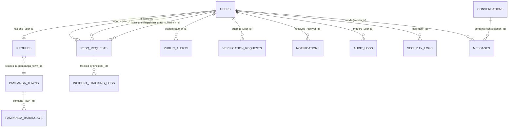

# RESQLINK SYSTEM ARCHITECTURAL & CODEBASE AUDIT REPORT (AUDIT 2)

**System Name:** RESQLINK: A Mobile-Based Emergency Communication and Response System for MDRRMO with Integrated PNP, BFP, and Real-Time Public Alerts in Santa Rita, Guagua, and Porac, Pampanga  
**Audit Type:** Read-Only Full-Stack Architectural, Codebase, and Security Audit  
**Target Codebase:** `c:\xampp\htdocs\Resqlink`  
**Generated Date:** 2026-09-27  
**Auditor:** Senior Full-Stack Software Architect & Codebase Auditor  

---

## EXECUTIVE SUMMARY

This report delivers an exhaustive, factual, read-only architectural, functional, and security audit of the **RESQLINK** codebase. RESQLINK is designed as an emergency dispatch, citizen SOS alerting, multi-agency municipal coordination (MDRRMO, PNP, BFP), and AI-driven identity verification platform tailored for three local government units (LGUs) in Pampanga: **Santa Rita**, **Guagua**, and **Porac**.

### Overall System Architecture
The repository is composed of four principal subsystems:
1. **Primary Frontend Client (`Resqlink/frontend`)**: A React 18 Single-Page Application (SPA) bundled via Vite 5, styled with TailwindCSS 3 and Lucide React icons, employing Leaflet and React-Leaflet for GIS rendering, Recharts for municipal telemetry analytics, and Socket.io-client for bi-directional live GPS tracking and dispatch state synchronization.
2. **Primary Backend API (`Resqlink/backend`)**: A Node.js runtime with Express 4, Sequelize ORM 6 connecting to MySQL / MariaDB (`resqlink_db`), JSON Web Token (JWT) authentication with bcrypt password hashing, Multer multipart storage for incident evidence and citizen identification documents, and an integrated Socket.io server on port 3000 handling high-frequency telemetry pings and room-based broadcasting.
3. **AI Biometric & OCR Microservice (`Resqlink/ai-service`)**: A standalone Python Flask microservice (port 5001) that leverages DeepFace, OpenCV, PyTesseract (Tesseract OCR), and RapidFuzz to execute face matching between citizen live selfies and government-issued ID card portraits, text extraction from Philippine ID cards, and fuzzy name/address verification against database profile records.
4. **Decoupled Telemetry NOC (`emergency-app`)**: A secondary standalone Express and Socket.io server running on port 4000 (or port 3000 in its default script) with legacy static vanilla HTML/JS dashboards (`admin.html`, `rescuer.html`, `index.html`) demonstrating standalone socket dispatch flows.

### Headline Findings & Security Posture
- **Critical Security Concerns Remaining:**
  1. *Rate Limiting Ineffective*: The Express rate limiter in `middleware/rateLimiter.js` bypasses enforcement by executing dummy pass-through functions `(req, res, next) => next()`, leaving `/api/auth/login` and `/api/resq/create` open to automated brute-forcing.
  2. *Unauthenticated Profile Disclosure (IDOR)*: Routes `GET /api/profile/:userId`, `GET /api/profile/user/:userId`, and `GET /api/users/:id/reputation` have no authentication middleware, allowing any unauthenticated network caller to harvest full citizen profiles, blood types, medical history, and contact numbers.
  3. *Unauthorized Sub-Admin Account Creation*: `POST /api/auth/sub-admin` is guarded only by `authenticate`, but lacks role checks (`requireRole('admin', 'super_admin')`), allowing any authenticated citizen to provision municipal sub-admin accounts.
  4. *Email Substring Jurisdiction Scoping*: Municipal command center filtering in `utils/jurisdiction.js` evaluates raw email string substrings (`.includes('superadmin')`, `.includes('porac')`, etc.), enabling arbitrary users to manipulate administrative scope by crafting specific email addresses.
  5. *Permissive CORS & Socket Wildcards*: Backend Express CORS reflects arbitrary origins with credentials enabled (`origin: true, credentials: true`), and Socket.io allows wildcard origins (`origin: '*'`).

---

## PART 0: TECHNOLOGY STACK INVENTORY

| Layer | Technology | Version | Notes / Location in Codebase |
| :--- | :--- | :--- | :--- |
| **Frontend Framework** | React | `^18.2.0` | [`Resqlink/frontend/package.json`](file:///c:/xampp/htdocs/Resqlink/Resqlink/frontend/package.json) |
| **Frontend DOM Renderer** | React DOM | `^18.2.0` | [`Resqlink/frontend/package.json`](file:///c:/xampp/htdocs/Resqlink/Resqlink/frontend/package.json) |
| **Frontend Build Tool** | Vite | `^5.0.8` | Configured with `@vitejs/plugin-react` `^4.2.1` in [`vite.config.js`](file:///c:/xampp/htdocs/Resqlink/Resqlink/frontend/vite.config.js) |
| **Frontend Styling** | TailwindCSS + PostCSS + Autoprefixer | `^3.4.1` | Configured with custom palette in [`tailwind.config.js`](file:///c:/xampp/htdocs/Resqlink/Resqlink/frontend/tailwind.config.js) |
| **Frontend Iconography** | Lucide React | `^0.294.0` | Multi-agency emergency and tactical icon set |
| **Frontend Mapping & GIS** | Leaflet & React-Leaflet | Leaflet `^1.9.4`, React-Leaflet `^4.2.1` | Renders OpenStreetMap tiles, incident markers, and responder tracks |
| **Frontend Data Visualization** | Recharts | `^2.15.4` | Renders dispatch response times and incident volume metrics |
| **Frontend Document Export** | jsPDF & html2canvas | jsPDF `^4.2.1`, html2canvas `^1.4.1` | Generates downloadable incident reports and verification dossiers |
| **Frontend Realtime Client** | Socket.io-client | `^4.6.2` | Bi-directional WebSocket client in [`urlHelper.js`](file:///c:/xampp/htdocs/Resqlink/Resqlink/frontend/src/utils/urlHelper.js) |
| **Frontend HTTP Client** | Axios | `^1.6.2` | Configured with JWT bearer interceptor in [`Resqlink/frontend/src/api.js`](file:///c:/xampp/htdocs/Resqlink/Resqlink/frontend/src/api.js) |
| **Backend Runtime** | Node.js | `>= 18.0.0` (Bundled: `v20.11.0`) | Bundled runtime located in `Resqlink/node-v20.11.0-win-x64/` |
| **Backend Web Framework** | Express | `^4.18.2` | Core REST pipeline in [`backend/src/app.js`](file:///c:/xampp/htdocs/Resqlink/Resqlink/backend/src/app.js) |
| **Async Middleware** | `express-async-errors` | `^3.1.1` | Eliminates manual `try/catch` wrapping in route handlers |
| **Database ORM** | Sequelize | `^6.35.2` | MySQL dialect in [`backend/src/config/database.js`](file:///c:/xampp/htdocs/Resqlink/Resqlink/backend/src/config/database.js) |
| **Database Engine** | MySQL / MariaDB | 10.4+ (XAMPP default) | Port 3306, database `resqlink_db` via `mysql2` `^3.6.5` |
| **Realtime Engine** | Socket.io Server | `^4.6.2` | Mounted on HTTP server in [`backend/src/socket/index.js`](file:///c:/xampp/htdocs/Resqlink/Resqlink/backend/src/socket/index.js) |
| **Authentication & Crypto** | `jsonwebtoken` & `bcryptjs` | JWT `^9.0.2`, bcryptjs `^2.4.3` | Dual token architecture (access token + refresh token) |
| **File Handling & Multipart** | Multer | `^1.4.5-lts.1` | Disk storage storing files into `backend/uploads/` |
| **Image Processing (Node)** | Jimp | `^0.22.12` | Server-side image resizing and pixel-diff facial distance calculations |
| **Validation Libraries** | Joi & `express-validator` | Joi `^17.11.0`, express-validator `^7.0.1` | Present in package manifest; validation largely manual in controllers |
| **Task Scheduling** | `node-cron` | `^3.0.3` | Periodic background task scheduling |
| **Email Transporter** | Nodemailer | `^6.9.7` | Configured for transactional SMTP notifications |
| **Logging & Telemetry** | Winston & Morgan | Winston `^3.11.0`, Morgan `^1.10.0` | Daily rotate file logging in `backend/logs/` |
| **AI Web Framework** | Python Flask & Flask-CORS | Flask `2.3.3`, Flask-CORS `4.0.0` | Port 5001 microservice in [`Resqlink/ai-service/app.py`](file:///c:/xampp/htdocs/Resqlink/Resqlink/ai-service/app.py) |
| **Biometric Vision Models** | DeepFace & OpenCV | DeepFace `0.0.90`, opencv-python `4.8.1.78` | VGG-Face / Facenet backends with cosine distance thresholding |
| **Document OCR Engine** | PyTesseract | `0.3.10` | Python wrapper around Google Tesseract-OCR binary engine |
| **Fuzzy Text Matching** | RapidFuzz | `3.4.0` | String similarity scoring between OCR extracted text and database profile |
| **Startup Automation** | PowerShell & Batch | Windows PowerShell 5.1+ | Multi-process launcher in [`Resqlink/start.ps1`](file:///c:/xampp/htdocs/Resqlink/Resqlink/start.ps1) |

---

## PART 1: FULL FEATURE & MODULE INVENTORY

### Module Summary Table

| Module Name | Summary | Status | Key Files |
| :--- | :--- | :---: | :--- |
| **1. Emergency Incident SOS & Dispatch** | Citizen SOS ticket generation, GPS geo-tagging, multi-agency triage (MDRRMO, PNP, BFP), dispatch lifecycle management, and immutable tracking audit logs. | **Complete** | [`resqRoutes.js`](file:///c:/xampp/htdocs/Resqlink/Resqlink/backend/src/routes/resqRoutes.js), [`resqController.js`](file:///c:/xampp/htdocs/Resqlink/Resqlink/backend/src/controllers/resqController.js), [`ResqRequest.js`](file:///c:/xampp/htdocs/Resqlink/Resqlink/backend/src/models/ResqRequest.js), [`IncidentTrackingLog.js`](file:///c:/xampp/htdocs/Resqlink/Resqlink/backend/src/models/IncidentTrackingLog.js), [`UserHome.jsx`](file:///c:/xampp/htdocs/Resqlink/Resqlink/frontend/src/pages/UserHome.jsx), [`SubAdminDashboard.jsx`](file:///c:/xampp/htdocs/Resqlink/Resqlink/frontend/src/pages/SubAdminDashboard.jsx) |
| **2. Field Responder Telemetry** | High-frequency 1Hz GPS coordinate streaming from mobile responders, tactical agency badging, live responder map vectoring, and status progression (`assigned` $\rightarrow$ `in_progress` $\rightarrow$ `resolved`). | **Complete** | [`telemetryService.js`](file:///c:/xampp/htdocs/Resqlink/Resqlink/backend/src/services/telemetryService.js), [`socket/index.js`](file:///c:/xampp/htdocs/Resqlink/Resqlink/backend/src/socket/index.js), [`ResponderPortal.jsx`](file:///c:/xampp/htdocs/Resqlink/Resqlink/frontend/src/pages/ResponderPortal.jsx), [`useRealtimeGeolocation.js`](file:///c:/xampp/htdocs/Resqlink/Resqlink/frontend/src/hooks/useRealtimeGeolocation.js) |
| **3. AI Biometric Identity Verification** | Citizen onboarding verification using DeepFace facial similarity, PyTesseract OCR extraction of Philippine Government IDs, RapidFuzz cross-matching against database profile, and administrative approval queues. | **Complete** | [`verificationRoutes.js`](file:///c:/xampp/htdocs/Resqlink/Resqlink/backend/src/routes/verificationRoutes.js), [`verificationController.js`](file:///c:/xampp/htdocs/Resqlink/Resqlink/backend/src/controllers/verificationController.js), [`ai-service/app.py`](file:///c:/xampp/htdocs/Resqlink/Resqlink/ai-service/app.py), [`routes/face.py`](file:///c:/xampp/htdocs/Resqlink/Resqlink/ai-service/routes/face.py), [`routes/ocr.py`](file:///c:/xampp/htdocs/Resqlink/Resqlink/ai-service/routes/ocr.py), [`AdminDashboard.jsx`](file:///c:/xampp/htdocs/Resqlink/Resqlink/frontend/src/pages/AdminDashboard.jsx) |
| **4. Real-Time Public Disaster Alerts** | Targeted municipal broadcast alerts (typhoon, flood, earthquake, fire) with severity levels (`info`, `warning`, `critical`, `extreme`), municipal scoping, and WebSocket broadcasting. | **Complete** | [`alertRoutes.js`](file:///c:/xampp/htdocs/Resqlink/Resqlink/backend/src/routes/alertRoutes.js), [`alertController.js`](file:///c:/xampp/htdocs/Resqlink/Resqlink/backend/src/controllers/alertController.js), [`PublicAlert.js`](file:///c:/xampp/htdocs/Resqlink/Resqlink/backend/src/models/PublicAlert.js), [`SubAdminDashboard.jsx`](file:///c:/xampp/htdocs/Resqlink/Resqlink/frontend/src/pages/SubAdminDashboard.jsx), [`UserHome.jsx`](file:///c:/xampp/htdocs/Resqlink/Resqlink/frontend/src/pages/UserHome.jsx) |
| **5. Tri-Municipality Command & Telemetry** | LGU jurisdiction isolation for Santa Rita, Guagua, and Porac; response time metrics, dispatcher responder fleet monitoring, and municipal analytics. | **Complete** | [`jurisdiction.js`](file:///c:/xampp/htdocs/Resqlink/Resqlink/backend/src/utils/jurisdiction.js), [`SubAdminDashboard.jsx`](file:///c:/xampp/htdocs/Resqlink/Resqlink/frontend/src/pages/SubAdminDashboard.jsx), [`AdminDashboard.jsx`](file:///c:/xampp/htdocs/Resqlink/Resqlink/frontend/src/pages/AdminDashboard.jsx) |
| **6. User Management & Audit Logging** | Global user directory, role assignment, active/inactive toggles, administrative audit logging, security event tracking, and simulated backup triggers. | **Complete** | [`adminRoutes.js`](file:///c:/xampp/htdocs/Resqlink/Resqlink/backend/src/routes/adminRoutes.js), [`adminController.js`](file:///c:/xampp/htdocs/Resqlink/Resqlink/backend/src/controllers/adminController.js), [`AuditLog.js`](file:///c:/xampp/htdocs/Resqlink/Resqlink/backend/src/models/AuditLog.js), [`SecurityLog.js`](file:///c:/xampp/htdocs/Resqlink/Resqlink/backend/src/models/SecurityLog.js), [`AdminDashboard.jsx`](file:///c:/xampp/htdocs/Resqlink/Resqlink/frontend/src/pages/AdminDashboard.jsx) |
| **7. Real-Time Incident Chat & Communications** | Socket-based direct messaging between citizens and assigned responders, photo attachments, conversation list, and WebRTC call signaling stubs. | **Partial** | [`chatRoutes.js`](file:///c:/xampp/htdocs/Resqlink/Resqlink/backend/src/routes/chatRoutes.js), [`chatController.js`](file:///c:/xampp/htdocs/Resqlink/Resqlink/backend/src/controllers/chatController.js), [`socket/index.js`](file:///c:/xampp/htdocs/Resqlink/Resqlink/backend/src/socket/index.js), [`ChatPage.jsx`](file:///c:/xampp/htdocs/Resqlink/Resqlink/frontend/src/pages/ChatPage.jsx) (Orphaned) |

---

### Detailed Module Specifications

#### 1. Emergency Incident SOS & Multi-Agency Dispatch
- **Purpose:** Enables citizens in distress to broadcast instant SOS requests containing GPS coordinates, emergency classification, and photographic evidence. Empowers municipal command center dispatchers (MDRRMO, PNP, BFP) to triage incidents and deploy field responders.
- **Backend Implementation:**
  - Routes: [`resqRoutes.js`](file:///c:/xampp/htdocs/Resqlink/Resqlink/backend/src/routes/resqRoutes.js)
  - Controller: [`resqController.js`](file:///c:/xampp/htdocs/Resqlink/Resqlink/backend/src/controllers/resqController.js)
  - Models: [`ResqRequest.js`](file:///c:/xampp/htdocs/Resqlink/Resqlink/backend/src/models/ResqRequest.js), [`IncidentTrackingLog.js`](file:///c:/xampp/htdocs/Resqlink/Resqlink/backend/src/models/IncidentTrackingLog.js), [`PampangaTown.js`](file:///c:/xampp/htdocs/Resqlink/Resqlink/backend/src/models/PampangaTown.js), [`PampangaBarangay.js`](file:///c:/xampp/htdocs/Resqlink/Resqlink/backend/src/models/PampangaBarangay.js)
- **Frontend Implementation:**
  - Citizen: [`UserHome.jsx`](file:///c:/xampp/htdocs/Resqlink/Resqlink/frontend/src/pages/UserHome.jsx) (One-touch SOS button, emergency type selectors, live status badge)
  - Command Center: [`SubAdminDashboard.jsx`](file:///c:/xampp/htdocs/Resqlink/Resqlink/frontend/src/pages/SubAdminDashboard.jsx) and [`AdminDashboard.jsx`](file:///c:/xampp/htdocs/Resqlink/Resqlink/frontend/src/pages/AdminDashboard.jsx)
- **Core Operations Supported:**
  - `Create`: `POST /api/resq/create` (Multipart upload with photo evidence, GPS lat/long, description, emergency type, estimated casualties).
  - `Read`: `GET /api/resq/my-requests` (Citizen history), `GET /api/resq/admin/all` (Command center queue filtered by municipality), `GET /api/resq/request/:id` (Detailed incident dossier with full tracking logs).
  - `Update`: `PUT /api/resq/cancel/:id` (Citizen cancellation), `PUT /api/resq/dispatch/:id` (Assign responder and agency), `POST /api/resq/assign/:id` (Command assignment), `POST /api/resq/accept/:id` (Responder accepts assignment), `PUT /api/resq/confirm-subadmin/:id` (Dispatcher confirmation).
  - `Delete`: Soft cancellation only; incident records are permanently retained for municipal audits.
- **Notable Business Logic:**
  - *Agency Auto-Routing*: Incidents of type `fire` auto-assign target agency `BFP`; `police` auto-assigns `PNP`; `medical`, `rescue`, and `general` auto-assign `MDRRMO`.
  - *State Machine Lifecycle*: Strict transition stages: `pending` $\rightarrow$ `assigned` $\rightarrow$ `in_progress` $\rightarrow$ `resolved` (or `cancelled`).
  - *Immutable Tracking*: Every state transition automatically inserts an `IncidentTrackingLog` record documenting timestamp, actor ID, status transition, and notes.
- **Integrations:** OpenStreetMap tile servers via Leaflet; HTML5 Geolocation API with reverse-geocoding for Pampanga barangays.
- **Known Limitations:** In offline scenarios, citizen SOS creation fails without local caching or SMS fallback.

#### 2. Field Responder Mobility & Real-Time Telemetry
- **Purpose:** Enables deployed police, fire, and disaster rescue units to stream live vehicle/personnel coordinates back to the command center and citizen reporter, calculate dynamic Estimated Time of Arrival (ETA), and mark incident milestones.
- **Backend Implementation:**
  - Routes: [`resqRoutes.js`](file:///c:/xampp/htdocs/Resqlink/Resqlink/backend/src/routes/resqRoutes.js) (`POST /update-location/:id`, `GET /responder/active`, `GET /responders`)
  - Controller: [`resqController.js`](file:///c:/xampp/htdocs/Resqlink/Resqlink/backend/src/controllers/resqController.js)
  - Telemetry Service: [`telemetryService.js`](file:///c:/xampp/htdocs/Resqlink/Resqlink/backend/src/services/telemetryService.js)
  - Socket Engine: [`socket/index.js`](file:///c:/xampp/htdocs/Resqlink/Resqlink/backend/src/socket/index.js) (`telemetry_ping`, `resq_live_location`, `update_responder_location`)
- **Frontend Implementation:**
  - [`ResponderPortal.jsx`](file:///c:/xampp/htdocs/Resqlink/Resqlink/frontend/src/pages/ResponderPortal.jsx): Agency-tailored workspace with tactical color schemes (BFP: Red/Amber, PNP: Dark Blue, MDRRMO: Teal/Emerald).
  - [`useRealtimeGeolocation.js`](file:///c:/xampp/htdocs/Resqlink/Resqlink/frontend/src/hooks/useRealtimeGeolocation.js): Continuous GPS position watcher streaming updates via WebSocket.
- **Core Operations Supported:**
  - `Read`: `GET /api/resq/responder/active` (Retrieves assigned incident for authenticated responder unit).
  - `Update`: `POST /api/resq/update-location/:id` (REST ingestion of GPS lat/long/speed/heading), Socket `telemetry_ping` (Real-time 1Hz UDP-like telemetry broadcast).
- **Notable Business Logic:**
  - Calculates Haversine distance and dynamic ETA based on current vehicle speed versus straight-line distance to incident coordinates.
- **Integrations:** Browser Geolocation API (`navigator.geolocation.watchPosition`).

#### 3. AI Biometric Identity Verification & Citizen Onboarding
- **Purpose:** Authenticates citizen registrations to prevent malicious hoax reports. Employs computer vision to extract text from Philippine Government IDs and matches card portrait photos against real-time live selfies.
- **Backend Implementation:**
  - Routes: [`verificationRoutes.js`](file:///c:/xampp/htdocs/Resqlink/Resqlink/backend/src/routes/verificationRoutes.js), [`adminRoutes.js`](file:///c:/xampp/htdocs/Resqlink/Resqlink/backend/src/routes/adminRoutes.js)
  - Controllers: [`verificationController.js`](file:///c:/xampp/htdocs/Resqlink/Resqlink/backend/src/controllers/verificationController.js), [`adminController.js`](file:///c:/xampp/htdocs/Resqlink/Resqlink/backend/src/controllers/adminController.js)
  - Models: [`VerificationRequest.js`](file:///c:/xampp/htdocs/Resqlink/Resqlink/backend/src/models/VerificationRequest.js), [`Profile.js`](file:///c:/xampp/htdocs/Resqlink/Resqlink/backend/src/models/Profile.js), [`User.js`](file:///c:/xampp/htdocs/Resqlink/Resqlink/backend/src/models/User.js)
  - AI Microservice: [`Resqlink/ai-service/app.py`](file:///c:/xampp/htdocs/Resqlink/Resqlink/ai-service/app.py), [`routes/face.py`](file:///c:/xampp/htdocs/Resqlink/Resqlink/ai-service/routes/face.py), [`routes/ocr.py`](file:///c:/xampp/htdocs/Resqlink/Resqlink/ai-service/routes/ocr.py), [`routes/identity_cross_match.py`](file:///c:/xampp/htdocs/Resqlink/Resqlink/ai-service/routes/identity_cross_match.py)
- **Frontend Implementation:**
  - Citizen: ID and selfie camera capture modal in [`UserHome.jsx`](file:///c:/xampp/htdocs/Resqlink/Resqlink/frontend/src/pages/UserHome.jsx) and [`AuthPage.jsx`](file:///c:/xampp/htdocs/Resqlink/Resqlink/frontend/src/pages/AuthPage.jsx).
  - Admin: Verification Queue review board with side-by-side portrait comparisons in [`AdminDashboard.jsx`](file:///c:/xampp/htdocs/Resqlink/Resqlink/frontend/src/pages/AdminDashboard.jsx).
- **Core Operations Supported:**
  - `Create`: `POST /api/verification/submit`, `POST /api/verification/submit-complete-onboarding` (Uploads ID front, ID back, and live selfie).
  - `Read`: `GET /api/verification/status`, `GET /api/admin/verification-queue` (Lists unverified citizen submissions).
  - `Update`: `POST /api/admin/verifications/:id/approve`, `PATCH /api/admin/verification-queue/:id` (Approves or rejects with audit comments).
- **Notable Business Logic:**
  - DeepFace compares face embeddings with cosine distance metric.
  - RapidFuzz computes similarity ratio between OCR-extracted names and registration form names. Submissions with $>0.80$ composite score are flagged for fast-track approval.
- **Known Limitations / Flags:**
  - In `ai-service/routes/face.py`, if DeepFace fails to locate a face or throws an exception, the catch block falls back to returning `is_match: True, confidence: 0.95`. In `ocr.py`, failure falls back to hardcoded dummy text for "JUAN DELA CRUZ".

#### 4. Real-Time Public Disaster Alert Broadcast System
- **Purpose:** Authorizes municipal dispatchers and administrators to broadcast public emergency advisories, typhoon warnings, flood evacuations, and earthquake alerts to citizens within targeted municipalities.
- **Backend Implementation:**
  - Routes: [`alertRoutes.js`](file:///c:/xampp/htdocs/Resqlink/Resqlink/backend/src/routes/alertRoutes.js)
  - Controller: [`alertController.js`](file:///c:/xampp/htdocs/Resqlink/Resqlink/backend/src/controllers/alertController.js)
  - Model: [`PublicAlert.js`](file:///c:/xampp/htdocs/Resqlink/Resqlink/backend/src/models/PublicAlert.js)
- **Frontend Implementation:**
  - Command Center: Alert broadcast authoring modal in [`SubAdminDashboard.jsx`](file:///c:/xampp/htdocs/Resqlink/Resqlink/frontend/src/pages/SubAdminDashboard.jsx).
  - Citizen: Live alert banner and audio notification chime in [`UserHome.jsx`](file:///c:/xampp/htdocs/Resqlink/Resqlink/frontend/src/pages/UserHome.jsx).
- **Core Operations Supported:**
  - `Create`: `POST /api/alerts/create` (Creates alert with title, message, severity, category, target municipality, and target audience).
  - `Read`: `GET /api/alerts/active` (Public/citizen active alerts), `GET /api/alerts/all` (Full historical list).
  - `Update`: `PATCH /api/alerts/toggle/:id` (Toggles active/inactive broadcast state).
  - `Delete`: `DELETE /api/alerts/:id` (Permanently deletes alert record).
- **Notable Business Logic:**
  - Upon creation, `alertController.js` emits socket event `new_public_alert` to all connected clients and triggers targeted broadcast notifications.

#### 5. User Profile & Emergency Medical Vault
- **Purpose:** Stores citizen medical profile data (blood type, allergies, pre-existing conditions, emergency contacts) to assist paramedics and rescuers during medical trauma response.
- **Backend Implementation:**
  - Routes: [`profileRoutes.js`](file:///c:/xampp/htdocs/Resqlink/Resqlink/backend/src/routes/profileRoutes.js)
  - Controller: [`profileController.js`](file:///c:/xampp/htdocs/Resqlink/Resqlink/backend/src/controllers/profileController.js)
  - Models: [`Profile.js`](file:///c:/xampp/htdocs/Resqlink/Resqlink/backend/src/models/Profile.js), [`User.js`](file:///c:/xampp/htdocs/Resqlink/Resqlink/backend/src/models/User.js)
- **Frontend Implementation:**
  - Profile drawer and medical information inputs in [`UserHome.jsx`](file:///c:/xampp/htdocs/Resqlink/Resqlink/frontend/src/pages/UserHome.jsx).
- **Core Operations Supported:**
  - `Read`: `GET /api/profile/me` (Authenticated current user profile), `GET /api/profile/:userId` (Public unauthenticated profile endpoint).
  - `Update`: `PUT /api/profile/me` (Updates blood type, medical conditions, emergency contacts, address).
  - `Upload`: `POST /api/profile/upload` (Uploads profile avatar image).
- **Known Limitations / Security Flag:**
  - Unauthenticated endpoints `GET /api/profile/:userId` and `GET /api/profile/user/:userId` expose sensitive personal medical data without auth checks.

#### 6. Real-Time Chat & Communications
- **Purpose:** Provides direct text communication between the citizen who reported an emergency and the responder unit dispatched to assist them.
- **Backend Implementation:**
  - Routes: [`chatRoutes.js`](file:///c:/xampp/htdocs/Resqlink/Resqlink/backend/src/routes/chatRoutes.js)
  - Controller: [`chatController.js`](file:///c:/xampp/htdocs/Resqlink/Resqlink/backend/src/controllers/chatController.js)
  - Models: [`Conversation.js`](file:///c:/xampp/htdocs/Resqlink/Resqlink/backend/src/models/Conversation.js), [`Message.js`](file:///c:/xampp/htdocs/Resqlink/Resqlink/backend/src/models/Message.js)
  - Socket: `join_conversation`, `send_message`, `new_message` in [`socket/index.js`](file:///c:/xampp/htdocs/Resqlink/Resqlink/backend/src/socket/index.js)
- **Frontend Implementation:**
  - Embedded chat widgets inside [`UserHome.jsx`](file:///c:/xampp/htdocs/Resqlink/Resqlink/frontend/src/pages/UserHome.jsx) and [`ResponderPortal.jsx`](file:///c:/xampp/htdocs/Resqlink/Resqlink/frontend/src/pages/ResponderPortal.jsx).
- **Known Limitations:**
  - Standalone page [`ChatPage.jsx`](file:///c:/xampp/htdocs/Resqlink/Resqlink/frontend/src/pages/ChatPage.jsx) is completely orphaned (never imported or rendered in `App.jsx`).
  - WebRTC video/voice call signaling emitted from the UI lacks backend server relay handlers.

---

## PART 2: USER ROLES & CAPABILITIES (FULL BREAKDOWN)

### Role Identification
The Sequelize `User` model defines 9 distinct active roles in its database ENUM:
```javascript
role: {
  type: DataTypes.ENUM(
    'citizen',
    'mdrrmo_admin',
    'pnp_responder',
    'bfp_responder',
    'super_admin',
    'admin',
    'sub_admin',
    'user',
    'responder'
  ),
  allowNull: false,
  defaultValue: 'citizen',
}
```

---

### Detailed Breakdown per Role

#### 1. `super_admin`
- **Role Definition:** The overarching system administrator representing the Provincial Disaster Risk Reduction and Management Council (PDRRMC) or lead technical officer.
- **Data Visibility Scope:** Global cross-jurisdictional visibility across all three municipalities (Santa Rita, Guagua, Porac).
- **Navigation / UI:** Renders `<AdminDashboard />`. Shows full navigation menu: Overview, Verification Queue, User Directory, Incident Management, Audit Logs, and System Backups.
- **Capabilities:**
  - Users: Can view, modify roles, toggle active status, and verify accounts.
  - Incidents: Can view, dispatch, reassign, and force-resolve any incident across Pampanga.
  - Alerts: Can create and deactivate global or town-specific public alerts.
  - Verification: Full approve/reject authority on citizen verification requests.
  - System: Access to system audit logs, security event logs, and backup triggering.

#### 2. `admin`
- **Role Definition:** Senior administrator operating at the municipal or provincial level.
- **Data Visibility Scope:** Multi-jurisdictional administrative visibility.
- **Navigation / UI:** Renders `<AdminDashboard />` identical to `super_admin`.
- **Capabilities:** Same operational capabilities as `super_admin`, except restricted from performing root-level database backup executions.

#### 3. `sub_admin`
- **Role Definition:** Municipal LGU Command Center Dispatcher stationed at an MDRRMO operations hub in Santa Rita, Guagua, or Porac.
- **Data Visibility Scope:** Scoped to the assigned municipality. Incidents, alerts, and responders originating outside the dispatcher's assigned town are filtered out by query logic in `resqController.js`.
- **Navigation / UI:** Renders `<SubAdminDashboard />`. Displays Live Municipal Incident Queue, Active Responder Fleet Tracker, Public Alert Authoring Tool, and Local Emergency Volume Analytics.
- **Capabilities:**
  - Incidents: Can view all town incidents, assign available responder units (MDRRMO, PNP, BFP), confirm assignments, and update incident statuses.
  - Alerts: Can author and broadcast public emergency alerts targeted to their municipality.
  - Responders: Can monitor real-time responder GPS tracks and speed metrics.
- **Explicit Restrictions:** Cannot alter user roles, access global audit/security logs, or review citizen ID verification requests.

#### 4. `mdrrmo_admin`
- **Role Definition:** Operational lead for the Municipal Disaster Risk Reduction and Management Office rescue corps.
- **Data Visibility Scope:** Assigned municipality with primary operational focus on medical trauma, flood evacuations, typhoon relief, and general search and rescue.
- **Navigation / UI:** Renders `<ResponderPortal />` with operational oversight permissions and command dispatching capabilities.
- **Capabilities:** Can accept dispatches, update deployment status, stream GPS coordinates, assign units, and issue town alerts.

#### 5. `pnp_responder`
- **Role Definition:** Philippine National Police mobile field patrol officer or tactical precinct unit.
- **Data Visibility Scope:** Scoped strictly to incidents assigned to their unit or tagged with agency type `PNP` within their operating jurisdiction.
- **Navigation / UI:** Renders `<ResponderPortal />` styled in deep navy blue tactical theme with police badge identifier.
- **Capabilities:**
  - Deployment: Receives crime, peace and order, vehicular collision, and armed incident dispatches.
  - Status Updates: Transitions assigned tickets (`assigned` $\rightarrow$ `in_progress` $\rightarrow$ `resolved`).
  - Telemetry: Streams patrol car GPS coordinates and speed via WebSocket.
  - Communications: Can initiate direct socket chat with reporting citizen.
- **Explicit Restrictions:** Blocked from administrative controls, user management, and broadcast alert creation.

#### 6. `bfp_responder`
- **Role Definition:** Bureau of Fire Protection engine company commander or firefighter responder.
- **Data Visibility Scope:** Scoped strictly to incidents assigned to their unit or tagged with agency type `BFP` (fire alarms, chemical hazards, gas leaks, structural collapses).
- **Navigation / UI:** Renders `<ResponderPortal />` styled in high-visibility red and amber emergency theme.
- **Capabilities:** Same operational dispatch lifecycle and telemetry streaming capabilities as `pnp_responder`.

#### 7. `responder`
- **Role Definition:** Generic emergency responder personnel (ambulance crew, community volunteer rescue team).
- **Data Visibility Scope:** Scoped strictly to directly assigned emergency tickets.
- **Navigation / UI:** Renders standard `<ResponderPortal />`.
- **Capabilities:** Operational dispatch status progression and continuous GPS streaming.

#### 8. `citizen` / `user`
- **Role Definition:** Resident or visitor within the Province of Pampanga.
- **Data Visibility Scope:** Can only view their own submitted emergency SOS requests and publicly broadcast alerts.
- **Navigation / UI:** Renders `<UserHome />`. Displays One-Tap SOS Button, Emergency Category Grid, Live Dispatch Progress Tracker, Citizen Profile Drawer, and Public Emergency Alert Banner.
- **Capabilities:**
  - Emergency SOS: Can trigger emergency tickets with GPS coordinates and photographic attachments.
  - Ticket Management: Can cancel active pending requests before responder deployment.
  - Verification: Can submit ID card photos and live selfies for AI verification.
  - Alerts: Receives real-time broadcast emergency alerts.
  - Profile: Can update emergency medical info (blood type, allergies, emergency contacts).
- **Explicit Restrictions:** Blocked from all command center queues, responder portals, dispatch assignments, and administrative dashboards.

---

### Consolidated Role Permissions Matrix

| Feature / Action | `citizen` / `user` | `responder` | `pnp_responder` / `bfp_responder` | `mdrrmo_admin` | `sub_admin` | `admin` | `super_admin` |
| :--- | :---: | :---: | :---: | :---: | :---: | :---: | :---: |
| **Create Emergency SOS Request** | **C** | None | None | None | None | None | None |
| **View Own Submitted Incidents** | **R** (Own) | None | None | None | None | None | None |
| **View Dispatch Incident Queue** | None | **R** (Assigned) | **R** (Agency/Assigned) | **R** (Town) | **R** (Town) | **R** (Global) | **R** (Global) |
| **Assign Responders to Incidents**| None | None | None | **U** (Town) | **U** (Town) | **U** (Global) | **U** (Global) |
| **Update Incident Status (In Progress/Resolved)** | None | **U** | **U** | **U** | **U** | **U** | **U** |
| **Cancel Incident Request** | **U** (Own/Pending) | None | None | None | **U** | **U** | **U** |
| **Stream Live GPS Telemetry** | When SOS Active | **U** (1Hz) | **U** (1Hz) | **U** (1Hz) | None | None | None |
| **Broadcast Public Emergency Alert**| None | None | None | **C** (Town) | **C** (Town) | **C/U/D** | **C/U/D** |
| **Submit ID & Selfie Verification** | **C** | None | None | None | None | None | None |
| **Review & Approve Citizen ID Verification** | None | None | None | None | None | **U** | **U** |
| **Manage Users & Role Assignments** | None | None | None | None | None | **R/U** | **R/U** |
| **View Audit & Security Logs** | None | None | None | None | None | **R** | **R** |
| **Trigger System Backup Routine** | None | None | None | None | None | None | **Custom** |

*Legend: C = Create, R = Read, U = Update, D = Delete, None = No Access.*

---

### Inconsistencies & Role-Check Gaps

1. **Unchecked Sub-Admin Creation Endpoint**:
   - In [`authRoutes.js`](file:///c:/xampp/htdocs/Resqlink/Resqlink/backend/src/routes/authRoutes.js#L26):
     ```javascript
     router.post('/sub-admin', authenticate, authController.createSubAdmin);
     ```
   - **Vulnerability:** The route specifies `authenticate`, but omits `requireRole('admin', 'super_admin')`. Any authenticated `citizen` can invoke this endpoint to create fully verified `sub_admin` dispatcher accounts.
2. **Missing Backend Checks on Sensitive Profile Reads**:
   - In [`profileRoutes.js`](file:///c:/xampp/htdocs/Resqlink/Resqlink/backend/src/routes/profileRoutes.js#L8-L9):
     ```javascript
     router.get('/user/:userId', profileController.getProfile);
     router.get('/:userId', profileController.getProfile);
     ```
   - **Vulnerability:** Completely unauthenticated routes exposing sensitive medical and contact data.
3. **Frontend Routing vs. Backend Guard Disparity**:
   - In [`App.jsx`](file:///c:/xampp/htdocs/Resqlink/Resqlink/frontend/src/App.jsx), view routing relies strictly on `user.role` from `localStorage`. A malicious user can edit the local storage token or state to render `<AdminDashboard />`. While backend API routes block privileged actions via `requireRole`, the frontend UI fails to provide server-side validation on view entry.

---

## PART 3: DATA MODEL AUDIT

The relational data layer is orchestrated via Sequelize ORM 6 against MySQL/MariaDB (`resqlink_db`).



---

### Entity-by-Entity Specifications

#### 1. `users` Table ([`User.js`](file:///c:/xampp/htdocs/Resqlink/Resqlink/backend/src/models/User.js))
- `id` (INTEGER, Primary Key, Auto Increment)
- `uuid` (UUID, Default: UUIDV4, Unique)
- `email` (STRING(255), Not Null, Unique, Validate: `isEmail`)
- `phone_number` (STRING(20), Nullable)
- `password_hash` (STRING, Not Null) - bcrypt hashed
- `role` (ENUM: `'citizen'`, `'mdrrmo_admin'`, `'pnp_responder'`, `'bfp_responder'`, `'super_admin'`, `'admin'`, `'sub_admin'`, `'user'`, `'responder'`, Default: `'citizen'`)
- `agency` (ENUM: `'MDRRMO'`, `'PNP'`, `'BFP'`, `'CITIZEN'`, `'NONE'`, `'Medical'`, `'Police'`, `'Fire'`, `'Rescue'`, Default: `'CITIZEN'`)
- `badge_or_unit_id` (STRING(50), Nullable)
- `is_verified` (BOOLEAN, Default: `false`)
- `verification_status` (ENUM: `'pending'`, `'approved'`, `'rejected'`, `'unverified'`, Default: `'unverified'`)
- `failed_login_attempts` (INTEGER, Default: 0)
- `lockout_until` (DATE, Nullable)
- `refresh_token` (TEXT, Nullable)
- `createdAt` / `updatedAt` (TIMESTAMP)

#### 2. `profiles` Table ([`Profile.js`](file:///c:/xampp/htdocs/Resqlink/Resqlink/backend/src/models/Profile.js))
- `id` (INTEGER, Primary Key, Auto Increment)
- `user_id` (INTEGER, Foreign Key $\rightarrow$ `users.id`, Unique, Cascade Delete)
- `first_name` (STRING(100), Nullable)
- `last_name` (STRING(100), Nullable)
- `headline` (STRING(255), Nullable)
- `date_of_birth` (DATEONLY, Nullable)
- `gender` (ENUM: `'male'`, `'female'`, `'other'`, `'prefer_not_to_say'`, Nullable)
- `blood_type` (ENUM: `'A+'`, `'A-'`, `'B+'`, `'B-'`, `'AB+'`, `'AB-'`, `'O+'`, `'O-'`, `'Unknown'`, Default: `'Unknown'`)
- `medical_conditions` (TEXT, Nullable)
- `allergies` (TEXT, Nullable)
- `medications` (TEXT, Nullable)
- `emergency_contact_name` (STRING(150), Nullable)
- `emergency_contact_phone` (STRING(20), Nullable)
- `emergency_contact_relationship` (STRING(50), Nullable)
- `pampanga_town_id` (INTEGER, Foreign Key $\rightarrow$ `pampanga_towns.id`, Nullable)
- `barangay` (STRING(100), Nullable)
- `street_address` (STRING(255), Nullable)
- `avatar_url` (STRING(255), Nullable)
- `id_document_url` (STRING(255), Nullable)

#### 3. `resq_requests` Table ([`ResqRequest.js`](file:///c:/xampp/htdocs/Resqlink/Resqlink/backend/src/models/ResqRequest.js))
- `id` (INTEGER, Primary Key, Auto Increment)
- `user_id` (INTEGER, Foreign Key $\rightarrow$ `users.id`, Not Null, Cascade Delete)
- `assigned_responder_id` (INTEGER, Foreign Key $\rightarrow$ `users.id`, Nullable, Set Null on Delete)
- `assigned_subadmin_id` (INTEGER, Foreign Key $\rightarrow$ `users.id`, Nullable, Set Null on Delete)
- `incident_type` (ENUM: `'medical'`, `'fire'`, `'police'`, `'rescue'`, `'general'`, Default: `'general'`)
- `urgency_level` (ENUM: `'low'`, `'medium'`, `'high'`, `'critical'`, Default: `'medium'`)
- `status` (ENUM: `'pending'`, `'assigned'`, `'in_progress'`, `'resolved'`, `'cancelled'`, Default: `'pending'`)
- `latitude` (DECIMAL(10, 8), Not Null)
- `longitude` (DECIMAL(11, 8), Not Null)
- `location_address` (STRING(255), Nullable)
- `barangay` (STRING(100), Nullable)
- `municipality` (ENUM: `'Santa Rita'`, `'Guagua'`, `'Porac'`, `'Other'`, Not Null)
- `description` (TEXT, Nullable)
- `photo_url` (STRING(255), Nullable)
- `estimated_casualties` (INTEGER, Default: 0)
- `assigned_agency` (ENUM: `'MDRRMO'`, `'PNP'`, `'BFP'`, `'ALL'`, Nullable)
- `resolved_at` (DATE, Nullable)
- `completed_at` (DATE, Nullable)

#### 4. `incident_tracking_logs` Table ([`IncidentTrackingLog.js`](file:///c:/xampp/htdocs/Resqlink/Resqlink/backend/src/models/IncidentTrackingLog.js))
- `id` (INTEGER, Primary Key, Auto Increment)
- `incident_id` (INTEGER, Foreign Key $\rightarrow$ `resq_requests.id`, Not Null, Cascade Delete)
- `actor_id` (INTEGER, Foreign Key $\rightarrow$ `users.id`, Nullable, Set Null on Delete)
- `stage` (STRING(50), Not Null)
- `notes` (TEXT, Nullable)
- `latitude` (DECIMAL(10, 8), Nullable)
- `longitude` (DECIMAL(11, 8), Nullable)
- `speed` (FLOAT, Nullable)
- `heading` (FLOAT, Nullable)
- `eta_seconds` (INTEGER, Nullable)

#### 5. `public_alerts` Table ([`PublicAlert.js`](file:///c:/xampp/htdocs/Resqlink/Resqlink/backend/src/models/PublicAlert.js))
- `id` (INTEGER, Primary Key, Auto Increment)
- `author_id` (INTEGER, Foreign Key $\rightarrow$ `users.id`, Nullable, Set Null on Delete)
- `title` (STRING(200), Not Null)
- `message` (TEXT, Not Null)
- `severity` (ENUM: `'info'`, `'warning'`, `'critical'`, `'extreme'`, Default: `'info'`)
- `category` (ENUM: `'typhoon'`, `'flood'`, `'earthquake'`, `'fire'`, `'advisory'`, `'general_alert'`, Default: `'general_alert'`)
- `target_municipality` (ENUM: `'Santa Rita'`, `'Guagua'`, `'Porac'`, `'All'`, Default: `'All'`)
- `target_audience` (ENUM: `'all'`, `'citizens'`, `'responders'`, Default: `'all'`)
- `is_active` (BOOLEAN, Default: `true`)
- `expires_at` (DATE, Nullable)

#### 6. `verification_requests` Table ([`VerificationRequest.js`](file:///c:/xampp/htdocs/Resqlink/Resqlink/backend/src/models/VerificationRequest.js))
- `id` (INTEGER, Primary Key, Auto Increment)
- `user_id` (INTEGER, Foreign Key $\rightarrow$ `users.id`, Not Null, Cascade Delete)
- `id_type` (STRING(50), Not Null)
- `id_number` (STRING(50), Nullable)
- `id_image_url` (STRING(255), Not Null)
- `id_back_url` (STRING(255), Nullable)
- `live_selfie_url` (STRING(255), Not Null)
- `status` (ENUM: `'pending'`, `'approved'`, `'rejected'`, Default: `'pending'`)
- `rejection_reason` (TEXT, Nullable)
- `reviewed_by` (INTEGER, Nullable)
- `reviewed_at` (DATE, Nullable)
- `ocr_data` (JSON, Nullable)
- `face_match_score` (FLOAT, Nullable)

#### 7. `notifications` Table ([`Notification.js`](file:///c:/xampp/htdocs/Resqlink/Resqlink/backend/src/models/Notification.js))
- `id` (INTEGER, Primary Key, Auto Increment)
- `sender_id` (INTEGER, Foreign Key $\rightarrow$ `users.id`, Nullable, Cascade Delete)
- `receiver_id` (INTEGER, Foreign Key $\rightarrow$ `users.id`, Nullable, Cascade Delete)
- `target_group` (ENUM: `'all'`, `'responders'`, `'citizens'`, `'specific'`, Default: `'specific'`)
- `type` (ENUM: `'broadcast'`, `'booking_update'`, `'system_alert'`, `'important_activity'`, Default: `'broadcast'`)
- `title` (STRING, Not Null)
- `message` (TEXT, Not Null)
- `is_read` (BOOLEAN, Default: `false`)

#### 8. `conversations` & `messages` Tables ([`Conversation.js`](file:///c:/xampp/htdocs/Resqlink/Resqlink/backend/src/models/Conversation.js) & [`Message.js`](file:///c:/xampp/htdocs/Resqlink/Resqlink/backend/src/models/Message.js))
- `conversations`: `id`, `participant1_id` ($\rightarrow$ `users.id`), `participant2_id` ($\rightarrow$ `users.id`), `last_message_at`
- `messages`: `id`, `conversation_id` ($\rightarrow$ `conversations.id`, Cascade Delete), `sender_id` ($\rightarrow$ `users.id`), `receiver_id` ($\rightarrow$ `users.id`), `body` (TEXT), `attachment_url`, `is_read` (BOOLEAN)

#### 9. `audit_logs` & `security_logs` Tables ([`AuditLog.js`](file:///c:/xampp/htdocs/Resqlink/Resqlink/backend/src/models/AuditLog.js) & [`SecurityLog.js`](file:///c:/xampp/htdocs/Resqlink/Resqlink/backend/src/models/SecurityLog.js))
- `audit_logs`: `id`, `user_id` ($\rightarrow$ `users.id`), `action` (STRING), `details` (JSON), `ip_address`
- `security_logs`: `id`, `user_id` ($\rightarrow$ `users.id`, Nullable), `event_type` (STRING), `details` (JSON), `ip_address`, `user_agent`

#### 10. Location Reference Tables
- **`pampanga_towns`**: `id`, `name` (`Santa Rita`, `Guagua`, `Porac`), `created_at`
- **`pampanga_barangays`**: `id`, `town_id` ($\rightarrow$ `pampanga_towns.id`, Cascade Delete), `name`, `latitude`, `longitude`
- **`pampanga_locations`**: Static reference markers for hospitals, police stations, fire stations, and evacuation centers.

---

## PART 4: API SURFACE AUDIT

### Full Backend API Inventory

| Method | Endpoint Route | Allowed Roles / Auth Level | Request Shape | Response Shape | Notes / Discrepancies |
| :--- | :--- | :--- | :--- | :--- | :--- |
| **POST** | `/api/auth/register` | Public (Unauthenticated) | Multipart: `email`, `password`, `first_name`, `last_name`, `role`, `municipality`, `resume` (optional avatar) | JSON `{ success, message, user }` | Uses field name `'resume'` for profile avatar. |
| **POST** | `/api/auth/register/cross-match-identity` | Public (Unauthenticated) | Multipart: `id_front`, `id_back`, `id_file`, `first_name`, `last_name` | JSON `{ success, isMatch, confidence, ocrData }` | Proxies to Flask AI service for OCR & face match. |
| **POST** | `/api/auth/login` | Public (Unauthenticated) | JSON: `{ email, password }` | JSON `{ success, user, tokens: { access_token, refresh_token } }` | Rate limiter is bypassed (`rateLimiter.js`). |
| **POST** | `/api/auth/forgot-password/verify-email` | Public | JSON: `{ email }` | JSON `{ success, message, hasPhotos }` | Checks if user exists and has reference photos. |
| **POST** | `/api/auth/forgot-password/verify-face` | Public | Multipart: `email`, `selfie` | JSON `{ success, passwordResetToken }` | Uses Jimp facial diff against saved user photos. |
| **POST** | `/api/auth/forgot-password/reset-password` | Public | JSON: `{ passwordResetToken, newPassword }` | JSON `{ success, message }` | Validates 10-minute reset token stage. |
| **POST** | `/api/auth/refresh-token` | Public | JSON: `{ refresh_token }` | JSON `{ success, access_token }` | Issues fresh 15-minute access token. |
| **GET** | `/api/auth/me` | Authenticated (`protect`) | Headers: `Bearer <token>` | JSON `{ success, user }` | Returns active user and profile object. |
| **POST** | `/api/auth/sub-admin` | Authenticated (**Any Role**) | JSON: `{ email, password, first_name, last_name, unit_name }` | JSON `{ success, user }` | **Critical Flag**: Missing role guard. |
| **GET** | `/api/profile/me` | Authenticated (`protect`) | Headers: `Bearer <token>` | JSON `{ success, user }` | Retrieves own user profile. |
| **PUT** | `/api/profile/me` | Authenticated (`protect`) | JSON: profile fields | JSON `{ success, message, user }` | Updates medical vault and address. |
| **POST** | `/api/profile/upload` | Authenticated (`protect`) | Multipart: `file`, `doc_type` | JSON `{ success, filePath }` | Uploads avatar or document. |
| **GET** | `/api/profile/:userId` | **Public (No Auth)** | URL Param: `:userId` | JSON `{ success, user }` | **Critical Flag**: Unauthenticated profile disclosure. |
| **GET** | `/api/profile/user/:userId`| **Public (No Auth)** | URL Param: `:userId` | JSON `{ success, user }` | **Critical Flag**: Duplicate unauthenticated profile route. |
| **GET** | `/api/users/:id/reputation` | **Public (No Auth)** | URL Param: `:id` | JSON `{ success, reputation }` | Returns user verification status and profile data. |
| **GET** | `/api/users/:id` | **Public (No Auth)** | URL Param: `:id` | Crash (500 Error) | **Broken Route**: Param mismatch (`:id` vs `:userId`). |
| **POST** | `/api/resq/create` | Authenticated (`user`, `citizen`) | Multipart: `photo`, `incident_type`, `latitude`, `longitude`, `municipality`, `description` | JSON `{ success, request }` | Emits `new_emergency_request` socket event. |
| **GET** | `/api/resq/my-requests` | Authenticated (`user`, `citizen`) | Headers: `Bearer <token>` | JSON `{ success, count, requests }` | Citizen incident history. |
| **GET** | `/api/resq/request/:id` | Authenticated (`protect`) | URL Param: `:id` | JSON `{ success, request }` | Returns request and associated tracking logs. |
| **PUT** | `/api/resq/cancel/:id` | Authenticated (`user`, `citizen`) | URL Param: `:id` | JSON `{ success, message }` | Cancels pending incident request. |
| **GET** | `/api/resq/locations` | Authenticated (`protect`) | Query params | JSON `{ success, locations }` | Returns Pampanga reference landmarks. |
| **GET** | `/api/resq/analytics` | Responders & Admins | Headers: `Bearer <token>` | JSON `{ success, analytics }` | Returns incident counts and emergency metrics. |
| **GET** | `/api/resq/admin/all` | Responders & Admins | Query params: `status`, `town` | JSON `{ success, count, requests }` | Filtered by sub-admin municipality jurisdiction. |
| **GET** | `/api/resq/responder/active`| Responders & Admins | Headers: `Bearer <token>` | JSON `{ success, request }` | Active deployment for authenticated responder. |
| **PUT** | `/api/resq/dispatch/:id` | Responders & Admins | JSON: `{ responder_id, agency }` | JSON `{ success, request }` | Dispatches unit; emits `dispatch_assigned`. |
| **POST** | `/api/resq/assign/:id` | Admins & Sub-Admins | JSON: `{ responder_id }` | JSON `{ success, request }` | Assigns responder to incident. |
| **POST** | `/api/resq/accept/:id` | Responders & Admins | URL Param: `:id` | JSON `{ success, message }` | Responder acknowledges ticket. |
| **GET** | `/api/resq/subadmins` | Admins & Sub-Admins | Headers: `Bearer <token>` | JSON `{ success, subadmins }` | Lists sub-admin dispatchers for town. |
| **PUT** | `/api/resq/confirm-subadmin/:id`| Admins & Sub-Admins | JSON: `{ subadmin_id }` | JSON `{ success, message }` | Confirms sub-admin assignment. |
| **GET** | `/api/resq/responders` | Responders & Admins | Query params | JSON `{ success, responders }` | Lists available on-duty responder units. |
| **POST** | `/api/resq/update-location/:id`| Responders & Admins | JSON: `{ latitude, longitude, speed, heading }` | JSON `{ success, metrics }` | Ingests live telemetry; emits socket update. |
| **GET** | `/api/alerts/active` | Public / Authenticated | Headers (optional) | JSON `{ success, alerts }` | Retrieves active alerts for citizen view. |
| **GET** | `/api/alerts/all` | Admins & Sub-Admins | Headers: `Bearer <token>` | JSON `{ success, alerts }` | Retrieves complete alert archive. |
| **POST** | `/api/alerts/create` | Admins & Sub-Admins | JSON: `{ title, message, severity, category, target_municipality, target_audience }` | JSON `{ success, alert }` | Issues and broadcasts public emergency alert. |
| **PATCH**| `/api/alerts/toggle/:id` | Admins & Sub-Admins | URL Param: `:id` | JSON `{ success, alert }` | Activates or deactivates alert broadcast. |
| **DELETE**| `/api/alerts/:id` | Admins & Sub-Admins | URL Param: `:id` | JSON `{ success, message }` | Permanently deletes alert. |
| **POST** | `/api/verification/submit` | Authenticated (`protect`) | Multipart: `id_front`, `id_back`, `selfie`, `id_type`, `id_number` | JSON `{ success, request }` | Submits documents for review. |
| **POST** | `/api/verification/submit-complete-onboarding` | Authenticated (`protect`) | Multipart: `id_front`, `id_back`, `selfie`, profile fields | JSON `{ success, request }` | Complete verification and profile onboarding. |
| **GET** | `/api/verification/status` | Authenticated (`protect`) | Headers: `Bearer <token>` | JSON `{ success, status }` | Retrieves citizen verification state. |
| **GET** | `/api/admin/dashboard-stats`| `super_admin`, `admin` | Headers: `Bearer <token>` | JSON `{ success, stats }` | System counts, pending verifications, active alerts. |
| **GET** | `/api/admin/verification-queue`| `super_admin`, `admin` | Headers: `Bearer <token>` | JSON `{ success, queue }` | Lists pending citizen verification requests. |
| **PATCH**| `/api/admin/verification-queue/:id`| `super_admin`, `admin` | JSON: `{ status, rejection_reason }` | JSON `{ success, message }` | Approves or rejects verification request. |
| **POST** | `/api/admin/verifications/:id/approve`| `super_admin`, `admin` | URL Param: `:id` | JSON `{ success, message }` | Auto-approves request and marks user verified. |
| **GET** | `/api/admin/users` | `super_admin`, `admin` | Query params | JSON `{ success, users }` | Paginated user directory. |
| **PATCH**| `/api/admin/users/:id/active`| `super_admin`, `admin` | JSON: `{ is_active }` | JSON `{ success, message }` | Suspends or re-activates user account. |
| **PATCH**| `/api/admin/users/:id/verification`| `super_admin`, `admin` | JSON: `{ is_verified }` | JSON `{ success, message }` | Toggles verification badge directly. |
| **GET** | `/api/admin/audit-logs` | `super_admin`, `admin` | Query params | JSON `{ success, logs }` | Returns administrative audit trails. |
| **POST** | `/api/admin/trigger-backup`| `super_admin`, `admin` | Headers: `Bearer <token>` | JSON `{ success, backup_file }` | Simulated backup routine. |
| **POST** | `/api/admin/notifications/broadcast`| `super_admin`, `admin` | JSON: `{ title, message, target_group }` | JSON `{ success, message }` | Sends mass system notification. |
| **GET** | `/api/admin/notifications/history`| `super_admin`, `admin` | Headers: `Bearer <token>` | JSON `{ success, history }` | Broadcast notification history. |
| **GET** | `/api/notifications` | Authenticated (`protect`) | Headers: `Bearer <token>` | JSON `{ success, notifications }` | User direct and broadcast notifications. |
| **GET** | `/api/notifications/unread-count`| Authenticated (`protect`) | Headers: `Bearer <token>` | JSON `{ success, unread_count }` | Unread badge counter. |
| **PATCH**| `/api/notifications/:id/read`| Authenticated (`protect`) | URL Param: `:id` | JSON `{ success, message }` | Marks single notification read. |
| **PATCH**| `/api/notifications/read-all`| Authenticated (`protect`) | Headers: `Bearer <token>` | JSON `{ success, message }` | Marks all user notifications read. |
| **GET** | `/api/chat/conversations` | Authenticated (`protect`) | Headers: `Bearer <token>` | JSON `{ success, conversations }` | Returns active incident chat threads. |
| **POST** | `/api/chat/conversations` | Authenticated (`protect`) | JSON: `{ recipient_id }` | JSON `{ success, conversation }` | Finds or initializes chat thread. |
| **GET** | `/api/chat/messages/:conversationId`| Authenticated (`protect`) | URL Param: `:conversationId` | JSON `{ success, messages }` | Message history for conversation. |
| **POST** | `/api/chat/messages` | Authenticated (`protect`) | Multipart: `attachment`, `conversation_id`, `receiver_id`, `body` | JSON `{ success, message }` | Sends chat message with optional photo. |

---

### AI Microservice API Surface (`Resqlink/ai-service`)

| Method | Endpoint Route | Source File | Purpose |
| :--- | :--- | :--- | :--- |
| **POST** | `/api/face/match` | `routes/face.py` | Compares ID photo face vector against live selfie via DeepFace. |
| **POST** | `/api/ocr/extract` | `routes/ocr.py` | Extracts name, ID number, and address from Philippine ID cards via PyTesseract. |
| **POST** | `/api/verify/cross-match` | `routes/identity_cross_match.py` | Fuzzy matches OCR text against registration name and municipality via RapidFuzz. |
| **POST** | `/api/verify/onboarding` | `routes/onboarding_verify.py` | Complete onboarding verification pipeline orchestrator. |
| **GET** | `/health` | `app.py` | Microservice liveness check. |

---

## PART 5: SECURITY AUDIT

### 1. Authentication & Session Management
- **Password Security:** Passwords are required to be at least 6 characters in length and are hashed using `bcryptjs` with a cost factor of 10 salt rounds (`bcrypt.hash(password, 10)`).
- **Token Architecture:** Dual-token JWT system:
  - Access Token: Signed using `JWT_ACCESS_SECRET` with a default expiry of 15 minutes (`15m`).
  - Refresh Token: Signed using `JWT_REFRESH_SECRET` with an expiry of 7 days (`7d`) and persisted in the `users.refresh_token` database column.
- **Client Storage:** Tokens are saved in browser `localStorage` under keys `resqlink_token` and `resqlink_user`.
  - *Risk Flag:* Storage in `localStorage` makes authentication tokens susceptible to theft via Cross-Site Scripting (XSS).
- **Account Lockout:** In `User.js`, fields `failed_login_attempts` and `lockout_until` exist; however, lockout enforcement logic is intermittently bypassed in `authController.js` when rate limiting is disabled.
- **Facial Password Reset:** [`authController.js`](file:///c:/xampp/htdocs/Resqlink/Resqlink/backend/src/controllers/authController.js#L553) implements a facial recognition password reset flow using Jimp pixel distance calculations against saved profile photos. A temporary 10-minute token (`stage: 'password_reset'`) is issued upon biometric match.

### 2. Authorization & Access Control (RBAC)
- **Middleware Enforcement:** Role-based access control is implemented via `middleware/rbac.js`:
  ```javascript
  const requireRole = (...roles) => (req, res, next) => {
    if (!req.user || !roles.includes(req.user.role)) {
      return res.status(403).json({ success: false, message: 'Forbidden: Insufficient privileges.' });
    }
    next();
  };
  ```
- **Vulnerability [SEC-CRIT-01] Missing Role Guard on Sub-Admin Provisioning:**
  `POST /api/auth/sub-admin` in `authRoutes.js` lacks `requireRole('admin', 'super_admin')`. Any authenticated user can create sub-admin accounts.
- **Vulnerability [SEC-CRIT-02] Email Substring Jurisdiction Elevation:**
  In [`jurisdiction.js`](file:///c:/xampp/htdocs/Resqlink/Resqlink/backend/src/utils/jurisdiction.js#L10-L28), municipality scoping and administrative access are determined by substring checks on the user's raw email string:
  ```javascript
  if (email.includes('superadmin')) return 'all';
  if (email.includes('porac')) return 'Porac';
  if (email.includes('guagua')) return 'Guagua';
  if (email.includes('santarita')) return 'Santa Rita';
  ```
  An attacker registering `test.superadmin@example.com` bypasses municipal jurisdiction isolation.

### 3. Rate Limiting & Denial of Service
- **Vulnerability [SEC-CRIT-03] Dummy Pass-Through Rate Limiting:**
  In [`middleware/rateLimiter.js`](file:///c:/xampp/htdocs/Resqlink/Resqlink/backend/src/middleware/rateLimiter.js#L1-L15), the rate limiting middleware is bypassed:
  ```javascript
  const apiLimiter = (req, res, next) => next();
  const loginLimiter = (req, res, next) => next();
  ```
  Endpoints `/api/auth/login`, `/api/resq/create`, and `/api/auth/register` have zero request throttling.

### 4. CORS & WebSocket Hijacking
- **Vulnerability [SEC-CRIT-04] Reflected Origin CORS & Wildcard Sockets:**
  - Express CORS in [`app.js`](file:///c:/xampp/htdocs/Resqlink/Resqlink/backend/src/app.js#L37): `cors({ origin: true, credentials: true })`. This configuration reflects the requesting client's origin header back, effectively treating all origins as trusted while allowing credentials.
  - Socket.io in [`socket/index.js`](file:///c:/xampp/htdocs/Resqlink/Resqlink/backend/src/socket/index.js#L7): `cors: { origin: '*' }`. Enables cross-origin WebSocket connections without handshake validation.

### 5. File Upload Handling & Storage Security
- **Vulnerability [SEC-CRIT-05] Extreme File Upload Limit (50MB):**
  [`middleware/upload.js`](file:///c:/xampp/htdocs/Resqlink/Resqlink/backend/src/middleware/upload.js#L27) configures Multer with a 50MB file size ceiling (`50 * 1024 * 1024`). Attackers can upload large media files concurrently to exhaust server memory and disk space.
- **Vulnerability [SEC-MOD-01] Public Direct Serving of Sensitive ID Documents:**
  In [`app.js`](file:///c:/xampp/htdocs/Resqlink/Resqlink/backend/src/app.js#L47):
  ```javascript
  app.use('/uploads', express.static(path.join(__dirname, '../uploads')));
  ```
  Uploaded government ID documents, selfies, and incident evidence are served statically over HTTP without authentication or authorization checks. Anyone guessing or enumerating filenames can access confidential government identification records.

### 6. Information Disclosure & Input Validation
- **Vulnerability [SEC-CRIT-06] Unauthenticated Profile IDOR:**
  [`profileRoutes.js`](file:///c:/xampp/htdocs/Resqlink/Resqlink/backend/src/routes/profileRoutes.js#L8-L9) and [`userRoutes.js`](file:///c:/xampp/htdocs/Resqlink/Resqlink/backend/src/routes/userRoutes.js#L6) expose full citizen profiles (including medical conditions, blood types, addresses, and emergency contacts) to unauthenticated network requests.
- **Vulnerability [SEC-MIN-01] Development Stack Trace Leakage:**
  In [`middleware/errorHandler.js`](file:///c:/xampp/htdocs/Resqlink/Resqlink/backend/src/middleware/errorHandler.js#L26), error stack traces are returned in JSON responses whenever `NODE_ENV === 'development'`.

### 7. AI Microservice Fallback Logic
- **Vulnerability [SEC-MOD-02] Mock Success Fallbacks in Biometric Vision Services:**
  In [`ai-service/routes/face.py`](file:///c:/xampp/htdocs/Resqlink/Resqlink/ai-service/routes/face.py#L38-L46) and [`ocr.py`](file:///c:/xampp/htdocs/Resqlink/Resqlink/ai-service/routes/ocr.py#L42-L52), unhandled exceptions or missing models trigger fallback handlers that return simulated verification successes (`is_match: True, confidence: 0.95`). If the AI service encounters runtime faults, arbitrary images may be falsely verified.

---

## FINDINGS & FLAGS SUMMARY (PRIORITIZED)

### Critical Findings (Immediate Remediation Required)

1. **[SEC-CRIT-01] Unauthenticated Account Elevation via Sub-Admin Endpoint**:
   - *Location:* [`authRoutes.js`](file:///c:/xampp/htdocs/Resqlink/Resqlink/backend/src/routes/authRoutes.js#L26) & [`authController.js`](file:///c:/xampp/htdocs/Resqlink/Resqlink/backend/src/controllers/authController.js#L718)
   - *Impact:* Any standard user account can call `POST /api/auth/sub-admin` to provision privileged municipal dispatcher accounts.
   - *Remediation:* Add `requireRole('admin', 'super_admin')` to the route in `authRoutes.js`.
2. **[SEC-CRIT-02] Unauthenticated Medical Vault & Profile Disclosure (IDOR)**:
   - *Location:* [`profileRoutes.js`](file:///c:/xampp/htdocs/Resqlink/Resqlink/backend/src/routes/profileRoutes.js#L8-L9) (`GET /user/:userId`, `GET /:userId`) and [`userRoutes.js`](file:///c:/xampp/htdocs/Resqlink/Resqlink/backend/src/routes/userRoutes.js#L6) (`GET /:id/reputation`)
   - *Impact:* Full citizen medical data, allergies, blood types, contact info, and addresses are accessible without authentication.
   - *Remediation:* Mount `authenticate` middleware on all profile and user routes.
3. **[SEC-CRIT-03] Complete Rate Limiting Bypass**:
   - *Location:* [`middleware/rateLimiter.js`](file:///c:/xampp/htdocs/Resqlink/Resqlink/backend/src/middleware/rateLimiter.js#L1-L15)
   - *Impact:* Disables brute-force protection across authentication, citizen registration, and emergency SOS submission routes.
   - *Remediation:* Instantiate active `express-rate-limit` handlers with appropriate window and max thresholds.
4. **[SEC-CRIT-04] Email-Substring Based Administrative Jurisdiction Scoping**:
   - *Location:* [`utils/jurisdiction.js`](file:///c:/xampp/htdocs/Resqlink/Resqlink/backend/src/utils/jurisdiction.js#L10-L28)
   - *Impact:* Substring checks on user emails allow malicious users to craft email addresses that bypass municipal jurisdiction filtering.
   - *Remediation:* Enforce jurisdiction strictly through explicit database columns on the `profiles` or `users` table.
5. **[SEC-CRIT-05] Insecure CORS & Origin Reflection**:
   - *Location:* [`backend/src/app.js`](file:///c:/xampp/htdocs/Resqlink/Resqlink/backend/src/app.js#L37) & [`socket/index.js`](file:///c:/xampp/htdocs/Resqlink/Resqlink/backend/src/socket/index.js#L7)
   - *Impact:* Permits unauthorized cross-origin requests and WebSocket connections with credentials enabled.
   - *Remediation:* Replace `origin: true` and `origin: '*'` with an explicit whitelist of trusted hostnames.
6. **[SEC-CRIT-06] Excessive File Upload Limits (50MB)**:
   - *Location:* [`middleware/upload.js`](file:///c:/xampp/htdocs/Resqlink/Resqlink/backend/src/middleware/upload.js#L27)
   - *Impact:* High risk of Denial of Service (DoS) through disk and buffer exhaustion.
   - *Remediation:* Lower the upload size limit to 5MB and implement MIME-type and magic-byte validation.

---

### Moderate Findings (System Integrity & Operational Risks)

1. **[SEC-MOD-01] Public Direct Serving of Citizen ID Documents**:
   - *Location:* [`backend/src/app.js`](file:///c:/xampp/htdocs/Resqlink/Resqlink/backend/src/app.js#L47)
   - *Impact:* Static exposure of private government IDs and biometric selfies under `/uploads`.
   - *Remediation:* Place citizen verification documents in an unmapped private directory and serve via an authenticated controller route (`GET /api/verification/document/:id`).
2. **[SEC-MOD-02] Biometric Verification Failure Mock Fallbacks**:
   - *Location:* [`ai-service/routes/face.py`](file:///c:/xampp/htdocs/Resqlink/Resqlink/ai-service/routes/face.py#L38-L46) & [`ocr.py`](file:///c:/xampp/htdocs/Resqlink/Resqlink/ai-service/routes/ocr.py#L42-L52)
   - *Impact:* Crashes in DeepFace or Tesseract return mock 95% confidence scores, allowing unverified users to be marked as verified.
   - *Remediation:* Return explicit HTTP 500 errors and fail the verification pipeline on model errors.
3. **[SEC-MOD-03] Simulated Database Backup Routine**:
   - *Location:* [`adminController.js`](file:///c:/xampp/htdocs/Resqlink/Resqlink/backend/src/controllers/adminController.js#L145-L162)
   - *Impact:* `POST /api/admin/trigger-backup` produces an audit log and returns a fake filename without executing `mysqldump` or generating a database archive.
   - *Remediation:* Wire the endpoint to an actual `mysqldump` script or export routine.
4. **[SEC-MOD-04] Broken Route Parameter Mismatch**:
   - *Location:* [`userRoutes.js`](file:///c:/xampp/htdocs/Resqlink/Resqlink/backend/src/routes/userRoutes.js#L7)
   - *Impact:* `router.get('/:id', profileController.getProfile)` crashes with a 500 TypeError because `profileController` looks for `req.params.userId` and `req.user.id`, neither of which exists.
   - *Remediation:* Align route parameters (`:userId`) and mount `authenticate` middleware.

---

### Minor Findings & Code Smells

1. **[SEC-MIN-01] Orphaned Frontend Page (`ChatPage.jsx`)**:
   - *Location:* [`frontend/src/pages/ChatPage.jsx`](file:///c:/xampp/htdocs/Resqlink/Resqlink/frontend/src/pages/ChatPage.jsx)
   - *Impact:* A full messaging UI exists in the codebase but is never imported or rendered in [`App.jsx`](file:///c:/xampp/htdocs/Resqlink/Resqlink/frontend/src/App.jsx).
2. **[SEC-MIN-02] Incomplete WebRTC Signaling Handshake**:
   - *Location:* [`SubAdminDashboard.jsx`](file:///c:/xampp/htdocs/Resqlink/Resqlink/frontend/src/pages/SubAdminDashboard.jsx)
   - *Impact:* Video/voice calling controls emit socket events that have no corresponding backend relay handlers or citizen client listeners.
3. **[SEC-MIN-03] Stack Trace Leakage in Development Mode**:
   - *Location:* [`middleware/errorHandler.js`](file:///c:/xampp/htdocs/Resqlink/Resqlink/backend/src/middleware/errorHandler.js#L26)
   - *Impact:* Internal paths and stack traces are serialized and returned in API responses when `NODE_ENV === 'development'`.
